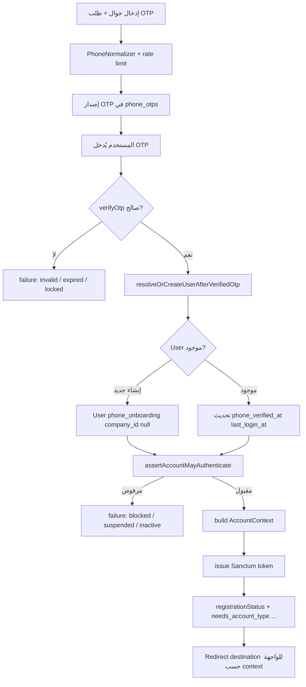

# WAVE 1 — Design & Safety Pass (الهوية، الجوال العالمي، الـ Resolver)

**الحالة:** معتمد للتصميم قبل التنفيذ البرمجي الواسع  
**التاريخ:** 2026-04-12  
**القيود الملزمة:** لا تغيير لمنطق مالي/محاسبي/محافظ/قيود/ترحيل مالي داخل WAVE 1 (انظر [`Platform_Financial_Control_Policy.md`](./Platform_Financial_Control_Policy.md)).

---

## Executive summary

المنصة **تملك بالفعل** مفتاح هوية قوي لمسار الجوال: **`users.phone` مع قيد UNIQUE على مستوى الجدول** (migration `2026_04_12_100000_alter_users_for_phone_registration.php`). مسار OTP الحالي (`RegisterOrLoginByPhoneService`) يحلّ المستخدم عبر `User::withoutGlobalScopes()->where('phone', …)` ويُنشئ مستخدماً بـ `company_id = null` حتى اكتمال التسجيل.

**الفجوة المنتجية/المعمارية:** «الجوال الفريد عالمياً» كـ **مبدأ منتج** يجب أن يفصل صراحة بين:

1. **هوية الدخول (Authentication Principal)** — صف واحد في `users` لكل رقم جوال مُفعّل للدخول.  
2. **هوية جهة اتصال تشغيلية (CRM / عميل ورشة)** — `customers.phone` **بدون** UNIQUE عالمي اليوم، وهو مقصود غالباً لأن نفس الرقم قد يظهر كجهة اتصال لعدة كيانات أو شركات.

التصميم أدناه يُثبت الطبقة المركزية، يحدد سياسة التعارض، يوسّع حالات الحساب دون كسر المالية، ويعرّف **LoginResolver** كخدمة/كائن مُختبر بدلاً من تفرّع عشوائي في الكنترولرات.

---

## 1) نموذج الهوية (Identity model)

### 1.1 الكيان المركزي الذي «يملك» رقم الجوال للدخول

| الخيار | التوصية لـ WAVE 1 |
|--------|-------------------|
| جدول جديد `phone_identities` | **مؤجّل** ما لم تظهر حاجة لعدة مستخدمين بنفس الجوال (غير مطلوبة بالمتطلبات الحالية). |
| **`users` كـ canonical login row** | **معتمد** — يتوافق مع الـ UNIQUE الحالي ومع `RegisterOrLoginByPhoneService`. |

**التعريف المركزي:**  
> **رقم الجوال المُخزَّن في `users.phone` (بعد `PhoneNormalizer::normalizeForStorage`) هو المفتاح العالمي لجلسة الدخول عبر OTP/الهاتف.**

### 1.2 الارتباط بأنواع الحسابات

| نوع الكيان | التمثيل الحالي في DB | العلاقة بالجوال |
|------------|---------------------|------------------|
| **مستخدم شركة (tenant staff)** | `users` مع `company_id` NOT NULL | نفس الصف؛ `phone` فريد عالمياً مع باقي المستخدمين |
| **موظف منصة / إداري** | `users` غالباً `company_id` NULL أو شركة نظامية (يُؤكَّد في التنفيذ عبر استعلام بيانات الإنتاج) | نفس الصف؛ صلاحيات عبر `role` / أذونات |
| **عميل فردي / أسطول (Individual في لغة المنتج)** | **`customers`** + اختيارياً `users.customer_id` لحسابات البوابة | **جهة اتصال:** `customers.phone` ليس بالضرورة مفتاح دخول؛ عند تفعيل دخول للعميل يُنشأ/يُربط **`users`** بنفس الجوال المُطبَّع |
| **تسجيل هاتف قيد الإكمال** | `users` + `registration_profiles` | موجود؛ `registration_stage` / `account_type` |

### 1.3 منع التعارضات (Conflict policy)

1. **على مستوى قاعدة البيانات:** الحفاظ على `UNIQUE(users.phone)` لجميع القيم غير NULL (سلوك PostgreSQL القياسي).  
2. **على مستوى المنتج:**  
   - لا يُسمح بوجود **صفّي `users` نشطين** بنفس الجوال — منعته الـ UNIQUE.  
   - يُسمح بتعدد **`customers.phone`** متطابقة **عبر شركات مختلفة** كبيانات تشغيل، **مع شرط واضح:** ذلك الرقم **لا يمنح دخولاً** إلا إذا وُجد `users.phone` مطابق **و** سياسة الـ Resolver تختار سياق الدخول الصحيح (انظر §4).  
3. **ربط User ↔ Customer:** عند إنشاء مستخدم بوابة عميل، يجب التحقق: إن وُجد `customer` بنفس `company_id` ورقم مطابق، يُفضَّل الربط بـ `users.customer_id` بدل ازدواج معنى.

---

## 2) سياسة «الجوال الفريد عالمياً» مقابل قيود المستأجر

### 2.1 ماذا يعني «فريد عالمياً» في الواقع الحالي؟

- **على `users`:** فريد **على كامل الجدول** (ليس `(company_id, phone)`). أي مستخدمين في شركتين مختلفتين **لا يمكنهما** مشاركة نفس `phone` غير NULL.  
- **على `customers`:** لا يوجد UNIQUE على `phone` في migration الإنشاء — التفرد **محلي بالمنطق التجاري** (اختياري مستقبلاً: `(company_id, phone)` إن رُغب بمنع تكرار عميل بنفس الرقم داخل الشركة فقط).

### 2.2 هل uniqueness على جدول مركزي؟

- **نعم للدخول:** الجدول المركزي هو **`users`** (صف المستخدم = principal للـ Sanctum).  
- **لا لجهات اتصال العملاء كهوية عالمية:** `customers` تبقى tenant-scoped؛ لا تُفرض UNIQUE عالمي على `customers.phone` في WAVE 1 دون تحليل أثر CRM/استيراد بيانات.

### 2.3 السجلات الحالية المتعارضة

| السيناريو | الكشف | المعالجة المقترحة |
|-----------|-------|-------------------|
| أكثر من `users` بنفس `phone` قبل تطبيق UNIQUE | يفشل migration أو يبقى غير منفّذ | **Pre-migration audit:** `SELECT phone, COUNT(*) FROM users WHERE phone IS NOT NULL GROUP BY phone HAVING COUNT(*) > 1` |
| `users.phone` يطابق `customers.phone` لشركة أخرى | ليس خطأ DB | مسموح؛ الـ Resolver يوجّه حسب **المستخدم المصدّق** لا حسب العميل |
| مستخدم `phone` NULL قديم | مسموح متعدد في PG | تعبئة تدريجية عند أول تسجيل OTP |

### 2.4 خطة migration آمنة (عند الحاجة لتعديلات إضافية)

> WAVE 1 لا يُلزم migration مالي. أي migration لهوية تتبع:

1. **Deploy read-only script / artisan command:** تقرير التعارضات + تصدير CSV.  
2. **دمج بشري أو دمج آلي محافظ:** اختيار «master user» لكل مجموعة مكررة، نقل علاقات غير مالية (مع **NO-GO** على نقل أرصدة/قيود داخل نفس PR).  
3. **فرض فهرس UNIQUE** إن لم يكن مطبّقاً في بيئة معيّنة (لن يُعاد إنشاؤه إن وُجد).  
4. **Rollback:** `down()` يحذف الفهرس فقط؛ **لا** يحذف بيانات دمجت يدوياً — لذلك النسخ الاحتياطي قبل الخطوة 2.

### 2.5 Fallback للبيانات «غير النظيفة»

- **وضع صيانة:** رفض إنشاء مستخدم جديد بنفس الجوال حتى تُحلّ التعارضات (رسالة دعم واضحة + `trace_id`).  
- **رقم مُعلّق (placeholder):** غير مُستحسن؛ إن وُجد لأسباب تاريخية، يُعالج بحقل `phone` NULL + سجل في `registration_profiles.internal_notes` (قراءة تشغيلية فقط).

---

## 3) سياسة حالات الحساب (Account status)

### 3.1 الحالة في الكود اليوم

- `UserStatus` enum: `active`, `inactive`, `suspended` — مع `canLogin()` = true فقط لـ `active`.  
- `users.is_active` (boolean) — يُستخدم مع `status` في `User::isActive()`.

### 3.2 المتطلبات الجديدة: `blocked` و `pending`

| الحالة | المعنى المقترح | التنفيذ المقترح (بدون تعقيد غير ضروري) |
|--------|----------------|----------------------------------------|
| **active** | يمكن الدخول إن تحققت بقية الشروط | `UserStatus::Active` + `is_active = true` |
| **inactive** | غير مفعّل تشغيلياً | `Inactive` + `is_active = false` |
| **suspended** | تعليق إداري مؤقت | `Suspended` + `is_active = false` |
| **blocked** | حظر أمني/احتيال (أشد من suspended) | **خيار أ (مُفضّل):** إضافة قيمتين إلى **`UserStatus` enum**: `Blocked`, `Pending` — مع تحديث `canLogin()` و`label()` |
| **pending** | تسجيل/مراجعة لم تكتمل | **أو** خيار ب: الإبقاء على `registration_stage` + `RegistrationProfile.status` كمصدر «pending» وعدم مضاعفة المعنى في `UserStatus` |

**التوصية:**  
- **`blocked` → إضافة `UserStatus::Blocked`** (أثر واضح على login وواجهات الحظر).  
- **`pending` → مصدر الحقيقة يبقى `registration_stage` + `registration_profiles`** لما دام التدفق الحالي يعتمد عليهما؛ إضافة `UserStatus::Pending` **اختيارية** فقط إذا أردتم توحيد كل القرارات في enum واحد — يتطلب then migration لتحديث الصفوف واختبارات أوسع.

### 3.3 الأثر على الطبقات

| الطبقة | الأثر |
|--------|-------|
| **Backend validation** | Form Requests للتسجيل/الدعم؛ منع انتقال حالات غير منطقية |
| **Policies / middleware** | middleware «حساب نشط» بعد المصادقة؛ لا يمس `financial.protection` |
| **Frontend guards** | قراءة `user.status` + أعلام التسجيل من `/auth/me` |
| **Login resolver** | خطوة صريحة بعد التحقق من OTP وكلمة المرور: `assertAccountMayAuthenticate()` |
| **Seeders / factories / tests** | تحديث لتغطية الحالات الجديدة |

---

## 4) Login Resolver — مخطط قرار (Decision flow)

**مبدأ:** طبقة واحدة مسماة مثلاً `LoginAccountResolutionResult` تُنتجها خدمة `ResolveLoginContextAction` (أو ما شابه) تُستدعى من `PhoneOtpAuthController::verifyOtp` ومن `AuthController::completeLogin` (بعد التحقق من كلمة المرور)، **بدون** تكرار المنطق.

### 4.1 تدفق الجوال + OTP (مبسّط)

### 4.2 مخرجات `AccountContext` (مقترح للعقد بين API و SPA)

| حقل | الغرض |
|-----|-------|
| `principal_kind` | `platform_staff` \| `tenant_user` \| `phone_onboarding` \| `fleet_linked` (يُحدَّد بدقة في التنفيذ) |
| `company_id` | null أو معرف الشركة |
| `home_route_hint` | مثلاً `staff` / `admin` / `phone/onboarding` |
| `permissions_snapshot` | كما اليوم من bootstrap |
| `session_policy` | مدة الجلسة، force logout عند تغيير الحالة (لاحقاً) |

### 4.3 حالات الفشل (Failure cases)

| الحالة | HTTP | رسالة للمستخدم |
|--------|------|-----------------|
| OTP خاطئ / منتهي | 422 | عامة آمنة (لا تكشف وجود الرقم) حيث ينطبق سياسة الأمان |
| حساب غير `canLogin` | 403 | «الحساب موقوف» — بدون تفاصيل داخلية |
| شركة معطّلة | 403 | بعد تحميل الشركة في bootstrap الحالي إن وُجد |
| سياق غامض (مستقبل: عدة أدوار بنفس المستخدم) | 409 أو 200 + `requires_step_up` | يُعرّف في التنفيذ المرحلي |

### 4.4 ambiguous account handling

- **اليوم:** صف `users` واحد لكل `phone` — لا غموض على مستوى الصف.  
- **مستقبل إن أُدخل `phone_identities`:** Resolver يُرجع قائمة مرشّحين + خطوة `disambiguation` — **خارج نطاق WAVE 1** ما لم يُفرض منتجياً.

---

## 5) مصفوفة الاختبارات (Test matrix) — WAVE 1

| # | السيناريو | النوع | ملاحظة |
|---|-----------|-------|---------|
| T1 | login OTP ناجح لمستخدم موجود | Feature | يتضمن audit write إن وُجد الجدول |
| T2 | OTP خاطئ | Feature | عداد المحاولات + قفل مؤقت |
| T3 | حساب `blocked` / `suspended` / `inactive` | Feature | رفض إصدار token أو رفض bootstrap |
| T4 | مستخدم جديد بعد OTP | Feature | `is_new_user`, إنشاء `registration_profiles` |
| T5 | missing context (company_id null لكن أكمل التسجيل) | Feature | توجيه بيانات `registrationStatus` |
| T6 | legacy: محاولة إنشاء تعارض `users.phone` | Unit/DB | انتهاك UNIQUE |
| T7 | session revoke / logout-all | Feature | Sanctum tokens |
| T8 | audit: login success / failure | Feature | سجلات `auth.login.*` أو جدول audit مخصص |
| T9 | rate limit على request-otp و login | Feature | throttle |
| T10 | suspicious login (IP جديد + user agent) | Feature | إشارة read-only + log، **بدون حظر آلي** في البداية إن لم تُوافق السياسة |

---

## 6) ما الذي سيُتأثر عند التنفيذ (للتخطيط فقط)

### 6.1 جداول / أعمدة محتملة

| الجدول / العمود | التغيير المحتمل |
|------------------|-----------------|
| `users` / `status` (enum في التطبيق) | إضافة قيم `blocked` (+ اختياري `pending`) |
| جدول جديد اختياري `login_audit_events` أو توسيع `audit_logs` | تسجيل login/logout/device — **قراءة/كتابة غير مالية** |
| `personal_access_tokens` (Sanctum) | سياسة إبطال عند `blocked` |
| لا تغيير على | `wallet_*`, `journal_*`, `invoices` monetary fields |

### 6.2 مسارات و guards

| المنطقة | ملاحظة |
|---------|--------|
| `routes/api.php` — مجموعة `auth/phone/*` | ربط بنفس الـ Resolver |
| `AuthController::login` | استدعاء Resolver للحالة بعد كلمة المرور |
| Middleware جديد اختياري `account.status` | بعد `auth:sanctum` |
| `frontend` — `LoginView.vue` / `PhoneOtpVerifyView.vue` | توحيد UX؛ **لا إلزام** بحذف `/platform/login` في الجولة الأولى |

### 6.3 المخاطر

| الخطر | التخفيف |
|-------|---------|
| كسر مستخدمين قدامى عند إضافة enum قيم | migration بيانات + default |
| ازدواج منطق بين email login و phone login | Resolver موحّد |
| خلط `customers.phone` مع هوية الدخول | توثيق واجهات API ورسائل واضحة للمطورين |

### 6.4 ما لن يُلمس (NO-GO صريح)

- `WalletService`, `LedgerService`, `FinancialGlMapping`, `WalletGlMapping`  
- تريغرات `journal_entries`  
- منطق ترحيل POS / تسويات مالية  
- تغيير قيود FK على جداول الفواتير/المدفوعات لأغراض الهوية

---

## 7) Secure impersonation readiness (تصميم فقط)

- جدول أو امتداد: `impersonation_sessions` (من impersonator → target user، سبب، `trace_id`, انتهاء).  
- **لا تنفيذ** في WAVE 1 إلا إن كان PR صغيراً يضيف الجدول فقط + سياسات قراءة — القرار: **readiness = واجهة خدمة فارغة + وثيقة SoD**، التفعيل الكامل مع Wave 12.

---

## 8) التسليم المرحلي المقترح داخل WAVE 1 (بعد إغلاق هذا التصميم)

1. PR1: توسيع `UserStatus` + اختبارات + تطبيق في `canLogin` ومسار OTP.  
2. PR2: استخراج `ResolveLoginContextAction` + ربط الكنترولرات (بدون توحيد مسارات wallet).  
3. PR3: device/session + audit events (غير مالية).  
4. PR4: UX موحّد للدخول (تدريجي؛ إبقاء redirect للمسارات القديمة).

---

## 9) القرار التنفيذي للفريق

- **اعتمدوا `users.phone` كهوية الدخول العالمية** مع الحفاظ على UNIQUE.  
- **لا تجعلوا `customers.phone` مصدر حقيقة للدخول** دون ربط صريح بـ `users`.  
- **Resolver = خدمة/Action واحدة** تُستدعى من مسارات المصادقة المعتمدة.  
- **`blocked` كحالة صريحة في `UserStatus`**؛ **`pending` عبر `registration_*` ما أمكن** لتقليل اتساع migration.  
- **أي migration:** فقط بعد تقرير تعارضات + نسخ احتياطي + خطة rollback موثّقة.

---

*هذا المستند يُغلق مرحلة Design & Safety Pass لـ WAVE 1؛ التنفيذ البرمجي يبدأ بعد اعتماد الفريق لهذه النقاط صراحة.*
