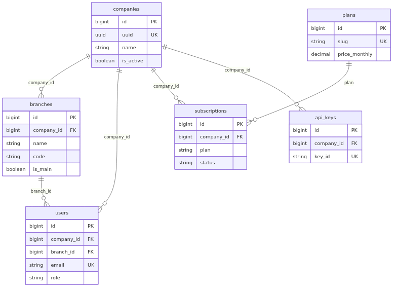
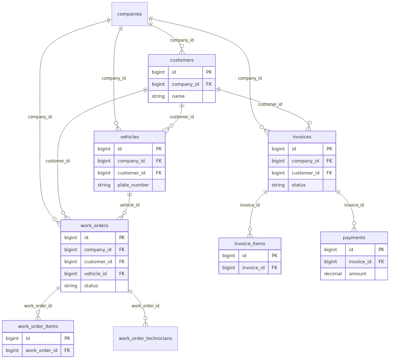
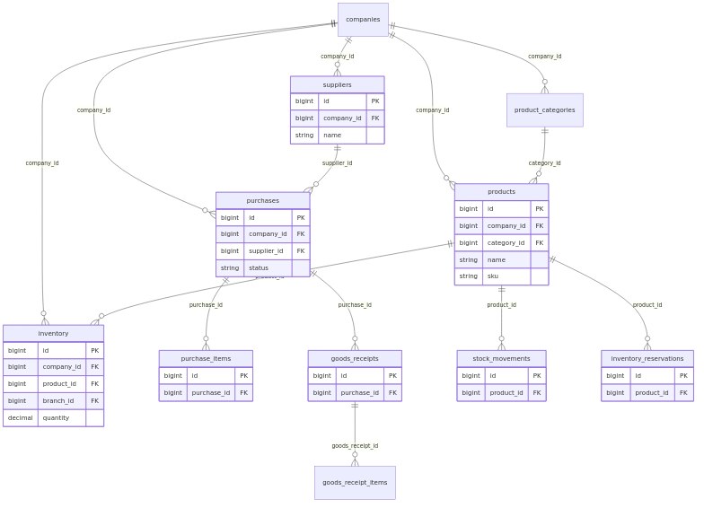
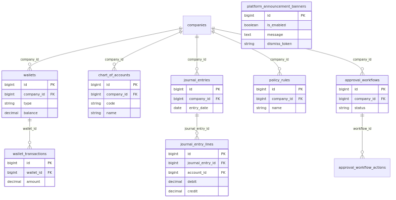

# تقرير شامل — منصة أسس برو / AutoService SaaS

**تاريخ إعداد التقرير:** 2026-04-05  
**نسخة PDF:** يُولَّد الملف `System_Comprehensive_Report.pdf` من هذا المستند (انظر `docs/report-pdf.css` وأمر التوليد في نهاية القسم 5.8).  
**النطاق:** وصف البنية التقنية، الأعمال المنفذة في جلسة التطوير الأخيرة، جاهزية النظام، قاعدة البيانات والعلاقات، ومخططات ERD، وما لم يُنفَّذ أو يبقى مسؤولية التشغيل.

---

## 1. ملخص تنفيذي

المنصة **SaaS متعددة المستأجرين** لقطاع ورش السيارات والأساطيل والتشغيل الميداني: خلفية **Laravel 11**، واجهة **Vue 3 + TypeScript**، قاعدة **PostgreSQL**، **Redis** للتخزين المؤقت والطوابير، **Nginx** كطبقة عكسية، **Docker Compose** للتشغيل المحلي والنشر الشبيه بالإنتاج.

في جلسة التطوير المشار إليها في هذا التقرير تم تنفيذ تحسينات على **صفحة الهبوط التسويقية**، إضافة **شريط إعلان منصة** قابل للإدارة من لوحة مشغّل المنصة، **تعزيز أمان وسلوك nginx** لمنع فهرسة مجلد `/landing`، توسيع **تتبّع أحداث الهبوط**، واختبارات آلية جزئية مؤكدة.

**جاهزية النظام:** البناء الإنتاجي للواجهة (`npm run build`) و**فحص nginx** لملف الواجهة الإنتاجية و**PHPUnit** لمسار الإعلان نجحت في بيئة التحقق المستخدمة؛ **النشر على خوادمكم (مثل pro.osas.sa)** و**اختبار القبول الكامل** يبقى مسؤولية فريق التشغيل وفق [`Staging_Execution_Now.md`](./Staging_Execution_Now.md).

---

## 2. الأعمال المنفذة (جلسة التطوير المرجعية)

### 2.1 صفحة الهبوط (`/landing`)

| البند | الوصف |
|--------|--------|
| تجربة المستخدم | تبسيط أزرار الهيرو، روابط ثانوية داخل `<details>`، شريط تقدّر للتمرير، شريط ثقة قصير، مسار ذكي يربط «نوع الضغط التشغيلي» بقسم قبل/بعد مع تمرير سلس |
| التنقل | روابط في الرأس (موبايل + سطح مكتب)، معرّفات `#faq` و `#use-cases` |
| المحتوى التقني | نص المطوّرين (أوامر npm) داخل `<details>`؛ وصف ميتا تسويقي أوضح |
| التحليلات | أحداث إضافية في `landingAnalytics.ts` (تنقّل الرأس، فتح «استكشف»، قفزة persona) |

**الملفات الرئيسية:** `frontend/src/views/marketing/LandingView.vue`، `frontend/src/utils/landingAnalytics.ts`.

### 2.2 الشريط الإعلاني للمنصة

| الطبقة | التنفيذ |
|--------|---------|
| قاعدة البيانات | جدول `platform_announcement_banners` (صف منطقي واحد عبر `theOne()`) |
| API | `GET/PUT /api/v1/platform/announcement-banner`، `GET .../admin`، حماية التحديث بـ `SaasPlatformAccess::isPlatformOperator` |
| الواجهة | مكوّن `PlatformPromoBanner.vue` في `AppLayout`؛ تبويب «شريط الإعلان» في واجهة المنصة (`/platform/announcements` — `PlatformAdminDashboardPage`) عند وضع مشغّل المنصة |
| السلوك | `dismiss_token` يتجدد عند الحفظ؛ إخفاء محلي عبر `localStorage` عند السماح بالإخفاء |

**الملفات الرئيسية:** الهجرة `2026_04_05_120000_create_platform_announcement_banners_table.php`، `PlatformAnnouncementBanner` (Model)، `PlatformAnnouncementBannerController`، `UpdatePlatformAnnouncementBannerRequest`، `api.php`، `PlatformPromoBanner.vue`، `PlatformAdminDashboardPage.vue` (قسم الإعلانات).

### 2.3 nginx — منع «Index of /landing»

| الملف | التغيير |
|--------|---------|
| `frontend/nginx.conf` | `autoindex off`، رؤوس أمان، `location ^~ /landing/showcase/` للأصول الثابتة، إعادة كتابة `landing` / `asas-pro` / `asaspro` إلى `/index.html`، حظر `/.` |
| `docker/nginx/conf.d/default.conf` | `autoindex off` على مستوى الـ server |

### 2.4 الاختبارات والتحقق (ما تم تشغيله فعلياً)

| الفحص | النتيجة (حسب التشغيل في المشروع) |
|--------|-------------------------------------|
| `npm run build` (واجهة) | نجاح (يشمل `vue-tsc` و`vite build`) |
| `nginx -t` على `frontend/nginx.conf` | صياغة صحيحة |
| `vendor/bin/phpunit --filter=PlatformAnnouncementBannerTest` | **4 tests, 13 assertions — OK** |

**ملاحظة:** `php artisan test` في بعض البيئات قد يتصل بـ `127.0.0.1` لقاعدة البيانات بسبب `.env`؛ التشغيل المباشر لـ `phpunit` يقرأ `phpunit.xml` (`DB_HOST=postgres`، قاعدة `saas_test`).

---

## 3. التقنيات المستخدمة (Stack)

| الطبقة | التقنية | إصدار تقريبي / ملاحظة |
|--------|---------|------------------------|
| لغة الخلفية | PHP | ^8.2 |
| إطار الخلفية | Laravel | ^11 |
| مصادقة API | Laravel Sanctum | ^4 |
| الواجهة | Vue | ^3.4 |
| لغة الواجهة | TypeScript | — |
| حالة التطبيق | Pinia | ^2.1 |
| التوجيه | Vue Router | ^4.3 |
| بناء الواجهة | Vite | 5.x |
| HTTP عميل | Axios | ^1.6 |
| واجهة ورسوم | Headless UI، Heroicons، Tailwind (عبر Vite) | — |
| خرائط (حيث يُستخدم) | Leaflet | ^1.9 |
| تقارير/تصدير | Chart.js، jsPDF، xlsx | — |
| مراقبة أخطاء (اختياري) | Sentry (Laravel + Vue) | — |
| قاعدة البيانات | PostgreSQL | 15 (في Docker Compose) |
| تخزين مؤقت / طوابير | Redis | 7 |
| خادم ويب | Nginx | 1.25 (صور Alpine) |
| حاويات | Docker + Docker Compose | — |
| اختبار خلفية | PHPUnit | 11.x |
| اختبار واجهة | Vitest | — |

---

## 4. بنية النظام والمفاهيم

### 4.1 تعدد المستأجرين (Multi-tenancy)

- الكيان المركزي: **`companies`** (المستأجر).
- **`branches`**: فروع تابعة لشركة واحدة؛ المستخدمون يرتبطون بـ `company_id` وغالباً `branch_id`.
- **نطاق tenant:** سمات مثل `HasTenantScope` على النماذج الحساسة مع فلترة حسب الشركة (والفرع حيث ينطبق).
- **اشتراك:** `plans`، `subscriptions`، حدود الاستخدام وفق الباقة.

### 4.2 طبقات الطلب (API)

- بادئة موحّدة: **`/api/v1/`**.
- وسائط شائعة: `auth:sanctum`، `tenant`، `financial.protection`، `branch.scope`، `subscription`، وصلاحيات دقيقة (`permission:...`).
- **مشغّلو المنصة:** بريد مُعرَّف في `SAAS_PLATFORM_ADMIN_EMAILS` (`config/saas.php`) — وصول محدود لواجهات مثل قائمة الشركات وتحديث الإعلان.

### 4.3 البوابات (Portals) في الواجهة

تشمل التطبيق مسارات **فريق العمل (Staff)** داخل `AppLayout`، ومسارات **الأسطول** و**العميل** في تخطيطات مخصّصة؛ التفعيل يمكن تقييده عبر `VITE_ENABLED_PORTALS` عند البناء.

### 4.4 الخدمات في Docker Compose (مرجعية)

- `app` — PHP-FPM / Laravel  
- `nginx` — عكسي للواجهة التطويرية ولـ API  
- `frontend` — Vite dev  
- `postgres`، `redis`  
- `queue_high`، `queue_default`، `queue_low`، `scheduler`  

صورة **إنتاج الواجهة** في `frontend/Dockerfile` (مرحلة `production`) تستخدم **`frontend/nginx.conf`** كـ `default.conf` داخل nginx.

---

## 5. قاعدة البيانات والعلاقات (ملخص مجالّي)

> **ملاحظة:** يوجد **أكثر من 80 ملف هجرة**؛ أدناه تجميع **منطقي** وليس قائمة كل عمود. العلاقات النموذجية: **Company 1—N Branch**، **Company 1—N User**، **Branch 1—N User** (حسب التصميم)، وجداول التشغيل ترتبط بـ **`company_id`** (وأحياناً **`branch_id`**).

### 5.1 الهوية والاشتراك والصلاحيات

| الجداول / المجال | العلاقات والدور |
|-------------------|-----------------|
| `companies` | جذر المستأجر |
| `branches` | `company_id` |
| `users` | `company_id`, `branch_id`؛ أدوار وصلاحيات (Spatie-style: `roles`, `permissions`, جداول ربط) |
| `plans`, `subscriptions`, `subscription_invoices` | اشتراك الشركة بالباقة |
| `personal_access_tokens` | Sanctum |
| `api_keys`, `api_usage_logs` | تكامل خارجي |

### 5.2 التشغيل والورشة

| المجال | جداول ممثّلة |
|--------|----------------|
| العملاء والمركبات | `customers`, `vehicles` |
| أوامر العمل | `work_orders`, `work_order_items`, `work_order_technicians` |
| المناطق والحجوزات | `bays`, `bookings`, `bay_maintenance_logs` |
| الموارد البشرية | `employees`, `attendance_logs`, `tasks`, `commissions`, `commission_rules`, `leaves`, `salaries` |
| الخدمات | `services`, `bundles`, `bundle_items` |

### 5.3 المخزون والمشتريات والمنتجات

| المجال | جداول ممثّلة |
|--------|----------------|
| المنتجات | `product_categories`, `products` |
| المخزون | `inventory`, `inventory_reservations`, `stock_movements` |
| الوحدات | `units`, `unit_conversions` |
| الموردون والشراء | `suppliers`, `purchases`, `purchase_items`, `goods_receipts`, `goods_receipt_items` |

### 5.4 المالية والمحاسبة والفوترة

| المجال | جداول ممثّلة |
|--------|----------------|
| الفواتير والدفع | `invoices`, `invoice_items`, `payments` |
| المحافظ | `wallets`, `wallet_transactions`, تطورات `customer_wallets` (هجرات الأسطول) |
| المحاسبة | `chart_of_accounts`, `journal_entries`, `journal_entry_lines` |
| عدادات الفواتير | `invoice_counters` (+ تسلسل عالمي في هجرات لاحقة) |
| ZATCA / سجلات | `zatca_logs` وحقول متعلقة في `invoices` |

### 5.5 الحوكمة والموافقات والتنبيهات

| المجال | جداول ممثّلة |
|--------|----------------|
| السياسات والموافقات | `policy_rules`, `approval_workflows`, `approval_workflow_actions` |
| التدقيق والتنبيهات | `audit_logs`, `alert_rules`, `alert_notifications` |

### 5.6 SaaS إضافي ودعم وتكامل

| المجال | جداول ممثّلة |
|--------|----------------|
| Webhooks | `webhook_endpoints`, `webhook_deliveries` |
| Idempotency | `idempotency_keys` |
| الدعم | `support_tickets`, `support_ticket_replies`, `knowledge_base`, `sla_policies`, … |
| الإحالات | `referrals`, `loyalty_points`, `loyalty_transactions`, `referral_policies` |
| العقود والوقود والمركبة | `contracts`, `contract_notifications`, `fuel_logs`, `vehicle_settings`, `vehicle_documents` |
| عروض الأسعار | `quotes`, `quote_items` |
| الإضافات | `plugins_registry`, `tenant_plugins`, `plugin_logs` |
| الإشعارات | `notifications` |
| الذكاء / الأحداث | `domain_events`, `event_record_failures`, `intelligence_command_center_governance_audits` |
| الاجتماعات (MVP) | `meetings`, `meeting_participants`, `meeting_minutes`, `meeting_decisions`, `meeting_actions`, `meeting_attachments` |
| المطابقة المالية | `financial_reconciliation_runs`, `financial_reconciliation_findings`, `financial_reconciliation_finding_histories`, `financial_reconciliation_run_attempts` |
| الإعدادات القابلة للضبط | `vertical_profiles`, `config_settings` |
| الفواتير الذكية / تذكيرات | `nps_ratings`, `warranty_items`, `service_reminders` |

### 5.7 جدول على مستوى المنصة (غير مرتبط بمستأجر واحد في الاستخدام المنطقي)

| الجدول | الغرض |
|--------|--------|
| **`platform_announcement_banners`** | إعلان واحد للواجهة لجميع المستأجرين؛ يُدار من مشغّلي المنصة |

### 5.8 مخطط العلاقات (ERD)

المنصة تضم **أكثر من 80 هجرة**؛ عرض **كل** الجدول في رسم واحد يصعّب القراءة. لذلك يُعرض **أربعة مخططات منطقية** تغطي الجزء الأكثر استخداماً في التشغيل اليومي. الأسماء والمفاتيح تعكس **النموذج المفاهيمي**؛ قد تختلف تسميات أعمدة فعلية أو فهارس بين الهجرات.

#### أ) المخطط 1 — المستأجر والاشتراك والهوية



*يشمل: `companies`، `branches`، `users`، `plans`، `subscriptions`، `api_keys`. رموز Sanctum (`personal_access_tokens`) وربط الأدوار (`roles` / `permissions`) موجودة في الهجرات ولم تُرسم هنا لتبسيط الصورة.*

#### ب) المخطط 2 — العملاء والمركبات وأوامر العمل والفوترة



*يشمل: `customers`، `vehicles`، `work_orders` (+ بنود وفنّيين)، `invoices` (+ بنود)، `payments`.*

#### ج) المخطط 3 — المنتجات والمخزون والمشتريات



*يشمل: `products`، `product_categories`، `inventory`، `stock_movements`، `inventory_reservations`، `suppliers`، `purchases`، `goods_receipts` (+ بنود).*

#### د) المخطط 4 — المحاسبة والمحافظ والحوكمة وجدول المنصة



*يشمل: `wallets`، `wallet_transactions`، `chart_of_accounts`، `journal_entries` (+ بنود)، `policy_rules`، `approval_workflows` (+ إجراءات)، **`platform_announcement_banners`** (بدون `company_id` — إعداد على مستوى المنصة).*

#### مصادر المخططات وإعادة التوليد

- ملفات Mermaid المصدر: `docs/diagrams/erd-01-core-tenancy.mmd` … `erd-04-*.mmd`  
- توليد الصور (يتطلب Docker وصورة `minlag/mermaid-cli`):

```bash
cd docs/diagrams
for f in erd-01-core-tenancy erd-02-operations-crm erd-03-inventory-purchases erd-04-finance-governance-platform; do
  docker run --rm -v "$(pwd):/data" minlag/mermaid-cli:latest -i "/data/${f}.mmd" -o "/data/${f}.png" -b transparent
done
```

- توليد **PDF** (موصى به: **Gotenberg** + Chromium — جودة عربية/RTL أفضل من wkhtmltopdf):
  - **Windows (PowerShell):** من مجلد `docs` نفّذ `.\build-report-pdf.ps1` (يتطلب Node وDocker وصورة `gotenberg/gotenberg:8`).
  - **Linux/macOS:** `bash docs/build-report-pdf.sh`
  - يدويًا: تحويل Markdown إلى HTML للجسم بـ `marked`، ثم `node build-report-html.mjs` (يدمج `report-pdf.css` ويُضمّن صور `diagrams/erd-*.png` كـ base64 ويزيل روابط `.md` التي تربك بعض محركات PDF)، ثم:

```bash
# بعد إنشاء docs/System_Comprehensive_Report.html
docker run -d --rm -p 3399:3000 --name gt-report-pdf gotenberg/gotenberg:8
sleep 8
curl -f -S -X POST "http://127.0.0.1:3399/forms/chromium/convert/html" \
  -F "files=@System_Comprehensive_Report.html;filename=index.html" \
  -o System_Comprehensive_Report.pdf
docker rm -f gt-report-pdf
```

يُنشَأ `System_Comprehensive_Report.pdf` في `docs/` بجانب ملف Markdown.

---

## 6. الإضافات والملفات المرجعية (وثائق التشغيل)

- سياسات Staging: [`Staging_Execution_Now.md`](./Staging_Execution_Now.md)، [`Staging_Deploy_Runbook.md`](./Staging_Deploy_Runbook.md)، [`Staging_Manual_Test_Checklist.md`](./Staging_Manual_Test_Checklist.md).
- `Makefile` / `scripts/staging-gate.sh` — بوابة جودة قبل الدمج (Vitest + PHPUnit مراحل 0–7 + **`ocr:verify --fail`**).
- أمثلة بيئة: `backend/.env.staging.example`، `frontend/env.staging.example` (إن وُجدت).

---

## 7. تقييم الجاهزية (بصراحة)

| المحور | الحالة | تعليق |
|--------|--------|--------|
| بناء الواجهة الإنتاجي | مؤكد نجاحه في التشغيل المرجعي | يشمل TypeScript |
| صياغة nginx للواجهة الإنتاجية | مؤكد `nginx -t` | يجب نشر نفس الملف على الخادم الفعلي |
| اختبارات مسار الإعلان | 4 اختبارات ناجحة | لا تغطي كامل النظام |
| اختبارات النظام بالكامل | غير مُعلَن «PASS كامل» هنا | يشغّل الفريق `make verify` / PHPUnit كاملاً حسب السياسة |
| النشر على استضافة الإنتاج/التجريب | خارج نطاق المستودع فقط | يتطلب CI/CD، أسرار، `migrate`، وبناء `VITE_*` الصحيح |
| اختبار يدوي Staging | مطلوب حسب الوثائق | لا يُستبدل بالاختبار الآلي فقط |

---

## 8. ما لم يُنفَّذ أو ما يبقى مسؤولية الفريق

1. **نشر التغييرات** على `pro.osas.sa` أو أي بيئة — دمج Git، pipeline، ونسخ `dist` كامل مع `nginx.conf` المحدّث.  
2. **تشغيل الهجرات** على قاعدة بيانات كل بيئة (`platform_announcement_banners` وغيرها).  
3. **ضبط `SAAS_PLATFORM_ADMIN_EMAILS`** لمن يُسمح له بإدارة الإعلان وقائمة الشركات.  
4. **اختبار قبول المستخدم (UAT)** وقوائم Staging اليدوية بالكامل.  
5. **إصلاح/توحيد** تشغيل `php artisan test` إذا كان `.env` يفرض `DB_HOST=127.0.0.1` داخل الحاوية (استخدم `vendor/bin/phpunit` أو اضبط البيئة).  
6. **ميزات أو تكاملات** مذكورة في الوثائق أو الواجهة كـ «حسب الإعداد» أو «مرحلة» — قد تكون غير مفعّلة أو تحتاج عقوداً خارجية (ERP، جهات حكومية، ZATCA، إلخ).  
7. **تغطية اختبار آلية شاملة** لكل مسار (POS، محفظة، tenancy، …) — المشروع يحتوي اختبارات جزئية؛ «جاهزية إنتاج كاملة» قرار تنظيمي بعد البوابات واليدوي.

---

## 9. خلاصة

المنصة **ناضجة تقنياً كمنتج كبير متعدد الوحدات** مع **PostgreSQL** وعلاقات **شركة ← فرع ← مستخدم** وطبقة **خدمات** واسعة. تم في الجلسة المذكورة: **تحسين الهبوط**، **إعلان منصة مع API وواجهة إدارة**، **تصليب nginx**، و**اختبارات مستهدفة** للإعلان. **الجاهزية للإنتاج** تتطلب اتباع مسار Staging الرسمي، نشراً صحيحاً للواجهة وقاعدة البيانات، واختباراً يدوياً موثَّقاً — وذلك خارج ما يثبته المستودع وحده.

---

*نهاية التقرير.*
