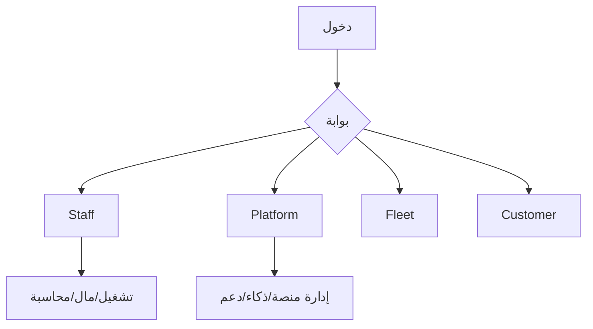

# الدليل المرجعي العربي الشامل للنظام

مرجع رسمي شامل مبني على قراءة الكود الفعلي في الواجهة والخلفية والتشغيل.

## محتويات الحزمة
- [01_نظرة_عامة_على_النظام.md](./01_نظرة_عامة_على_النظام.md)
- [02_الأدوار_والصلاحيات.md](./02_الأدوار_والصلاحيات.md)
- [03_رحلات_العمل_الكاملة.md](./03_رحلات_العمل_الكاملة.md)
- [04_فهرس_الشاشات_والمسارات.md](./04_فهرس_الشاشات_والمسارات.md)
- [05_نماذج_العمل_والعلاقات.md](./05_نماذج_العمل_والعلاقات.md)
- [06_الخصائص_والمزايا_الكاملة.md](./06_الخصائص_والمزايا_الكاملة.md)
- [07_المنظومة_المالية_والمحاسبية.md](./07_المنظومة_المالية_والمحاسبية.md)
- [08_المنظومة_التشغيلية_والإدارية.md](./08_المنظومة_التشغيلية_والإدارية.md)
- [09_التقنيات_والبنية_المعمارية_والتكاملات.md](./09_التقنيات_والبنية_المعمارية_والتكاملات.md)
- [10_الذكاء_الاصطناعي_والتحليلات_والتوصيات.md](./10_الذكاء_الاصطناعي_والتحليلات_والتوصيات.md)
- [11_الإشعارات_والتنبيهات_والاعتمادات.md](./11_الإشعارات_والتنبيهات_والاعتمادات.md)
- [12_سيناريوهات_النظام_الكاملة.md](./12_سيناريوهات_النظام_الكاملة.md)
- [13_السياسات_والضوابط_الحاكمة.md](./13_السياسات_والضوابط_الحاكمة.md)
- [14_الاستثناءات_والحالات_الخاصة.md](./14_الاستثناءات_والحالات_الخاصة.md)
- [15_مصفوفة_القرارات_والإجراءات.md](./15_مصفوفة_القرارات_والإجراءات.md)
- [16_دليل_الدعم_الفني_وفهم_الحالات.md](./16_دليل_الدعم_الفني_وفهم_الحالات.md)
- [17_دليل_النشر_والتشغيل_المرجعي.md](./17_دليل_النشر_والتشغيل_المرجعي.md)
- [18_المصطلحات_والمفاهيم.md](./18_المصطلحات_والمفاهيم.md)

## ملاحق الجرد الفعلي
- [A1_جرد_مسارات_API.md](./A1_جرد_مسارات_API.md)
- [A2_جرد_مسارات_الواجهة.md](./A2_جرد_مسارات_الواجهة.md)
- [A3_تفصيل_الشاشات_وعناصر_الواجهة.md](./A3_تفصيل_الشاشات_وعناصر_الواجهة.md)
- [A4_مصفوفة_صلاحيات_الشاشات.md](./A4_مصفوفة_صلاحيات_الشاشات.md)
- [A5_ربط_الشاشات_API_الخلفية.md](./A5_ربط_الشاشات_API_الخلفية.md)
- [A6_تشخيص_حالات_المنع_Access_Denied.md](./A6_تشخيص_حالات_المنع_Access_Denied.md)
- [A7_Runbook_الدعم_التنفيذي_السريع.md](./A7_Runbook_الدعم_التنفيذي_السريع.md)
- [A8_Runbook_حوادث_النشر_والتشغيل.md](./A8_Runbook_حوادث_النشر_والتشغيل.md)

## مخطط مرجعي

## محضر الاعتماد
- [99_محضر_الاعتماد_النهائي.md](./99_محضر_الاعتماد_النهائي.md)
