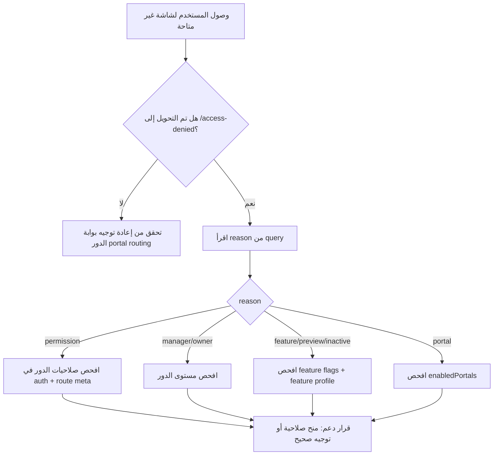

# ملحق A6 - تشخيص حالات المنع Access Denied

مستخرج من:
- `frontend/src/router/index.ts`
- `frontend/src/views/auth/AccessDeniedView.vue`

## أسباب المنع المعتمدة

| reason | متى يظهر (من الحارس) | نص الواجهة (عربي) | خطوة دعم أولية |
|---|---|---|---|
| `manager` | عندما تحتوي الشاشة على `meta.requiresManager=true` والمستخدم ليس مديرًا (`!auth.isManager`). | يتطلب صلاحية إدارية / هذه الصفحة مخصصة لمديري المنشأة أو أعلى. | تحقق من role الفعلي للمستخدم داخل `auth` وإعداد الدور في الشركة. |
| `owner` | عندما تحتوي الشاشة على `meta.requiresOwner=true` والمستخدم ليس مالكًا (`!auth.isOwner`). | يتطلب صلاحية مالك/منصة / هذه الصفحة مخصصة لمالك الشركة أو دور إداري على مستوى المنصة. | تحقق من دور المالك أو وجود صلاحية منصة بديلة. |
| `permission` | عند فشل `requiresPermission` أو `requiresAnyPermission` أو `requiresAllPermissions` أو شرط ذكاء يعتمد على `reports.intelligence.view`. | لا تملك صلاحية هذا القسم / دورك الحالي لا يشمل فتح هذا المسار. | طابق صلاحيات المسار مع `auth.hasPermission(...)` ثم تحقق من منح الصلاحيات في الخلفية. |
| `feature` | عند تعطيل الميزة عبر `featureFlags` أو `requiresBusinessFeature` أو بوابات ذكاء/ورش عمل غير مفعلة في profile. | هذه الميزة غير مفعّلة في إعداد البناء الحالي. | تحقق من `featureFlags` + `businessProfile.isEnabled(...)` للميزة المطلوبة. |
| `portal` | عند محاولة دخول مسارات `fleet/customer/admin` بينما البوابة معطلة في `enabledPortals`. | هذه البوابة غير متاحة في الإعداد الحالي. | راجع إعدادات تفعيل البوابات في build والبيئة الحالية. |
| `preview` | عندما يكون المسار موسومًا بـ `meta.unavailablePreview=true`. | هذا المسار غير متاح في الإصدار الحالي. | هذا منع مقصود بالإصدار؛ وجه المستخدم لمسار بديل. |
| `inactive` | عندما يكون المسار موسومًا بـ `meta.featureInactive=true`. | الميزة غير مفعلة حالياً. | تحقق من خطة التفعيل أو أعطِ المستخدم مسارًا تشغيليًا بديلًا. |

## خريطة قرار تشخيص سريعة

## قائمة تحقق الدعم الفني
- جمع `from` و`reason` من query في شاشة المنع.
- التحقق من role context (staff/platform/fleet/customer).
- مطابقة route meta في الراوتر مع صلاحيات المستخدم الفعلية.
- التحقق من `enabledPortals` و`featureFlags` و`business profile`.
- عند الاشتباه بخطأ صلاحيات خلفي: الربط مع `A5_ربط_الشاشات_API_الخلفية.md`.
