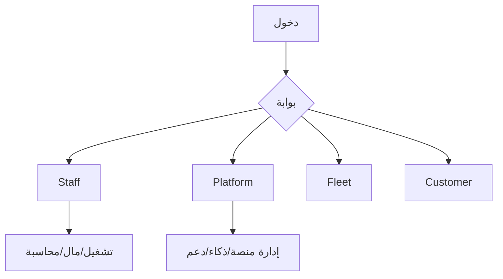
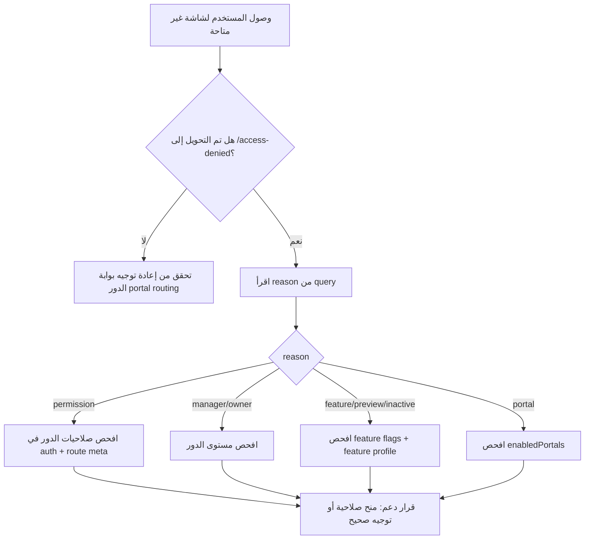

---

# 00_الفهرس_العام.md

# الدليل المرجعي العربي الشامل للنظام

مرجع رسمي شامل مبني على قراءة الكود الفعلي في الواجهة والخلفية والتشغيل.

## محتويات الحزمة
- [01_نظرة_عامة_على_النظام.md](./01_نظرة_عامة_على_النظام.md)
- [02_الأدوار_والصلاحيات.md](./02_الأدوار_والصلاحيات.md)
- [03_رحلات_العمل_الكاملة.md](./03_رحلات_العمل_الكاملة.md)
- [04_فهرس_الشاشات_والمسارات.md](./04_فهرس_الشاشات_والمسارات.md)
- [05_نماذج_العمل_والعلاقات.md](./05_نماذج_العمل_والعلاقات.md)
- [06_الخصائص_والمزايا_الكاملة.md](./06_الخصائص_والمزايا_الكاملة.md)
- [07_المنظومة_المالية_والمحاسبية.md](./07_المنظومة_المالية_والمحاسبية.md)
- [08_المنظومة_التشغيلية_والإدارية.md](./08_المنظومة_التشغيلية_والإدارية.md)
- [09_التقنيات_والبنية_المعمارية_والتكاملات.md](./09_التقنيات_والبنية_المعمارية_والتكاملات.md)
- [10_الذكاء_الاصطناعي_والتحليلات_والتوصيات.md](./10_الذكاء_الاصطناعي_والتحليلات_والتوصيات.md)
- [11_الإشعارات_والتنبيهات_والاعتمادات.md](./11_الإشعارات_والتنبيهات_والاعتمادات.md)
- [12_سيناريوهات_النظام_الكاملة.md](./12_سيناريوهات_النظام_الكاملة.md)
- [13_السياسات_والضوابط_الحاكمة.md](./13_السياسات_والضوابط_الحاكمة.md)
- [14_الاستثناءات_والحالات_الخاصة.md](./14_الاستثناءات_والحالات_الخاصة.md)
- [15_مصفوفة_القرارات_والإجراءات.md](./15_مصفوفة_القرارات_والإجراءات.md)
- [16_دليل_الدعم_الفني_وفهم_الحالات.md](./16_دليل_الدعم_الفني_وفهم_الحالات.md)
- [17_دليل_النشر_والتشغيل_المرجعي.md](./17_دليل_النشر_والتشغيل_المرجعي.md)
- [18_المصطلحات_والمفاهيم.md](./18_المصطلحات_والمفاهيم.md)

## ملاحق الجرد الفعلي
- [A1_جرد_مسارات_API.md](./A1_جرد_مسارات_API.md)
- [A2_جرد_مسارات_الواجهة.md](./A2_جرد_مسارات_الواجهة.md)
- [A3_تفصيل_الشاشات_وعناصر_الواجهة.md](./A3_تفصيل_الشاشات_وعناصر_الواجهة.md)
- [A4_مصفوفة_صلاحيات_الشاشات.md](./A4_مصفوفة_صلاحيات_الشاشات.md)
- [A5_ربط_الشاشات_API_الخلفية.md](./A5_ربط_الشاشات_API_الخلفية.md)
- [A6_تشخيص_حالات_المنع_Access_Denied.md](./A6_تشخيص_حالات_المنع_Access_Denied.md)
- [A7_Runbook_الدعم_التنفيذي_السريع.md](./A7_Runbook_الدعم_التنفيذي_السريع.md)
- [A8_Runbook_حوادث_النشر_والتشغيل.md](./A8_Runbook_حوادث_النشر_والتشغيل.md)

## مخطط مرجعي

## محضر الاعتماد
- [99_محضر_الاعتماد_النهائي.md](./99_محضر_الاعتماد_النهائي.md)

---

# 01_نظرة_عامة_على_النظام.md

# نظرة عامة على النظام

## تعريف النظام
منصة SaaS متعددة الأدوار تدير التشغيل، المال، المحاسبة، الحوكمة، الدعم، والذكاء التشغيلي.

## نطاقه الكامل
- بوابة فريق العمل للشركة.
- بوابة إدارة المنصة.
- بوابة الأسطول.
- بوابة العميل.
- واجهات عامة ودخول متعدد السياقات.

## الوحدات الرئيسية
- Auth/OTP/Sessions.
- شركات وفروع ومستخدمون وصلاحيات.
- عملاء ومركبات وأوامر عمل.
- فواتير ومدفوعات ومحافظ.
- ledger/chart-of-accounts/reconciliation.
- مخزون ومشتريات وموردون.
- دعم فني وسياسات SLA وقاعدة معرفة.
- Platform Intelligence: signals/candidates/incidents/decisions/actions.

## لماذا هذا التصميم
- فصل صلاحيات الشركة عن إدارة المنصة.
- تقوية الضبط المالي والمحاسبي عبر idempotency والحماية والمطابقة.
- قابلية التوسع عبر فصل البوابات.

---

# 02_الأدوار_والصلاحيات.md

# الأدوار والصلاحيات

## الأدوار المثبتة فعليًا
- العميل.
- الشركة: مالك، مدير، موظف تشغيلي.
- مستخدمو الأسطول.
- إدارة المنصة ومشغل المنصة.

## مبادئ الصلاحية
- صلاحيات tenant عبر permission middleware.
- صلاحيات منصة عبر platform.permission.
- مشغل المنصة يتحقق عبر platform.admin.

## مصفوفة مختصرة
| الدور | ماذا يرى | ماذا يُمنع عنه |
|---|---|---|
| عميل | مسارات customer | مسارات الإدارة والمنصة |
| موظف شركة | مسارات staff حسب الصلاحيات | أي شاشة غير مصرح بها |
| مدير/مالك | نطاق أوسع في staff | صلاحيات منصة بدون منح صريح |
| أسطول | fleet-portal | customer/platform/staff غير المصرح |
| مشغل منصة | platform routes حسب platform.permission | التنفيذ خارج صلاحياته |

## مرجع تفصيلي للصلاحيات على مستوى الشاشة
- [A4_مصفوفة_صلاحيات_الشاشات.md](./A4_مصفوفة_صلاحيات_الشاشات.md)

---

# 03_رحلات_العمل_الكاملة.md

# رحلات العمل الكاملة

## من التسجيل حتى الإغلاق
1. دخول/تسجيل/OTP.
2. تحديد سياق الحساب والبوابة.
3. دخول المستخدم لبوابته المخصصة.
4. تنفيذ العمليات (تشغيلية/مالية/إدارية).
5. تحديث الحالات وإرسال الإشعارات.
6. اعتماد/رفض/تصعيد عند الحاجة.
7. إغلاق الحالة مع أثر مالي/تشغيلي/إداري.

## رحلات أساسية
- رحلة Staff: أمر عمل -> فاتورة -> دفع -> أثر محاسبي -> تقرير.
- رحلة Platform: متابعة شركات -> ضبط اشتراكات -> متابعة incidents.
- رحلة Support: تذكرة -> ردود -> SLA -> إغلاق.
- رحلة Intelligence: signal -> candidate -> incident -> decision -> action -> close.

---

# 04_فهرس_الشاشات_والمسارات.md

# فهرس الشاشات والمسارات

## بوابة المنصة
/platform/overview, /platform/ops, /platform/companies, /platform/finance, /platform/support, /platform/notifications, /platform/intelligence/incidents, /platform/intelligence/command

## بوابة الشركة
/, /customers, /vehicles, /work-orders, /invoices, /wallet, /ledger, /chart-of-accounts, /financial-reconciliation, /inventory, /purchases, /reports, /settings, /support, /plans, /subscription

## بوابة الأسطول
/fleet-portal, /fleet-portal/new-order, /fleet-portal/top-up, /fleet-portal/vehicles, /fleet-portal/orders

## بوابة العميل
/customer/dashboard, /customer/bookings, /customer/vehicles, /customer/invoices, /customer/wallet, /customer/notifications

## ملاحظة
الفهرس مستند إلى router الفعلي، وتفاصيل الوظائف مرتبطة بصلاحيات وfeature flags.

## مرجع التفصيل التشغيلي للشاشات
- [A3_تفصيل_الشاشات_وعناصر_الواجهة.md](./A3_تفصيل_الشاشات_وعناصر_الواجهة.md)

---

# 05_نماذج_العمل_والعلاقات.md

# نماذج العمل والعلاقات

## الكيانات
User, Company, Branch, Customer, Vehicle, WorkOrder, Invoice, Payment, Wallet, Subscription, PlanAddon, SubscriptionAddon, SupportTicket, PlatformIncident, PlatformDecisionLogEntry, PlatformControlledAction.

## العلاقات
- الشركة تمتلك فروعًا ومستخدمين وعمليات.
- العميل يمتلك مركبات، والمركبة ترتبط بأوامر عمل.
- أمر العمل قد يولد فاتورة.
- الفاتورة والمدفوعات ترتبطان بالدفتر والمطابقة.
- الحادثة الذكية ترتبط بقرارات وإجراءات وسجل دورة حياة.

---

# 06_الخصائص_والمزايا_الكاملة.md

# الخصائص والمزايا الكاملة

## تشغيلية
إدارة العملاء، المركبات، أوامر العمل، الخدمات، الحجوزات، المشتريات، المخزون.

## مالية ومحاسبية
الفوترة، المدفوعات، المحافظ، طلبات الشحن، ledger، chart of accounts، reconciliation.

## إدارية
إدارة المستخدمين والأدوار، الفروع، الإعدادات، التكاملات، API keys، webhooks.

## دعم
التذاكر، SLA، قاعدة المعرفة، التصعيد، الإغلاق.

## SaaS
الخطط، تغيير الاشتراك، add-ons، حدود الاستخدام.

## ذكاء
لوحات وتحليلات وإشارات وتوصيات وحوادث ذكية وإجراءات موجهة.

---

# 07_المنظومة_المالية_والمحاسبية.md

# المنظومة المالية والمحاسبية

## الدورة المالية
إنشاء التزام مالي -> تنفيذ معاملة -> تسجيل أثر -> مراجعة تقارير -> مطابقة -> معالجة استثناءات.

## الدورة المحاسبية
قيد/ترحيل -> ميزان مراجعة -> تقارير -> عكس عند الحاجة ضمن ضوابط.

## ضوابط أساسية
- financial.protection للمسارات الحساسة.
- idempotent لعمليات الدفع/التحويل/البيع الحساسة.
- reconciliation مجدول لاكتشاف الانحرافات.

## صلاحيات مالية
reports.financial.view, reports.accounting.view, invoices.update, wallet.top_up_requests.review.

## [تحتاج تأكيد]
تفصيل القيود المحاسبية الدقيقة لكل سيناريو جزئي داخل كل service يحتاج توثيقًا تفصيليًا إضافيًا من طبقة الخدمات الداخلية.

---

# 08_المنظومة_التشغيلية_والإدارية.md

# المنظومة التشغيلية والإدارية

## التشغيل اليومي
دخول، تنفيذ مهام، تحديث حالات، معالجة طلبات، إصدار فواتير، متابعة تقارير.

## الإدارة
إدارة المستخدمين والصلاحيات، الإعدادات، التهيئة، الفروع، السياسات، الاجتماعات، المعاملات.

## إدارة المنصة
إدارة الشركات والاشتراكات، تدقيق، دعم، ذكاء، إشعارات منصية.

## إدارة الحالات
- حالات أوامر العمل.
- حالات تذاكر الدعم.
- حالات طلبات شحن المحفظة.
- حالات incidents الذكية.

---

# 09_التقنيات_والبنية_المعمارية_والتكاملات.md

# التقنيات والبنية المعمارية والتكاملات

## التقنية
- Backend: Laravel/PHP.
- Frontend: Vue3/TypeScript.
- PostgreSQL + Redis.
- Docker Compose + Nginx + workers + scheduler.

## التكاملات
Sentry, AWS S3, Twilio OTP, ZATCA, OCR, Webhooks, API Keys.

## التشغيل
Health endpoint, queue workers متعددة، schedule jobs، monitor scripts وgates.

## البيئات
Local/Staging/Production عبر env templates وCI workflows.

## مرجع ربط الواجهة مع الخلفية
- [A5_ربط_الشاشات_API_الخلفية.md](./A5_ربط_الشاشات_API_الخلفية.md)

---

# 10_الذكاء_الاصطناعي_والتحليلات_والتوصيات.md

# الذكاء الاصطناعي والتحليلات والتوصيات

## مكونات الذكاء
- Signals.
- Incident Candidates.
- Incidents.
- Decision Log.
- Controlled Actions.
- Guided Workflows.

## التسلسل
Collect -> Normalize -> Detect -> Correlate -> Score -> Dedupe -> Explain -> Prioritize.

## الحدود
- الذكاء داعم للقرار وليس بديلًا للحوكمة البشرية.
- التنفيذ المقيد يتطلب صلاحيات منصة.

---

# 11_الإشعارات_والتنبيهات_والاعتمادات.md

# الإشعارات والتنبيهات والاعتمادات

## الإشعارات
- Notifications للمستخدمين داخل الشركة.
- مركز إشعارات المنصة لمشغليها.

## التنبيهات
- SLA.
- مالية/مطابقة.
- تنبيهات ذكاء الحوادث.

## الاعتمادات
- طلبات شحن المحفظة (اعتماد/رفض/إرجاع).
- طلبات إلغاء أوامر عمل.
- قرارات الحوادث الذكية وإجراءاتها.

---

# 12_سيناريوهات_النظام_الكاملة.md

# سيناريوهات النظام الكاملة

## يومية
إدارة عميل/مركبة/أمر عمل/فاتورة/تحصيل.

## إدارية
تحديث صلاحيات، تفعيل ميزات، ضبط تكاملات.

## مالية ومحاسبية
سداد، تحويل، عكس، مطابقة.

## ذكية
تحول إشارة إلى حادثة ثم معالجتها حتى الإغلاق.

## استثنائية
فشل صلاحية، feature inactive، فشل توافق مالي، تعارض lifecycle.

---

# 13_السياسات_والضوابط_الحاكمة.md

# السياسات والضوابط الحاكمة

## وصول وهوية
Sanctum + middleware متعددة الطبقات.

## فصل الصلاحيات
Tenant permissions منفصلة عن Platform permissions.

## ضوابط التنفيذ
لا تنفيذ حساس بدون permission صريح.

## ضوابط مالية
financial.protection + idempotency + reconciliation.

## ضوابط ذكاء
الحالات الذكية تتحرك عبر transition policy صارمة.

---

# 14_الاستثناءات_والحالات_الخاصة.md

# الاستثناءات والحالات الخاصة

## استثناءات نطاقية
LedgerPostingFailedException, IncidentLifecycleException, IncidentMaterializationConflictException, DecisionRecordingException, GuidedWorkflowExecutorException.

## حالات خاصة
- منع حسب portal.
- منع حسب feature flags.
- منع حسب صلاحية.
- معالجة حالات stuck/concurrency في reconciliation.

---

# 15_مصفوفة_القرارات_والإجراءات.md

# مصفوفة القرارات والإجراءات

| القرار | من يملكه | الشروط | النتيجة |
|---|---|---|---|
| اعتماد طلب شحن | مراجع مالي | صلاحية review + مستندات مكتملة | رصيد مضاف + أثر مالي |
| رفض طلب شحن | مراجع مالي | نقص/عدم مطابقة | إغلاق بالرفض |
| تصعيد incident | مشغل منصة | incident تحت المراجعة + صلاحية | انتقال حالة + إشعار |
| إغلاق incident | مشغل منصة | مكتمل المعالجة + صلاحية close | إغلاق نهائي + trace |

---

# 16_دليل_الدعم_الفني_وفهم_الحالات.md

# دليل الدعم الفني وفهم الحالات

## خطوات الدعم
1. تحديد البوابة والدور.
2. تحديد المسار/الشاشة المتأثرة.
3. تحديد الكيان (ticket/invoice/work-order/incident).
4. مراجعة trace_id والحالة والصلاحية.
5. تنفيذ حل أو تصعيد.

## مسارات التصعيد
- مالي/محاسبي مع أثر غير متوازن.
- أعطال طوابير/جدولة متكررة.
- تناقض صلاحيات.
- استثناءات ذكية حرجة.

## مرجع تشخيص المنع والصلاحيات
- [A6_تشخيص_حالات_المنع_Access_Denied.md](./A6_تشخيص_حالات_المنع_Access_Denied.md)
- [A5_ربط_الشاشات_API_الخلفية.md](./A5_ربط_الشاشات_API_الخلفية.md)
- [A7_Runbook_الدعم_التنفيذي_السريع.md](./A7_Runbook_الدعم_التنفيذي_السريع.md)

---

# 17_دليل_النشر_والتشغيل_المرجعي.md

# دليل النشر والتشغيل المرجعي

## متطلبات
Docker, Compose, PostgreSQL, Redis, env configs.

## خدمات التشغيل
app/nginx/frontend/queue_high/queue_default/queue_low/scheduler/postgres/redis.

## التحقق التشغيلي
- /api/v1/health
- logs + failed jobs
- queue depth
- scheduler heartbeat
- sentry alerts

## مراجع تشغيل إضافية
الرجوع إلى runbooks داخل مجلد docs التشغيلي.

## Runbook الحوادث التشغيلية
- [A8_Runbook_حوادث_النشر_والتشغيل.md](./A8_Runbook_حوادث_النشر_والتشغيل.md)

---

# 18_المصطلحات_والمفاهيم.md

# المصطلحات والمفاهيم

| المصطلح | المعنى |
|---|---|
| Tenant | شركة ضمن المنصة متعددة المستأجرين |
| Platform Operator | مشغل يملك صلاحيات عابرة للشركات |
| Idempotency | منع أثر التكرار لنفس الطلب |
| Reconciliation | مطابقة مالية/محاسبية لاكتشاف الانحراف |
| Incident | حالة ذكية تشغيلية مؤثرة |
| Decision Log | سجل قرارات معالجة الحادثة |
| Controlled Action | إجراء موجّه مرتبط بالحالة |

---

# 99_محضر_الاعتماد_النهائي.md

# محضر الاعتماد النهائي للدليل المرجعي

## حالة الاعتماد
**الحالة: جاهز للاعتماد التشغيلي الرسمي**

## تاريخ المراجعة
- الأربعاء 15 أبريل 2026

## نطاق ما تم التحقق منه
- اكتمال الملفات الأساسية من `00` إلى `18`.
- اكتمال الملاحق التنفيذية من `A1` إلى `A8`.
- ترابط الفهرس الداخلي والروابط المرجعية.
- وجود تغطية تشغيلية/مالية/محاسبية/إدارية/تقنية/أمنية/ذكاء/تكامل.
- وجود أدلة دعم وتشغيل ونشر واستجابة للحوادث.

## نتيجة فحص القبول
| معيار قبول | الحالة | ملاحظة |
|---|---|---|
| توثيق الأدوار والصلاحيات | ✅ | موجود في `02` + `A4` |
| توثيق الشاشات والمسارات | ✅ | موجود في `04` + `A2` + `A3` |
| توثيق الرحلات والسيناريوهات | ✅ | موجود في `03` + `12` |
| توثيق الكيانات والعلاقات | ✅ | موجود في `05` |
| توثيق المالي والمحاسبي | ✅ | موجود في `07` + ملاحق التشغيل |
| توثيق التقنية والمعمارية | ✅ | موجود في `09` |
| توثيق الذكاء والتحليلات | ✅ | موجود في `10` |
| توثيق الإشعارات والاعتمادات | ✅ | موجود في `11` |
| توثيق السياسات والضوابط | ✅ | موجود في `13` + `A6` |
| توثيق الدعم والتشغيل والنشر | ✅ | موجود في `16` + `17` + `A7` + `A8` |

## ملاحظات جودة نهائية
- `A5` يحتوي مستويات ثقة (`high/medium/unmatched`) بشكل صريح، وهذا مقصود لشفافية الربط الآلي.
- الحالات `unmatched` لا تعني نقص توثيق أساسي، بل تشير لحاجة تتبع يدوي عند المسارات المركبة/الديناميكية.

## قرار الاعتماد
بناءً على المراجعة الحالية، **الدليل صالح كمرجع رسمي للنشر والدعم والتشغيل والتدريب**، مع توصية تحسين مستمر للملاحق الآلية عند أي تعديل جذري في المسارات.

---

# A1_جرد_مسارات_API.md

# ملحق A1 - جرد مسارات API الفعلية

مستخرج آليًا من `backend/routes/api.php`.

| # | method | path |
|---|---|---|
| 1 | `GET` | `/health` |
| 2 | `GET` | `/system/version` |
| 3 | `GET` | `/public/landing-plans` |
| 4 | `GET` | `/public/platform-announcement-banner` |
| 5 | `GET` | `/public/vehicle-identity/{token}` |
| 6 | `POST` | `/auth/login` |
| 7 | `POST` | `/auth/register` |
| 8 | `POST` | `/auth/forgot-password` |
| 9 | `POST` | `/auth/reset-password` |
| 10 | `POST` | `/auth/phone/request-otp` |
| 11 | `POST` | `/auth/phone/verify-otp` |
| 12 | `POST` | `/auth/logout` |
| 13 | `POST` | `/auth/logout-all` |
| 14 | `POST` | `/auth/push-device` |
| 15 | `GET` | `/auth/me` |
| 16 | `GET` | `/auth/sessions` |
| 17 | `DELETE` | `/auth/sessions/{id}` |
| 18 | `POST` | `/auth/sessions/revoke-others` |
| 19 | `GET` | `/auth/registration-status` |
| 20 | `GET` | `/platform/ops-summary` |
| 21 | `GET` | `/platform/audit-logs` |
| 22 | `GET` | `/platform/companies/{id}` |
| 23 | `GET` | `/platform/companies` |
| 24 | `GET` | `/platform/customers` |
| 25 | `GET` | `/admin/companies` |
| 26 | `GET` | `/admin/overview` |
| 27 | `GET` | `/platform/intelligence/signals` |
| 28 | `GET` | `/platform/intelligence/incident-candidates` |
| 29 | `GET` | `/platform/intelligence/incidents` |
| 30 | `GET` | `/platform/intelligence/incidents/{incident_key}` |
| 31 | `POST` | `/platform/intelligence/incidents/materialize` |
| 32 | `POST` | `/platform/intelligence/incidents/{incident_key}/acknowledge` |
| 33 | `POST` | `/platform/intelligence/incidents/{incident_key}/move-under-review` |
| 34 | `POST` | `/platform/intelligence/incidents/{incident_key}/escalate` |
| 35 | `POST` | `/platform/intelligence/incidents/{incident_key}/move-monitoring` |
| 36 | `POST` | `/platform/intelligence/incidents/{incident_key}/resolve` |
| 37 | `POST` | `/platform/intelligence/incidents/{incident_key}/close` |
| 38 | `POST` | `/platform/intelligence/incidents/{incident_key}/assign-owner` |
| 39 | `POST` | `/platform/intelligence/incidents/{incident_key}/notes` |
| 40 | `GET` | `/platform/intelligence/decisions` |
| 41 | `GET` | `/platform/intelligence/incidents/{incident_key}/decisions` |
| 42 | `POST` | `/platform/intelligence/incidents/{incident_key}/decisions` |
| 43 | `GET` | `/platform/intelligence/incidents/{incident_key}/workflows` |
| 44 | `POST` | `/platform/intelligence/incidents/{incident_key}/workflows/execute` |
| 45 | `GET` | `/platform/intelligence/command-surface` |
| 46 | `GET` | `/platform/intelligence/incidents/{incident_key}/correlation` |
| 47 | `GET` | `/platform/intelligence/incidents/{incident_key}/controlled-actions` |
| 48 | `POST` | `/platform/intelligence/incidents/{incident_key}/controlled-actions/create-follow-up` |
| 49 | `POST` | `/platform/intelligence/incidents/{incident_key}/controlled-actions/request-human-review` |
| 50 | `POST` | `/platform/intelligence/incidents/{incident_key}/controlled-actions/link-internal-task-reference` |
| 51 | `POST` | `/platform/intelligence/controlled-actions/{action_id}/assign-owner` |
| 52 | `POST` | `/platform/intelligence/controlled-actions/{action_id}/schedule-follow-up-window` |
| 53 | `POST` | `/platform/intelligence/controlled-actions/{action_id}/mark-completed` |
| 54 | `POST` | `/platform/intelligence/controlled-actions/{action_id}/cancel` |
| 55 | `POST` | `/platform/intelligence/controlled-actions/{action_id}/reopen` |
| 56 | `PATCH` | `/platform/companies/{id}/operational` |
| 57 | `PATCH` | `/platform/companies/{id}/subscription` |
| 58 | `POST` | `/platform/companies/{id}/subscription-addons` |
| 59 | `PATCH` | `/platform/companies/{id}/vertical-profile` |
| 60 | `PATCH` | `/platform/companies/{id}/financial-model` |
| 61 | `PUT` | `/platform/plans/{slug}` |
| 62 | `POST` | `/platform/plan-addons` |
| 63 | `PUT` | `/platform/plan-addons/{slug}` |
| 64 | `GET` | `/platform/work-order-cancellation-requests` |
| 65 | `POST` | `/platform/work-order-cancellation-requests/{id}/approve` |
| 66 | `POST` | `/platform/work-order-cancellation-requests/{id}/reject` |
| 67 | `GET` | `/platform/announcement-banner/admin` |
| 68 | `PUT` | `/platform/announcement-banner` |
| 69 | `GET` | `/platform/registration-profiles` |
| 70 | `POST` | `/platform/registration-profiles/{id}/approve` |
| 71 | `POST` | `/platform/registration-profiles/{id}/reject` |
| 72 | `POST` | `/platform/registration-profiles/{id}/request-more-info` |
| 73 | `POST` | `/platform/registration-profiles/{id}/suspend` |
| 74 | `GET` | `/platform/support/tickets` |
| 75 | `GET` | `/platform/support/tickets/{id}` |
| 76 | `GET` | `/platform/support/stats` |
| 77 | `GET` | `/platform/notifications` |
| 78 | `PATCH` | `/platform/support/tickets/{id}` |
| 79 | `PATCH` | `/platform/support/tickets/{id}/status` |
| 80 | `POST` | `/platform/support/tickets/{id}/replies` |
| 81 | `GET` | `/v1/platform/pulse-summary` |
| 82 | `GET` | `/v1/platform/pulse-summary/export` |
| 83 | `POST` | `/auth/complete-account-type` |
| 84 | `POST` | `/auth/complete-individual-profile` |
| 85 | `POST` | `/auth/complete-company-profile` |
| 86 | `POST` | `/internal/run-tests` |
| 87 | `GET` | `/internal/test-results` |
| 88 | `GET` | `/internal/auth/suspicious-login-signals` |
| 89 | `GET` | `/dashboard/summary` |
| 90 | `GET` | `/system/capabilities` |
| 91 | `GET` | `/onboarding/setup-status` |
| 92 | `GET` | `/domain-events` |
| 93 | `GET` | `/intelligence/overview` |
| 94 | `GET` | `/intelligence/insights` |
| 95 | `GET` | `/intelligence/recommendations` |
| 96 | `GET` | `/intelligence/alerts` |
| 97 | `GET` | `/intelligence/command-center` |
| 98 | `POST` | `/intelligence/command-center/governance` |
| 99 | `GET` | `/intelligence/command-center/governance/history` |
| 100 | `GET` | `/companies/{id}/profile` |
| 101 | `GET` | `/platform/announcement-banner` |
| 102 | `POST` | `/companies/{id}/logo` |
| 103 | `POST` | `/companies/{id}/signature` |
| 104 | `DELETE` | `/companies/{id}/signature` |
| 105 | `POST` | `/companies/{id}/stamp` |
| 106 | `DELETE` | `/companies/{id}/stamp` |
| 107 | `GET` | `/companies/{id}/settings` |
| 108 | `PATCH` | `/companies/{id}/settings` |
| 109 | `POST` | `/companies/{id}/settings/test-channel` |
| 110 | `POST` | `/companies/{id}/pos/test-connection` |
| 111 | `GET` | `/companies/{id}/feature-profile` |
| 112 | `PATCH` | `/companies/{id}/feature-profile` |
| 113 | `PATCH` | `/companies/{id}/vertical-profile` |
| 114 | `GET` | `/companies/{id}/effective-config` |
| 115 | `PATCH` | `/branches/{id}/vertical-profile` |
| 116 | `GET` | `/branches/{id}/effective-config` |
| 117 | `POST` | `/notifications/share-email` |
| 118 | `POST` | `/notifications/track-share` |
| 119 | `GET` | `/roles/{id}/assign` |
| 120 | `POST` | `/roles/{id}/assign` |
| 121 | `GET` | `/permissions` |
| 122 | `GET` | `/permissions/my` |
| 123 | `GET` | `/` |
| 124 | `GET` | `/current` |
| 125 | `POST` | `/renew` |
| 126 | `POST` | `/customers` |
| 127 | `PUT` | `/customers/{customer}` |
| 128 | `DELETE` | `/customers/{customer}` |
| 129 | `GET` | `/customers/{id}/profile` |
| 130 | `POST` | `/vehicles` |
| 131 | `GET` | `/vehicles/resolve-plate` |
| 132 | `PUT` | `/vehicles/{vehicle}` |
| 133 | `DELETE` | `/vehicles/{vehicle}` |
| 134 | `GET` | `vehicles/{id}/digital-card` |
| 135 | `POST` | `/vehicle-identity/resolve` |
| 136 | `POST` | `/vehicles/{id}/identity/rotate` |
| 137 | `POST` | `/vehicles/{id}/identity/revoke` |
| 138 | `POST` | `/vehicles/{id}/identity/issue` |
| 139 | `DELETE` | `/services/{service}` |
| 140 | `DELETE` | `/bundles/{bundle}` |
| 141 | `GET` | `/customer-groups` |
| 142 | `POST` | `/customer-groups` |
| 143 | `PUT` | `/customer-groups/{id}` |
| 144 | `DELETE` | `/customer-groups/{id}` |
| 145 | `GET` | `/service-pricing-policies` |
| 146 | `POST` | `/service-pricing-policies` |
| 147 | `PUT` | `/service-pricing-policies/{id}` |
| 148 | `DELETE` | `/service-pricing-policies/{id}` |
| 149 | `POST` | `/line-pricing-preview` |
| 150 | `GET` | `/` |
| 151 | `POST` | `/` |
| 152 | `POST` | `/batches` |
| 153 | `GET` | `/{id}/pdf` |
| 154 | `GET` | `/{id}/share-links` |
| 155 | `POST` | `/{id}/share-email` |
| 156 | `POST` | `/{id}/share-whatsapp-driver` |
| 157 | `GET` | `/{id}` |
| 158 | `PUT` | `/{id}` |
| 159 | `PATCH` | `/{id}/status` |
| 160 | `POST` | `/{id}/cancellation-requests` |
| 161 | `DELETE` | `/{id}` |
| 162 | `POST` | `/work-order-cancellation-requests/{id}/approve` |
| 163 | `POST` | `/work-order-cancellation-requests/{id}/reject` |
| 164 | `POST` | `/sensitive-operations/preview` |
| 165 | `POST` | `/invoices` |
| 166 | `POST` | `/invoices/{id}/pay` |
| 167 | `POST` | `/pos/sale` |
| 168 | `POST` | `/invoices/from-work-order/{workOrderId}` |
| 169 | `GET` | `/invoices` |
| 170 | `GET` | `/invoices/{invoice}` |
| 171 | `GET` | `/invoices/{invoice}/pdf` |
| 172 | `PUT` | `/invoices/{invoice}` |
| 173 | `PATCH` | `/invoices/{invoice}` |
| 174 | `DELETE` | `/invoices/{invoice}` |
| 175 | `POST` | `/invoices/{id}/media` |
| 176 | `POST` | `/invoices/ocr-extract` |
| 177 | `GET` | `/` |
| 178 | `GET` | `/transactions` |
| 179 | `POST` | `/top-up` |
| 180 | `POST` | `/transfer` |
| 181 | `POST` | `/transactions/{id}/reverse` |
| 182 | `POST` | `/` |
| 183 | `GET` | `/my` |
| 184 | `GET` | `/{id}/receipt` |
| 185 | `GET` | `/{id}` |
| 186 | `PATCH` | `/{id}` |
| 187 | `POST` | `/{id}/resubmit` |
| 188 | `GET` | `/` |
| 189 | `POST` | `/{id}/approve` |
| 190 | `POST` | `/{id}/reject` |
| 191 | `POST` | `/{id}/return` |
| 192 | `GET` | `/invoice/{invoiceId}` |
| 193 | `POST` | `/{id}/refund` |
| 194 | `DELETE` | `/products/{product}` |
| 195 | `POST` | `/quotes` |
| 196 | `PUT` | `/quotes/{quote}` |
| 197 | `DELETE` | `/quotes/{quote}` |
| 198 | `GET` | `/nps` |
| 199 | `POST` | `/nps` |
| 200 | `GET` | `/warranty-items` |
| 201 | `GET` | `/service-reminders` |
| 202 | `GET` | `/` |
| 203 | `POST` | `/` |
| 204 | `PUT` | `/{id}` |
| 205 | `DELETE` | `/{id}` |
| 206 | `GET` | `/conversions` |
| 207 | `POST` | `/conversions` |
| 208 | `POST` | `/suppliers` |
| 209 | `PUT` | `/suppliers/{supplier}` |
| 210 | `DELETE` | `/suppliers/{supplier}` |
| 211 | `GET` | `/org-units` |
| 212 | `GET` | `/org-units/tree` |
| 213 | `POST` | `/org-units` |
| 214 | `PUT` | `/org-units/{id}` |
| 215 | `DELETE` | `/org-units/{id}` |
| 216 | `GET` | `/suppliers/{supplierId}/contracts` |
| 217 | `GET` | `/suppliers/{supplierId}/contracts/{contractId}/download` |
| 218 | `POST` | `/suppliers/{supplierId}/contracts` |
| 219 | `DELETE` | `/suppliers/{supplierId}/contracts/{contractId}` |
| 220 | `GET` | `/` |
| 221 | `POST` | `/` |
| 222 | `POST` | `/ocr-extract` |
| 223 | `GET` | `/{id}` |
| 224 | `PATCH` | `/{id}/status` |
| 225 | `POST` | `/{id}/receive` |
| 226 | `POST` | `/{id}/documents` |
| 227 | `DELETE` | `/{id}/documents/{index}` |
| 228 | `GET` | `/{id}/receipts` |
| 229 | `POST` | `/{id}/receipts` |
| 230 | `GET` | `/` |
| 231 | `GET` | `/{id}` |
| 232 | `GET` | `/` |
| 233 | `GET` | `/movements` |
| 234 | `POST` | `/adjust` |
| 235 | `GET` | `/{id}` |
| 236 | `GET` | `/` |
| 237 | `POST` | `/` |
| 238 | `PATCH` | `/{id}/consume` |
| 239 | `PATCH` | `/{id}/release` |
| 240 | `PATCH` | `/{id}/cancel` |
| 241 | `GET` | `/{customerId}/summary` |
| 242 | `GET` | `/{walletId}/transactions` |
| 243 | `POST` | `/top-up/individual` |
| 244 | `POST` | `/top-up/fleet` |
| 245 | `POST` | `/transfer` |
| 246 | `POST` | `/reversal` |
| 247 | `GET` | `/` |
| 248 | `POST` | `/` |
| 249 | `PATCH` | `/{id}` |
| 250 | `DELETE` | `/{id}` |
| 251 | `GET` | `/` |
| 252 | `POST` | `/` |
| 253 | `DELETE` | `/{id}` |
| 254 | `GET` | `/{id}/deliveries` |
| 255 | `GET` | `/api-usage-logs` |
| 256 | `GET` | `/dashboard/kpi` |
| 257 | `GET` | `/sales` |
| 258 | `GET` | `/sales-by-customer` |
| 259 | `GET` | `/sales-by-product` |
| 260 | `GET` | `/overdue-receivables` |
| 261 | `GET` | `/work-orders` |
| 262 | `GET` | `/kpi` |
| 263 | `GET` | `/summary` |
| 264 | `GET` | `/kpi-dictionary` |
| 265 | `GET` | `/vat` |
| 266 | `GET` | `/inventory` |
| 267 | `GET` | `/financial` |
| 268 | `GET` | `/cash-flow` |
| 269 | `GET` | `/purchases` |
| 270 | `GET` | `/receivables-aging` |
| 271 | `GET` | `/business-analytics` |
| 272 | `GET` | `/employees` |
| 273 | `GET` | `/operations` |
| 274 | `GET` | `/intelligence-digest` |
| 275 | `GET` | `/communications` |
| 276 | `GET` | `/smart-tasks` |
| 277 | `GET` | `/v1/operations/work-order-summary` |
| 278 | `GET` | `/v1/operations/work-order-summary/export` |
| 279 | `GET` | `/v1/company/pulse-summary` |
| 280 | `GET` | `/v1/company/pulse-summary/export` |
| 281 | `GET` | `/v1/customer/pulse-summary` |
| 282 | `GET` | `/v1/customer/pulse-summary/export` |
| 283 | `GET` | `/v1/operations/global-feed` |
| 284 | `GET` | `/v1/operations/global-feed/export` |
| 285 | `GET` | `/latest` |
| 286 | `GET` | `/health` |
| 287 | `GET` | `/runs` |
| 288 | `GET` | `/findings` |
| 289 | `GET` | `/findings/{id}` |
| 290 | `GET` | `/summary` |
| 291 | `PATCH` | `/findings/{id}/status` |
| 292 | `GET` | `/` |
| 293 | `GET` | `/{id}` |
| 294 | `POST` | `/` |
| 295 | `PUT` | `/{id}` |
| 296 | `POST` | `/{id}/participants` |
| 297 | `DELETE` | `/{id}/participants/{participantId}` |
| 298 | `POST` | `/{id}/minutes` |
| 299 | `GET` | `/{id}/minutes` |
| 300 | `POST` | `/{id}/decisions` |
| 301 | `POST` | `/{id}/decisions/{decisionId}/approval/start` |
| 302 | `GET` | `/{id}/decisions/{decisionId}/approval-status` |
| 303 | `POST` | `/{id}/decisions/{decisionId}/approve` |
| 304 | `POST` | `/{id}/decisions/{decisionId}/reject` |
| 305 | `POST` | `/{id}/actions` |
| 306 | `PATCH` | `/{id}/actions/{actionId}` |
| 307 | `POST` | `/{id}/actions/{actionId}/close` |
| 308 | `POST` | `/{id}/close` |
| 309 | `GET` | `/` |
| 310 | `GET` | `/trial-balance` |
| 311 | `GET` | `/{id}` |
| 312 | `POST` | `/{id}/reverse` |
| 313 | `GET` | `/wallet/{customerId}/summary` |
| 314 | `GET` | `/wallet/{walletId}/transactions` |
| 315 | `POST` | `/wallet/top-up/individual` |
| 316 | `POST` | `/wallet/top-up/fleet` |
| 317 | `POST` | `/wallet/transfer` |
| 318 | `POST` | `/wallet/reversal` |
| 319 | `GET` | `/customers` |
| 320 | `POST` | `/verify-plate` |
| 321 | `POST` | `/work-orders/{id}/approve` |
| 322 | `GET` | `/dashboard` |
| 323 | `GET` | `/service-catalog` |
| 324 | `POST` | `/work-orders/pricing-preview` |
| 325 | `GET` | `/vehicles` |
| 326 | `GET` | `/wallet/summary` |
| 327 | `GET` | `/wallet/transactions` |
| 328 | `POST` | `/wallet/top-up` |
| 329 | `GET` | `/work-orders` |
| 330 | `POST` | `/work-orders` |
| 331 | `GET` | `/work-orders/pending-approval` |
| 332 | `GET` | `/wallet` |
| 333 | `POST` | `/work-orders/{id}/approve-credit` |
| 334 | `POST` | `/work-orders/{id}/reject-credit` |
| 335 | `GET` | `/plans` |
| 336 | `POST` | `/plans/seed` |
| 337 | `GET` | `/subscription` |
| 338 | `POST` | `/subscription/change` |
| 339 | `POST` | `/subscription/addons` |
| 340 | `DELETE` | `/subscription/addons/{slug}` |
| 341 | `GET` | `/subscription/usage` |
| 342 | `PUT` | `/plans/{slug}` |
| 343 | `GET` | `/bays` |
| 344 | `POST` | `/bays` |
| 345 | `PATCH` | `/bays/{id}/status` |
| 346 | `GET` | `/bookings` |
| 347 | `POST` | `/bookings` |
| 348 | `PATCH` | `/bookings/{id}` |
| 349 | `POST` | `/bookings/availability` |
| 350 | `GET` | `/bays/heatmap` |
| 351 | `GET` | `/employees/stats` |
| 352 | `GET` | `/employees` |
| 353 | `POST` | `/employees` |
| 354 | `GET` | `/employees/{id}` |
| 355 | `PUT` | `/employees/{id}` |
| 356 | `POST` | `/attendance/check-in` |
| 357 | `POST` | `/attendance/check-out` |
| 358 | `GET` | `/attendance/today` |
| 359 | `GET` | `/attendance/month-all` |
| 360 | `GET` | `/attendance/{employeeId}/today` |
| 361 | `GET` | `/attendance/{employeeId}/month` |
| 362 | `GET` | `/attendance/{employeeId}/logs` |
| 363 | `GET` | `/tasks` |
| 364 | `POST` | `/tasks` |
| 365 | `PATCH` | `/tasks/{id}/status` |
| 366 | `GET` | `/tasks/stats` |
| 367 | `GET` | `/tasks/smart-summary` |
| 368 | `GET` | `/tasks/suggested-assignees` |
| 369 | `GET` | `/communications` |
| 370 | `POST` | `/communications` |
| 371 | `PUT` | `/communications/{id}` |
| 372 | `POST` | `/communications/{id}/submit` |
| 373 | `POST` | `/communications/{id}/transfer` |
| 374 | `POST` | `/communications/{id}/request-signature` |
| 375 | `POST` | `/communications/{id}/sign` |
| 376 | `POST` | `/communications/{id}/archive` |
| 377 | `POST` | `/communications/{id}/restore` |
| 378 | `GET` | `/commissions` |
| 379 | `GET` | `/commission-rules` |
| 380 | `POST` | `/commission-rules` |
| 381 | `PUT` | `/commission-rules/{id}` |
| 382 | `DELETE` | `/commission-rules/{id}` |
| 383 | `POST` | `/commissions/{id}/pay` |
| 384 | `GET` | `/contracts/{contract}/service-items` |
| 385 | `GET` | `/contracts/{contract}/service-items/{itemId}/usage` |
| 386 | `POST` | `/contracts/{contract}/service-items/match-preview` |
| 387 | `POST` | `/contracts/{contract}/service-items` |
| 388 | `PUT` | `/contracts/{contract}/service-items/{itemId}` |
| 389 | `DELETE` | `/contracts/{contract}/service-items/{itemId}` |
| 390 | `GET` | `/policies` |
| 391 | `POST` | `/policies` |
| 392 | `DELETE` | `/policies/{id}` |
| 393 | `POST` | `/policies/evaluate` |
| 394 | `GET` | `/workflows` |
| 395 | `POST` | `/workflows/{id}/approve` |
| 396 | `POST` | `/workflows/{id}/reject` |
| 397 | `GET` | `/audit-logs` |
| 398 | `GET` | `/alert-rules` |
| 399 | `POST` | `/alert-rules` |
| 400 | `GET` | `/alerts/me` |
| 401 | `POST` | `/alerts/mark-read` |
| 402 | `POST` | `/contracts/{contract}/upload-document` |
| 403 | `POST` | `/contracts/{contract}/send-for-signature` |
| 404 | `GET` | `/contracts-expiring` |
| 405 | `POST` | `/products/import` |
| 406 | `POST` | `/vehicles/import` |
| 407 | `GET` | `/products/template` |
| 408 | `GET` | `/vehicles/template` |
| 409 | `GET` | `/` |
| 410 | `POST` | `/` |
| 411 | `DELETE` | `/{id}` |
| 412 | `GET` | `/stats` |
| 413 | `GET` | `/vehicles/{id}/settings` |
| 414 | `GET` | `/vehicles/{id}/documents` |
| 415 | `POST` | `/vehicles/{id}/documents` |
| 416 | `DELETE` | `/vehicles/{vehicleId}/documents/{docId}` |
| 417 | `POST` | `/vehicles/import` |
| 418 | `POST` | `/employees/import` |
| 419 | `POST` | `/ocr/plate` |
| 420 | `POST` | `/ocr/invoice` |
| 421 | `POST` | `/ocr/vehicle-document` |
| 422 | `GET` | `/leaves` |
| 423 | `POST` | `/leaves` |
| 424 | `POST` | `/leaves/{id}/approve` |
| 425 | `POST` | `/leaves/{id}/reject` |
| 426 | `DELETE` | `/leaves/{id}` |
| 427 | `GET` | `/salaries` |
| 428 | `POST` | `/salaries` |
| 429 | `POST` | `/salaries/{id}/approve` |
| 430 | `POST` | `/salaries/{id}/pay` |
| 431 | `GET` | `/salaries/summary` |
| 432 | `GET` | `/referrals` |
| 433 | `POST` | `/referrals/generate` |
| 434 | `GET` | `/referrals/policy` |
| 435 | `PUT` | `/referrals/policy` |
| 436 | `GET` | `/loyalty/customer/{id}` |
| 437 | `POST` | `/loyalty/redeem` |
| 438 | `GET` | `/loyalty/leaderboard` |
| 439 | `GET` | `/tickets` |
| 440 | `POST` | `/tickets` |
| 441 | `GET` | `/tickets/{id}` |
| 442 | `PUT` | `/tickets/{id}` |
| 443 | `PATCH` | `/tickets/{id}/status` |
| 444 | `POST` | `/tickets/{id}/replies` |
| 445 | `POST` | `/tickets/{id}/rate` |
| 446 | `GET` | `/stats` |
| 447 | `GET` | `/sla-policies` |
| 448 | `POST` | `/sla-policies` |
| 449 | `PUT` | `/sla-policies/{id}` |
| 450 | `POST` | `/sla/check-breaches` |
| 451 | `GET` | `/kb` |
| 452 | `POST` | `/kb` |
| 453 | `PUT` | `/kb/{id}` |
| 454 | `POST` | `/kb/{id}/vote` |
| 455 | `GET` | `/kb/search` |
| 456 | `GET` | `/kb-categories` |
| 457 | `POST` | `/kb-categories` |
| 458 | `GET` | `/status` |
| 459 | `GET` | `/logs` |
| 460 | `POST` | `/submit` |
| 461 | `GET` | `/` |
| 462 | `PUT` | `/{id}/read` |
| 463 | `PUT` | `/read-all` |
| 464 | `GET` | `/dashboard` |
| 465 | `POST` | `/invoices` |
| 466 | `GET` | `/invoices/{uuid}` |
| 467 | `GET` | `/` |
| 468 | `GET` | `/tenant` |
| 469 | `GET` | `/{key}` |
| 470 | `POST` | `/{key}/install` |
| 471 | `DELETE` | `/{key}/uninstall` |
| 472 | `PUT` | `/{key}/configure` |
| 473 | `POST` | `/{key}/execute` |
| 474 | `APIRESOURCE` | `companies` |
| 475 | `APIRESOURCE` | `branches` |
| 476 | `APIRESOURCE` | `users` |
| 477 | `APIRESOURCE` | `roles` |
| 478 | `APIRESOURCE` | `customers` |
| 479 | `APIRESOURCE` | `vehicles` |
| 480 | `APIRESOURCE` | `services` |
| 481 | `APIRESOURCE` | `bundles` |
| 482 | `APIRESOURCE` | `products` |
| 483 | `APIRESOURCE` | `quotes` |
| 484 | `APIRESOURCE` | `suppliers` |
| 485 | `APIRESOURCE` | `chart-of-accounts` |
| 486 | `APIRESOURCE` | `contracts` |

---

# A2_جرد_مسارات_الواجهة.md

# ملحق A2 - جرد مسارات الواجهة الفعلية

مستخرج آليًا من `frontend/src/router/index.ts`.

| # | path | name |
|---|---|---|
| 1 | `/dashboard` | `` |
| 2 | `/login` | `login` |
| 3 | `/platform/login` | `platform-login` |
| 4 | `/admin/login` | `` |
| 5 | `/fleet/login` | `` |
| 6 | `/customer/login` | `` |
| 7 | `/forgot-password` | `forgot-password` |
| 8 | `/reset-password` | `reset-password` |
| 9 | `/register` | `register` |
| 10 | `/phone` | `phone-auth` |
| 11 | `/phone/verify` | `phone-verify` |
| 12 | `/phone/onboarding` | `phone-onboarding` |
| 13 | `/phone/onboarding/type` | `phone-onboarding-type` |
| 14 | `/phone/onboarding/individual` | `phone-onboarding-individual` |
| 15 | `/phone/onboarding/company` | `phone-onboarding-company` |
| 16 | `/phone/onboarding/pending-review` | `phone-onboarding-pending` |
| 17 | `/phone/onboarding/done` | `phone-onboarding-done` |
| 18 | `/admin/qa` | `AdminQA` |
| 19 | `/admin/registration-profiles` | `admin-registration-profiles` |
| 20 | `/admin` | `admin-legacy` |
| 21 | `/admin/overview` | `` |
| 22 | `/platform` | `` |
| 23 | `overview` | `platform-overview` |
| 24 | `governance` | `platform-governance` |
| 25 | `ops` | `platform-ops` |
| 26 | `companies` | `platform-companies` |
| 27 | `companies/:id` | `platform-company-detail` |
| 28 | `customers` | `platform-customers` |
| 29 | `plans` | `platform-plans` |
| 30 | `operator-commands` | `platform-operator-commands` |
| 31 | `audit` | `platform-audit` |
| 32 | `finance` | `platform-finance` |
| 33 | `cancellations` | `platform-cancellations` |
| 34 | `support` | `platform-support` |
| 35 | `announcements` | `platform-announcements` |
| 36 | `intelligence/incidents` | `platform-incidents` |
| 37 | `intelligence/command` | `platform-intelligence-command` |
| 38 | `notifications` | `platform-notifications` |
| 39 | `intelligence/incidents/:incidentKey` | `platform-incident-detail` |
| 40 | `/` | `` |
| 41 | `customers` | `customers` |
| 42 | `customers/:customerId/reports` | `customers.reports` |
| 43 | `customers/:customerId` | `customers.profile` |
| 44 | `vehicles` | `vehicles` |
| 45 | `vehicles/:id` | `vehicles.show` |
| 46 | `vehicles/:id/card` | `vehicles.card` |
| 47 | `vehicles/:id/passport` | `vehicles.passport` |
| 48 | `pos` | `pos` |
| 49 | `work-orders` | `work-orders` |
| 50 | `work-orders/new` | `work-orders.create` |
| 51 | `work-orders/batch` | `work-orders.batch` |
| 52 | `work-orders/:id` | `work-orders.show` |
| 53 | `services` | `services` |
| 54 | `bundles` | `bundles` |
| 55 | `invoices` | `invoices` |
| 56 | `invoices/create` | `invoices.create` |
| 57 | `invoices/:id` | `invoices.show` |
| 58 | `invoices/:id/smart` | `invoices.smart` |
| 59 | `crm/quotes` | `crm.quotes` |
| 60 | `crm/relations` | `crm.relations` |
| 61 | `products` | `products` |
| 62 | `products/new` | `products.create` |
| 63 | `products/:id/edit` | `products.edit` |
| 64 | `inventory` | `inventory` |
| 65 | `inventory/units` | `inventory.units` |
| 66 | `inventory/reservations` | `inventory.reservations` |
| 67 | `suppliers` | `suppliers` |
| 68 | `purchases` | `purchases` |
| 69 | `purchases/new` | `purchases.create` |
| 70 | `purchases/:id` | `purchases.show` |
| 71 | `purchases/:id/receive` | `purchases.receive` |
| 72 | `goods-receipts/:id` | `goods-receipts.show` |
| 73 | `reports` | `reports` |
| 74 | `operations/global-feed` | `operations.global-feed` |
| 75 | `business-intelligence` | `business-intelligence` |
| 76 | `contracts` | `contracts` |
| 77 | `contracts/:contractId/catalog` | `contracts.catalog` |
| 78 | `companies/:companyId` | `companies.profile` |
| 79 | `settings` | `settings` |
| 80 | `settings/integrations` | `settings.integrations` |
| 81 | `settings/api-keys` | `settings.api-keys` |
| 82 | `settings/org-units` | `settings.org-units` |
| 83 | `settings/team-users` | `settings.team-users` |
| 84 | `branches` | `branches` |
| 85 | `branches/map` | `branches.map` |
| 86 | `profile` | `profile` |
| 87 | `account/sessions` | `account.sessions` |
| 88 | `about/deployment` | `about.deployment` |
| 89 | `about/taxonomy` | `about.taxonomy` |
| 90 | `about/capabilities` | `about.capabilities` |
| 91 | `wallet` | `wallet` |
| 92 | `wallet/top-up-requests` | `wallet.top-up-requests` |
| 93 | `wallet/transactions` | `` |
| 94 | `wallet/transactions/:walletId` | `wallet-transactions` |
| 95 | `ledger` | `ledger` |
| 96 | `ledger/:id` | `ledger.show` |
| 97 | `chart-of-accounts` | `chart-of-accounts` |
| 98 | `fixed-assets` | `fixed-assets` |
| 99 | `fleet/wallet` | `fleet.wallet` |
| 100 | `fleet/verify-plate` | `fleet.verify-plate` |
| 101 | `fleet/transactions/:walletId` | `fleet.transactions` |
| 102 | `governance` | `governance` |
| 103 | `financial-reconciliation` | `financial-reconciliation` |
| 104 | `meetings` | `meetings` |
| 105 | `internal/intelligence` | `internal.intelligence` |
| 106 | `support` | `support` |
| 107 | `zatca` | `zatca` |
| 108 | `workshop/employees` | `workshop.employees` |
| 109 | `workshop/tasks` | `workshop.tasks` |
| 110 | `workshop/attendance` | `workshop.attendance` |
| 111 | `workshop/commissions` | `workshop.commissions` |
| 112 | `workshop/leaves` | `workshop.leaves` |
| 113 | `workshop/salaries` | `workshop.salaries` |
| 114 | `workshop/hr-comms` | `workshop.hr-comms` |
| 115 | `workshop/hr-archive` | `workshop.hr-archive` |
| 116 | `workshop/hr-signatures` | `workshop.hr-signatures` |
| 117 | `workshop/wage-protection` | `workshop.wage-protection` |
| 118 | `workshop/commission-policies` | `workshop.commission-policies` |
| 119 | `compliance/labor-law` | `compliance.labor-law` |
| 120 | `documents` | `` |
| 121 | `documents/company` | `documents.company` |
| 122 | `electronic-archive` | `electronic-archive` |
| 123 | `bays` | `bays` |
| 124 | `bays/heatmap` | `bays.heatmap` |
| 125 | `bookings` | `bookings` |
| 126 | `plans` | `plans` |
| 127 | `subscription` | `subscription` |
| 128 | `fuel` | `fuel` |
| 129 | `referrals` | `referrals` |
| 130 | `plugins` | `plugins` |
| 131 | `activity` | `activity` |
| 132 | `access-denied` | `access-denied` |
| 133 | `/fleet-portal` | `` |
| 134 | `new-order` | `fleet-portal.new-order` |
| 135 | `top-up` | `fleet-portal.top-up` |
| 136 | `vehicles` | `fleet-portal.vehicles` |
| 137 | `orders` | `fleet-portal.orders` |
| 138 | `/customer` | `` |
| 139 | `dashboard` | `customer.dashboard` |
| 140 | `bookings` | `customer.bookings` |
| 141 | `vehicles` | `customer.vehicles` |
| 142 | `invoices` | `customer.invoices` |
| 143 | `wallet` | `customer.wallet` |
| 144 | `notifications` | `customer.notifications` |
| 145 | `/landing` | `landing` |
| 146 | `/v/:token` | `vehicle-identity-public` |
| 147 | `/:pathMatch(.*)*` | `not-found` |
| 148 | `/dashboard` | `` |
| 149 | `/platform/overview` | `` |
| 150 | `/phone/onboarding` | `` |
| 151 | `/fleet-portal` | `` |
| 152 | `/customer` | `` |

---

# A3_تفصيل_الشاشات_وعناصر_الواجهة.md

# ملحق A3 - تفصيل الشاشات وعناصر الواجهة

هذا الملحق مستخرج آليًا من `frontend/src/router/index.ts` وملفات `views` الفعلية.
يستخدمه فريق التشغيل/الدعم لتحديد عناصر الشاشة بسرعة دون الرجوع للمطور.

إجمالي الشاشات المفهرسة: **134**

## login — `/login`
- الملف: `frontend/src/views/auth/LoginView.vue`
- العناوين: —
- الأزرار: —
- روابط التنقل داخل الشاشة: —
- حقول الإدخال (placeholder): `lt('loginIdPlaceholder')`، `••••••••`، `••••••`
- أعمدة الجداول: —

## platform-login — `/platform/login`
- الملف: `frontend/src/views/auth/PlatformAdminLoginView.vue`
- العناوين: `مشغّل المنصة`، `بوابة آمنة لإدارة الاشتراكات والباقات على مستوى المنصة`
- الأزرار: `تعبئة: /`، `العودة لتعديل البريد وكلمة المرور`، `جارٍ التحقق...`
- روابط التنقل داخل الشاشة: `← دخول فريق العمل والبوابات`، `الصفحة التعريفية`
- حقول الإدخال (placeholder): `مثال: تشغيل@شركتك.sa`، `••••••••`، `••••••`
- أعمدة الجداول: —

## forgot-password — `/forgot-password`
- الملف: `frontend/src/views/auth/ForgotPasswordView.vue`
- العناوين: `نسيت كلمة المرور`
- الأزرار: —
- روابط التنقل داخل الشاشة: `العودة لتسجيل الدخول`
- حقول الإدخال (placeholder): —
- أعمدة الجداول: —

## reset-password — `/reset-password`
- الملف: `frontend/src/views/auth/ResetPasswordView.vue`
- العناوين: `تعيين كلمة مرور جديدة`
- الأزرار: —
- روابط التنقل داخل الشاشة: `تسجيل الدخول`
- حقول الإدخال (placeholder): —
- أعمدة الجداول: —

## register — `/register`
- الملف: `frontend/src/views/auth/RegisterView.vue`
- العناوين: —
- الأزرار: —
- روابط التنقل داخل الشاشة: —
- حقول الإدخال (placeholder): `05xxxxxxxx`، `you@company.com`
- أعمدة الجداول: —

## phone-auth — `/phone`
- الملف: `frontend/src/views/phone/PhoneAuthView.vue`
- العناوين: `دخول برقم الجوال`
- الأزرار: —
- روابط التنقل داخل الشاشة: `الدخول بالبريد وكلمة المرور`
- حقول الإدخال (placeholder): `05xxxxxxxx`
- أعمدة الجداول: —

## phone-verify — `/phone/verify`
- الملف: `frontend/src/views/phone/PhoneOtpVerifyView.vue`
- العناوين: —
- الأزرار: —
- روابط التنقل داخل الشاشة: —
- حقول الإدخال (placeholder): —
- أعمدة الجداول: —

## phone-onboarding — `/phone/onboarding`
- الملف: `frontend/src/views/phone/PhoneOnboardingHubView.vue`
- العناوين: —
- الأزرار: —
- روابط التنقل داخل الشاشة: —
- حقول الإدخال (placeholder): —
- أعمدة الجداول: —

## phone-onboarding-type — `/phone/onboarding/type`
- الملف: `frontend/src/views/phone/RegistrationAccountTypeView.vue`
- العناوين: `نوع الحساب`
- الأزرار: `فرد`، `شركة`
- روابط التنقل داخل الشاشة: —
- حقول الإدخال (placeholder): —
- أعمدة الجداول: —

## phone-onboarding-individual — `/phone/onboarding/individual`
- الملف: `frontend/src/views/phone/RegistrationIndividualView.vue`
- العناوين: `الاسم الكامل`
- الأزرار: —
- روابط التنقل داخل الشاشة: —
- حقول الإدخال (placeholder): —
- أعمدة الجداول: —

## phone-onboarding-company — `/phone/onboarding/company`
- الملف: `frontend/src/views/phone/RegistrationCompanyView.vue`
- العناوين: `بيانات الشركة`
- الأزرار: —
- روابط التنقل داخل الشاشة: —
- حقول الإدخال (placeholder): —
- أعمدة الجداول: —

## phone-onboarding-pending — `/phone/onboarding/pending-review`
- الملف: `frontend/src/views/phone/CompanyPendingReviewView.vue`
- العناوين: `قيد مراجعة المنصة`
- الأزرار: `تسجيل الخروج`
- روابط التنقل داخل الشاشة: —
- حقول الإدخال (placeholder): —
- أعمدة الجداول: —

## phone-onboarding-done — `/phone/onboarding/done`
- الملف: `frontend/src/views/phone/PhoneOnboardingDoneView.vue`
- العناوين: `تم توثيق حسابك`
- الأزرار: `لدي حساب شركة — تسجيل الدخول`، `تسجيل الخروج فقط`، `استكشف الصفحة التعريفية للمنصة`
- روابط التنقل داخل الشاشة: —
- حقول الإدخال (placeholder): —
- أعمدة الجداول: —

## AdminQA — `/admin/qa`
- الملف: `frontend/src/views/admin/QaValidationView.vue`
- العناوين: `التحقق من النظام (QA)`، `Stress (DB ping)`، `Race (محفظة — نفس مفتاح idempotency)`، `سلامة (استنتاج من الاختبارات)`
- الأزرار: `تلقائي`، `تشغيل الاختبارات الآن`
- روابط التنقل داخل الشاشة: `رجوع للوحة المنصة`، `العودة للتطبيق`
- حقول الإدخال (placeholder): —
- أعمدة الجداول: —

## admin-registration-profiles — `/admin/registration-profiles`
- الملف: `frontend/src/views/admin/AdminRegistrationQueueView.vue`
- العناوين: `طلبات التسجيل بالجوال`
- الأزرار: `تحديث`، `اعتماد`، `رفض`
- روابط التنقل داخل الشاشة: `← لوحة المنصة`
- حقول الإدخال (placeholder): —
- أعمدة الجداول: `#`، `جوال`، `منشأة`، `مسؤول`، `حالة`، `تفعيل`، `%`، `إجراءات`

## platform-overview — `overview`
- الملف: `frontend/src/views/platform/PlatformOverviewView.vue`
- العناوين: —
- الأزرار: —
- روابط التنقل داخل الشاشة: —
- حقول الإدخال (placeholder): —
- أعمدة الجداول: —

## platform-governance — `governance`
- الملف: `frontend/src/views/platform/PlatformGovernanceView.vue`
- العناوين: —
- الأزرار: —
- روابط التنقل داخل الشاشة: —
- حقول الإدخال (placeholder): —
- أعمدة الجداول: —

## platform-ops — `ops`
- الملف: `frontend/src/views/platform/PlatformOpsView.vue`
- العناوين: —
- الأزرار: —
- روابط التنقل داخل الشاشة: —
- حقول الإدخال (placeholder): —
- أعمدة الجداول: —

## platform-companies — `companies`
- الملف: `frontend/src/views/platform/PlatformCompaniesView.vue`
- العناوين: —
- الأزرار: —
- روابط التنقل داخل الشاشة: —
- حقول الإدخال (placeholder): —
- أعمدة الجداول: —

## platform-company-detail — `companies/:id`
- الملف: `frontend/src/views/platform/PlatformCompanyDetailView.vue`
- العناوين: —
- الأزرار: —
- روابط التنقل داخل الشاشة: `إدارة المنصة`، `الشركات`
- حقول الإدخال (placeholder): —
- أعمدة الجداول: —

## platform-customers — `customers`
- الملف: `frontend/src/views/platform/PlatformCustomersView.vue`
- العناوين: —
- الأزرار: —
- روابط التنقل داخل الشاشة: —
- حقول الإدخال (placeholder): —
- أعمدة الجداول: —

## platform-plans — `plans`
- الملف: `frontend/src/views/platform/PlatformPlansView.vue`
- العناوين: —
- الأزرار: —
- روابط التنقل داخل الشاشة: —
- حقول الإدخال (placeholder): —
- أعمدة الجداول: —

## platform-operator-commands — `operator-commands`
- الملف: `frontend/src/views/platform/PlatformOperatorCommandsView.vue`
- العناوين: —
- الأزرار: —
- روابط التنقل داخل الشاشة: —
- حقول الإدخال (placeholder): —
- أعمدة الجداول: —

## platform-audit — `audit`
- الملف: `frontend/src/views/platform/PlatformAuditView.vue`
- العناوين: —
- الأزرار: —
- روابط التنقل داخل الشاشة: —
- حقول الإدخال (placeholder): —
- أعمدة الجداول: —

## platform-finance — `finance`
- الملف: `frontend/src/views/platform/PlatformFinanceView.vue`
- العناوين: —
- الأزرار: —
- روابط التنقل داخل الشاشة: —
- حقول الإدخال (placeholder): —
- أعمدة الجداول: —

## platform-cancellations — `cancellations`
- الملف: `frontend/src/views/platform/PlatformCancellationsView.vue`
- العناوين: —
- الأزرار: —
- روابط التنقل داخل الشاشة: —
- حقول الإدخال (placeholder): —
- أعمدة الجداول: —

## platform-support — `support`
- الملف: `frontend/src/views/platform/PlatformSupportView.vue`
- العناوين: `الدعم الفني — عبر المشتركين`
- الأزرار: —
- روابط التنقل داخل الشاشة: `← الملخص التنفيذي`
- حقول الإدخال (placeholder): `رقم الشركة (اختياري)`، `بحث بالموضوع أو رقم التذكرة...`
- أعمدة الجداول: `رقم التذكرة`، `الشركة`، `الموضوع`، `الأولوية`، `الحالة`، `SLA`، `المسؤول`، `التاريخ`

## platform-announcements — `announcements`
- الملف: `frontend/src/views/platform/PlatformAnnouncementsView.vue`
- العناوين: —
- الأزرار: —
- روابط التنقل داخل الشاشة: —
- حقول الإدخال (placeholder): —
- أعمدة الجداول: —

## platform-incidents — `intelligence/incidents`
- الملف: `frontend/src/views/platform/PlatformIncidentCenterView.vue`
- العناوين: `مركز الحوادث التشغيلية`
- الأزرار: `تمثيل من مرشّح`
- روابط التنقل داخل الشاشة: `سطح القيادة الموحّد (قراءة فقط) ←`
- حقول الإدخال (placeholder): `incident_key من المرشّحات`
- أعمدة الجداول: `الشدة`، `الحالة`، `التصعيد`، `المالك`، `إشارات`، `شركات`، `ثقة`، `عنوان`

## platform-intelligence-command — `intelligence/command`
- الملف: `frontend/src/views/platform/PlatformCommandSurfaceView.vue`
- العناوين: `سطح القيادة الموحّد`، `حوادث عالية الخطورة (مفتوحة)`، `حوادث مصعّدة مؤخرًا`، `عيّنة مراقبة (متابعة)`
- الأزرار: —
- روابط التنقل داخل الشاشة: `← مركز الحوادث`، `).incident_key))" class="font-medium text-primary-700 hover:underline dark:text-primary-300" >`، `).incident_key))" class="text-primary-700 hover:underline dark:text-primary-300" >`
- حقول الإدخال (placeholder): —
- أعمدة الجداول: —

## platform-notifications — `notifications`
- الملف: `frontend/src/views/platform/PlatformNotificationsView.vue`
- العناوين: `جميع التنبيهات`
- الأزرار: `الكل`، `غير المقروءة ( )`، `تحتاج إجراء ( )`، `تحديد الكل كمقروء`
- روابط التنقل داخل الشاشة: —
- حقول الإدخال (placeholder): —
- أعمدة الجداول: —

## platform-incident-detail — `intelligence/incidents/:incidentKey`
- الملف: `frontend/src/views/platform/PlatformIncidentDetailView.vue`
- العناوين: `إجراءات آمنة`، `خط زمني للتغييرات`، `ملاحظات`
- الأزرار: `actions.acknowledge(incidentKey))">إقرار استلام`، `actions.moveUnderReview(incidentKey))">تحت المراجعة`، `actions.escalate(incidentKey, 'تصعيد تشغيلي'))">تصعيد`، `actions.moveMonitoring(incidentKey))">مراقبة`، `actions.assignOwner(incidentKey, ownerRef))">تعيين مالك`، `actions.resolve(incidentKey, resolveReason))">حل`
- روابط التنقل داخل الشاشة: `← العودة لمركز الحوادث`، `سطح القيادة الموحّد`
- حقول الإدخال (placeholder): `user:123`، `سبب الحل (إلزامي)`، `سبب الإغلاق (إلزامي)`، `ملاحظة تشغيلية`
- أعمدة الجداول: —

## customers — `customers`
- الملف: `frontend/src/views/customers/CustomerListView.vue`
- العناوين: `العملاء`، `عميل جديد`
- الأزرار: `عميل جديد`، `عرض المواعيد`، `إلغاء`
- روابط التنقل داخل الشاشة: `لوحة العميل`
- حقول الإدخال (placeholder): `البحث عن عميل...`
- أعمدة الجداول: `الاسم`، `النوع`، `رقم الجوال`، `البريد الإلكتروني`، `الحالة`، `تواصل`، `تقارير`

## customers.reports — `customers/:customerId/reports`
- الملف: `frontend/src/views/customers/CustomerReportsPulseView.vue`
- العناوين: —
- الأزرار: —
- روابط التنقل داخل الشاشة: —
- حقول الإدخال (placeholder): —
- أعمدة الجداول: —

## customers.profile — `customers/:customerId`
- الملف: `frontend/src/views/customers/CustomerProfileView.vue`
- العناوين: —
- الأزرار: —
- روابط التنقل داخل الشاشة: `→`
- حقول الإدخال (placeholder): —
- أعمدة الجداول: —

## vehicles — `vehicles`
- الملف: `frontend/src/views/vehicles/VehicleListView.vue`
- العناوين: `المركبات`، `إضافة مركبة جديدة`
- الأزرار: `إضافة مركبة`، `بحث`، `أضف أول مركبة`، `إلغاء`
- روابط التنقل داخل الشاشة: `عرض`
- حقول الإدخال (placeholder): `رقم اللوحة، الشاسيه، الماركة، الموديل...`، `Toyota`، `Camry`، `2023`، `أبيض`، `1HGBH41JXMN109186`، `أي ملاحظات إضافية...`
- أعمدة الجداول: `رقم اللوحة`، `الماركة / الموديل`، `السنة`، `العميل`، `الوقود`، `الحالة`

## vehicles.show — `vehicles/:id`
- الملف: `frontend/src/views/vehicles/VehicleShowView.vue`
- العناوين: `{{ vehicle ? `${vehicle.make} ${vehicle.model}` : '...' }}`، `بيانات المركبة`، `أوامر العمل`، `المستندات`
- الأزرار: `إعادة المحاولة`
- روابط التنقل داخل الشاشة: `← المركبات`، `البطاقة الرقمية`، `جواز المركبة`، `+ أمر عمل جديد`، `البطاقة الرقمية عرض وطباعة بطاقة المركبة`
- حقول الإدخال (placeholder): —
- أعمدة الجداول: —

## vehicles.card — `vehicles/:id/card`
- الملف: `frontend/src/views/vehicles/VehicleDigitalCardView.vue`
- العناوين: `أوامر العمل`، `المحفظة والمعاملات`، `برنامج الولاء`، `التتبع والكاميرات`
- الأزرار: `إعادة المحاولة`، `نسخ الرابط`، `إصدار رابط جديد`، `تدوير الرمز`، `إبطال الرابط`
- روابط التنقل داخل الشاشة: `عودة لملف المركبة`، `عرض الكل`، `ربط نظام تتبع من الإعدادات ←`
- حقول الإدخال (placeholder): —
- أعمدة الجداول: —

## vehicles.passport — `vehicles/:id/passport`
- الملف: `frontend/src/views/vehicles/VehiclePassportView.vue`
- العناوين: `🔧 متابعة تغيير الزيت`، `سجل الخدمات`، `سجل الفواتير`، `إعدادات المركبة`
- الأزرار: `تعديل الإعدادات`، `حفظ`، `إلغاء`
- روابط التنقل داخل الشاشة: —
- حقول الإدخال (placeholder): `s.placeholder`
- أعمدة الجداول: `الوصف`، `التاريخ`، `الحالة`، `المبلغ`، `رقم الفاتورة`، `المجموع`

## pos — `pos`
- الملف: `frontend/src/views/pos/POSView.vue`
- العناوين: `السلة ( )`، `إضافة عميل جديد`، `تم البيع بنجاح!`
- الأزرار: `إعدادات الربط`، `مزامنة الربط`، `✕`، `+ إضافة عميل جديد`، `مسح الكل`
- روابط التنقل داخل الشاشة: —
- حقول الإدخال (placeholder): `l('ابحث عن منتجات أو خدمات...', 'Search products or services...')`، `ابحث عن عميل...`، `اسم العميل`، `05xxxxxxxx`، `email@example.com`
- أعمدة الجداول: —

## work-orders — `work-orders`
- الملف: `frontend/src/views/work-orders/WorkOrderListView.vue`
- العناوين: `أوامر العمل`
- الأزرار: —
- روابط التنقل داخل الشاشة: `دفعة مركبات`، `+ أمر عمل جديد`، `عرض`
- حقول الإدخال (placeholder): `بحث برقم الأمر أو العميل أو اللوحة...`
- أعمدة الجداول: `رقم الأمر`، `العميل`، `المركبة`، `الفني`، `الحالة`، `الأولوية`

## work-orders.create — `work-orders/new`
- الملف: `frontend/src/views/work-orders/WorkOrderCreateView.vue`
- العناوين: `أمر عمل جديد`، `بيانات العميل والمركبة`، `البنود والخدمات`
- الأزرار: —
- روابط التنقل داخل الشاشة: `← أوامر العمل`، `إلغاء`
- حقول الإدخال (placeholder): `اختياري`، `05xxxxxxxx`، `مثال: 45000`، `وصف العمل المطلوب أو الملاحظات…`
- أعمدة الجداول: —

## work-orders.batch — `work-orders/batch`
- الملف: `frontend/src/views/work-orders/WorkOrderBatchCreateView.vue`
- العناوين: `دفعة أوامر عمل (عدة مركبات)`
- الأزرار: `1" type="button" class="text-xs text-red-600 hover:underline" @click="removeLine(idx)">حذف السطر`، `+ إضافة مركبة`
- روابط التنقل داخل الشاشة: `← أوامر العمل`
- حقول الإدخال (placeholder): —
- أعمدة الجداول: —

## work-orders.show — `work-orders/:id`
- الملف: `frontend/src/views/work-orders/WorkOrderShowView.vue`
- العناوين: `مشاركة أمر العمل`، `بيانات العميل والمركبة`، `معلومات أخرى`، `البنود والخدمات`
- الأزرار: `نسخ نص المشاركة`، `مشاركة النظام…`، `واتساب (رسالة جاهزة)`، `واتساب السائق`، `مسح`، `حفظ التوقيع`
- روابط التنقل داخل الشاشة: `← أوامر العمل`
- حقول الإدخال (placeholder): `السبب (إلزامي)...`
- أعمدة الجداول: `المنتج / الخدمة`، `النوع`، `الكمية`، `سعر الوحدة`، `الإجمالي`، `مصدر السعر`

## services — `services`
- الملف: `frontend/src/views/services/ServicesView.vue`
- العناوين: —
- الأزرار: `+`
- روابط التنقل داخل الشاشة: —
- حقول الإدخال (placeholder): `l('ابحث بالاسم أو الرمز…', 'Search name or code…')`
- أعمدة الجداول: —

## bundles — `bundles`
- الملف: `frontend/src/views/services/BundlesView.vue`
- العناوين: —
- الأزرار: `+`، `✕`
- روابط التنقل داخل الشاشة: —
- حقول الإدخال (placeholder): `l('الكمية', 'Qty')`
- أعمدة الجداول: —

## invoices — `invoices`
- الملف: `frontend/src/views/invoices/InvoiceListView.vue`
- العناوين: `${l('فواتير محددة', 'Selected invoices')} (${rows.length})`، `قائمة الفواتير — الصفحة الحالية`
- الأزرار: `PDF`، `Excel`، `= pagination.last_page" class="px-3 py-1 border rounded disabled:opacity-40" @click="page++; load(false)">`
- روابط التنقل داخل الشاشة: —
- حقول الإدخال (placeholder): `l('رقم الفاتورة أو العميل...', 'Invoice number or customer...')`
- أعمدة الجداول: `رقم الفاتورة`، `العميل`، `الفرع`، `التاريخ`، `الإجمالي`، `المدفوع`، `المتبقي`، `الحالة`، `${l('رقم', '#')}`، `${l('العميل', 'Customer')}`

## invoices.create — `invoices/create`
- الملف: `frontend/src/views/invoices/InvoiceCreateView.vue`
- العناوين: `فاتورة جديدة`، `بيانات الفاتورة`، `البنود والخدمات`، `معلومات الدفع`
- الأزرار: `+ عميل سريع`، `+ مركبة سريعة`، `+ إضافة بند`، `+ جديد في الكتالوج`، `×`، `إعادة التعبئة التلقائية`
- روابط التنقل داخل الشاشة: `← الفواتير`، `إلغاء`
- حقول الإدخال (placeholder): `ملاحظات للعميل...`، `ابحث بالاسم أو رمز SKU…`، `يُملأ تلقائياً عند الاختيار، أو اكتب وصف البند`، `paymentPlaceholder`، `اسم العميل`، `05xxxxxxxx`، `اختياري`، `مثال: أ ب ج 1234`
- أعمدة الجداول: `المنتج / الخدمة`، `الكمية`، `سعر الوحدة`، `الضريبة %`، `الإجمالي`

## invoices.show — `invoices/:id`
- الملف: `frontend/src/views/invoices/InvoiceShowView.vue`
- العناوين: `الفاتورة`، `العميل`، `المبالغ`، `بنود الفاتورة`
- الأزرار: `طباعة`، `دفع الفاتورة`، `إلغاء`، `نسخ الرابط`، `مشاركة`
- روابط التنقل داخل الشاشة: `← الفواتير`
- حقول الإدخال (placeholder): `رقم المرجع أو ملاحظة داخلية`، `أو أدخل رابط يوتيوب / Vimeo...`
- أعمدة الجداول: `البند`، `النوع`، `الكمية`، `سعر الوحدة`، `الضريبة`، `الإجمالي`، `طريقة الدفع`، `المرجع`، `التاريخ`، `المبلغ`

## invoices.smart — `invoices/:id/smart`
- الملف: `frontend/src/views/invoices/SmartInvoiceView.vue`
- العناوين: —
- الأزرار: `رجوع`، `طباعة`، `📱 واتساب`، `= n || npsScore >= n ? 'text-yellow-400 scale-110' : 'text-gray-200 dark:text-slate-600'" class="text-3xl transition-transform" @click="submitNPS(n)" @mouseenter="npsHover = n" @mouseleave="npsHover = 0" > ★`، `إرسال`
- روابط التنقل داخل الشاشة: —
- حقول الإدخال (placeholder): —
- أعمدة الجداول: `البند`، `الكمية`، `السعر`، `الضريبة`، `الإجمالي`، `رقم الفاتورة Invoice #`، `تاريخ الإصدار Issue date`، `وقت الإصدار Issue time`، `اسم العميل Customer name`، `الهاتف Phone`

## crm.quotes — `crm/quotes`
- الملف: `frontend/src/views/crm/QuotesView.vue`
- العناوين: `عروض الأسعار`، `تفاصيل عرض السعر`، `عرض سعر جديد`
- الأزرار: `عرض جديد`، `عرض`، `إرسال`، `قبول`، `رفض`، `حذف`
- روابط التنقل داخل الشاشة: —
- حقول الإدخال (placeholder): `ابحث عن عميل...`، `ملاحظات اختيارية...`، `اسم البند`، `اسم العميل`، `05xxxxxxxx`، `اختياري`
- أعمدة الجداول: `رقم العرض`، `العميل`، `التاريخ`، `الانتهاء`، `الإجمالي`، `الحالة`، `إجراءات`، `البند`، `الكمية`، `السعر`

## crm.relations — `crm/relations`
- الملف: `frontend/src/views/crm/CustomerRelationsView.vue`
- العناوين: `علاقات العملاء وتجربة العميل`، `أفضل ممارسات CRM/CX المقترحة داخل النظام`
- الأزرار: —
- روابط التنقل داخل الشاشة: `دليل العملاء بيانات، تواصل، تاريخ تعامل`، `عروض الأسعار متابعة العروض المعلقة`، `الفواتير والتحصيل ذمم مفتوحة وتذكير بالمتابعة`، `الدعم الفني تذاكر وشكاوى العملاء`
- حقول الإدخال (placeholder): —
- أعمدة الجداول: —

## products — `products`
- الملف: `frontend/src/views/products/ProductListView.vue`
- العناوين: `المنتجات`
- الأزرار: `⬇ قالب Excel`، `إغلاق`، `حذف`، `السابق`، `= pagination.last_page" class="px-3 py-1 border rounded-lg disabled:opacity-40" @click="page++; load()">التالي`
- روابط التنقل داخل الشاشة: `+ إضافة`، `تعديل`
- حقول الإدخال (placeholder): `ابحث بالاسم، الباركود، SKU...`
- أعمدة الجداول: `الاسم`، `النوع`، `الباركود`، `سعر البيع`، `الضريبة`، `المخزون`، `الحالة`، `إجراءات`

## products.create — `products/new`
- الملف: `frontend/src/views/products/ProductFormView.vue`
- العناوين: —
- الأزرار: —
- روابط التنقل داخل الشاشة: `إلغاء`
- حقول الإدخال (placeholder): —
- أعمدة الجداول: —

## products.edit — `products/:id/edit`
- الملف: `frontend/src/views/products/ProductFormView.vue`
- العناوين: —
- الأزرار: —
- روابط التنقل داخل الشاشة: `إلغاء`
- حقول الإدخال (placeholder): —
- أعمدة الجداول: —

## inventory — `inventory`
- الملف: `frontend/src/views/inventory/InventoryView.vue`
- العناوين: `المخزون`
- الأزرار: —
- روابط التنقل داخل الشاشة: `وحدات القياس`، `الحجوزات`
- حقول الإدخال (placeholder): —
- أعمدة الجداول: `المنتج`، `الفرع`، `الوحدة`، `الكمية`، `محجوز`، `المتاح`، `إعادة الطلب`

## inventory.units — `inventory/units`
- الملف: `frontend/src/views/inventory/UnitsView.vue`
- العناوين: `وحدات القياس`، `إنشاء وحدة جديدة`
- الأزرار: `+ إضافة وحدة`، `حذف`، `إلغاء`
- روابط التنقل داخل الشاشة: —
- حقول الإدخال (placeholder): —
- أعمدة الجداول: `الاسم`، `الرمز`، `النوع`، `النظام`، `الحالة`

## inventory.reservations — `inventory/reservations`
- الملف: `frontend/src/views/inventory/ReservationsView.vue`
- العناوين: `حجوزات المخزون`
- الأزرار: `استهلاك`، `تحرير`، `إلغاء`، `السابق`، `= pagination.last_page" class="px-3 py-1 border rounded disabled:opacity-40" @click="page++; load()">التالي`
- روابط التنقل داخل الشاشة: `← العودة للمخزون`
- حقول الإدخال (placeholder): —
- أعمدة الجداول: `المنتج`، `الفرع`، `الكمية`، `الحالة`، `المرجع`، `ينتهي في`، `إجراءات`

## suppliers — `suppliers`
- الملف: `frontend/src/views/suppliers/SupplierListView.vue`
- العناوين: `الموردون`، `عقود المورد:`
- الأزرار: `+ مورد جديد`، `تعديل`، `عقود PDF`، `إلغاء`، `تنزيل`، `حذف`
- روابط التنقل داخل الشاشة: `الطلبات`
- حقول الإدخال (placeholder): `ابحث بالاسم...`، `مثال: صافي 30`
- أعمدة الجداول: `الاسم`، `الكود`، `الهاتف`، `الرقم الضريبي`، `المدينة`، `الحالة`

## purchases — `purchases`
- الملف: `frontend/src/views/purchases/PurchaseListView.vue`
- العناوين: `أوامر الشراء`
- الأزرار: `السابق`، `= meta.last_page" class="px-3 py-1 border rounded-lg disabled:opacity-40" @click="changePage(meta.current_page + 1)">التالي`
- روابط التنقل داخل الشاشة: `+ أمر شراء جديد`، `عرض`
- حقول الإدخال (placeholder): —
- أعمدة الجداول: `المرجع`، `مرفقات`، `المورد`، `الإجمالي`، `الحالة`، `التاريخ المتوقع`

## purchases.create — `purchases/new`
- الملف: `frontend/src/views/purchases/PurchaseCreateView.vue`
- العناوين: `أمر شراء جديد`، `بيانات أمر الشراء`، `البنود`، `مورد جديد (سريع)`
- الأزرار: `+ مورد سريع`، `+ إضافة بند`، `✕`، `إلغاء`
- روابط التنقل داخل الشاشة: `← أوامر الشراء`، `إلغاء`
- حقول الإدخال (placeholder): `اسم البند`، `اختياري`، `اسم المورد أو المنشأة`، `05xxxxxxxx`
- أعمدة الجداول: `الاسم`، `الرمز (SKU)`، `الكمية`، `سعر الوحدة`، `الضريبة %`، `الإجمالي`

## purchases.show — `purchases/:id`
- الملف: `frontend/src/views/purchases/PurchaseShowView.vue`
- العناوين: `مرفقات PDF`، `البنود`
- الأزرار: `حذف`، `تأكيد الطلب`، `إلغاء أمر الشراء`
- روابط التنقل داخل الشاشة: `← أوامر الشراء`، `استلام البضاعة (GRN)`، `عرض`
- حقول الإدخال (placeholder): —
- أعمدة الجداول: `الاسم`، `الكمية المطلوبة`، `المستلم`، `سعر الوحدة`، `الإجمالي`، `رقم GRN`، `تاريخ الاستلام`، `الحالة`

## purchases.receive — `purchases/:id/receive`
- الملف: `frontend/src/views/purchases/GoodsReceiptCreateView.vue`
- العناوين: `استلام البضاعة (GRN)`
- الأزرار: —
- روابط التنقل داخل الشاشة: `← تفاصيل أمر الشراء`، `إلغاء`
- حقول الإدخال (placeholder): `اختياري`
- أعمدة الجداول: `البند`، `الكمية المطلوبة`، `المستلم سابقاً`، `الكمية المستلمة الآن`

## goods-receipts.show — `goods-receipts/:id`
- الملف: `frontend/src/views/purchases/GoodsReceiptShowView.vue`
- العناوين: —
- الأزرار: —
- روابط التنقل داخل الشاشة: `← أمر الشراء`
- حقول الإدخال (placeholder): —
- أعمدة الجداول: `المنتج`، `الكمية المتوقعة`، `المستلم`، `سعر الوحدة`، `حركة المخزون`

## reports — `reports`
- الملف: `frontend/src/views/reports/ReportsView.vue`
- العناوين: —
- الأزرار: `JSON`، `PNG`، `CSV`، `Excel`، `PDF`
- روابط التنقل داخل الشاشة: —
- حقول الإدخال (placeholder): —
- أعمدة الجداول: —

## operations.global-feed — `operations/global-feed`
- الملف: `frontend/src/views/operations/GlobalOperationsFeedView.vue`
- العناوين: —
- الأزرار: `= pagination.last_page" @click="nextPage" >`
- روابط التنقل داخل الشاشة: —
- حقول الإدخال (placeholder): —
- أعمدة الجداول: —

## business-intelligence — `business-intelligence`
- الملف: `frontend/src/views/analytics/BusinessIntelligenceView.vue`
- العناوين: `لوحة ذكاء الأعمال`، `مؤشرات الأداء الرئيسية`، `التحليل المالي والتشغيلي`، `توزيع الفواتير حسب الحالة (الفترة)`
- الأزرار: `تحديث البيانات`، `تطبيق`
- روابط التنقل داخل الشاشة: `التقارير التفصيلية`
- حقول الإدخال (placeholder): —
- أعمدة الجداول: —

## contracts — `contracts`
- الملف: `frontend/src/views/contracts/ContractsView.vue`
- العناوين: `إدارة العقود`، `قالب التعاقد الإلكتروني`، `مسار التعاقد مع الأطراف`، `إرسال للتوقيع`
- الأزرار: `+ عقد جديد`، `حفظ القالب`، `استعادة الافتراضي`، `إدراج في نموذج العقد`، `تعديل`، `إرسال`
- روابط التنقل داخل الشاشة: `بنود العقد`
- حقول الإدخال (placeholder): `ابحث باسم الطرف أو العقد...`، `عقد مركز خدمة سريع...`، `شروط وبنود العقد...`
- أعمدة الجداول: `العقد`، `الطرف`، `القيمة`، `سريان`، `الحالة`

## contracts.catalog — `contracts/:contractId/catalog`
- الملف: `frontend/src/views/contracts/ContractCatalogView.vue`
- العناوين: `بنود الكتالوج التعاقدي`، `اختبار انطباق البند`
- الأزرار: `+ بند جديد`، `تعديل`، `اختبر`، `حذف`، `×`، `إلغاء`
- روابط التنقل داخل الشاشة: `← العقود`
- حقول الإدخال (placeholder): `تصفية باسم/كود خدمة…`، `أولوية ≥`، `اسم أو كود…`، `بحث…`
- أعمدة الجداول: `الخدمة`، `السعر / الضريبة / الخصم`، `الفرع`، `المركبات`، `السقف`، `الحالة`، `أولوية`، `موافقة`، `تحديث`

## companies.profile — `companies/:companyId`
- الملف: `frontend/src/views/companies/CompanyProfileView.vue`
- العناوين: —
- الأزرار: —
- روابط التنقل داخل الشاشة: `→`
- حقول الإدخال (placeholder): —
- أعمدة الجداول: —

## settings — `settings`
- الملف: `frontend/src/views/settings/SettingsView.vue`
- العناوين: `ملف نشاط المنشأة والخصائص`، `شعار الشركة`، `التوقيع الرسمي`، `ختم الشركة`
- الأزرار: `✓`، `زر رئيسي`، `زر ثانوي`
- روابط التنقل داخل الشاشة: `→`
- حقول الإدخال (placeholder): `شركة النخبة لصيانة السيارات`، `Elite Auto Services Co.`، `3000000000`، `1010000000`، `+966512345678`، `https://www.myworkshop.sa`، `الرياض`، `البنك الأهلي السعودي`
- أعمدة الجداول: —

## settings.integrations — `settings/integrations`
- الملف: `frontend/src/views/settings/IntegrationsView.vue`
- العناوين: `التكاملات المتقدمة`، `واتساب`، `البريد الإلكتروني`، `كاميرات IP لمركز الخدمة / المنفذ`
- الأزرار: `إرسال تجريبي`، `إضافة كاميرا`، `اختبار`، `حذف`، `+ إضافة أول كاميرا`
- روابط التنقل داخل الشاشة: `موردي المخزون`
- حقول الإدخال (placeholder): `whatsapp:+14155238886`، `https://api.provider.com/send`، `smtp.yourmail.com`، `587`، `ورشتي للسيارات`، `no-reply@workshop.sa`، `اسم الكاميرا`، `cam.protocol === 'rtsp' ? 'rtsp://192.168.1.100:554/stream1' : 'http://192.168.1.100/video'`
- أعمدة الجداول: `#`، `HTTP`، `وقت`

## settings.api-keys — `settings/api-keys`
- الملف: `frontend/src/views/settings/ApiKeysView.vue`
- العناوين: `API Keys`، `تنبيهات أمن API`
- الأزرار: `إضافة API Key`، `حفظ`، `إلغاء`
- روابط التنقل داخل الشاشة: —
- حقول الإدخال (placeholder): —
- أعمدة الجداول: `الاسم`، `الحد/دقيقة`، `تاريخ الانتهاء`، `آخر استخدام`، `الحالة`، `إجراء`، `التاريخ`، `المسار`، `المدة`

## settings.org-units — `settings/org-units`
- الملف: `frontend/src/views/settings/OrgUnitsView.vue`
- العناوين: —
- الأزرار: —
- روابط التنقل داخل الشاشة: —
- حقول الإدخال (placeholder): —
- أعمدة الجداول: —

## settings.team-users — `settings/team-users`
- الملف: `frontend/src/views/settings/TeamUsersView.vue`
- العناوين: —
- الأزرار: `= lastPage" @click="page++; load()" >`
- روابط التنقل داخل الشاشة: —
- حقول الإدخال (placeholder): `locale.t('teamUsers.searchPlaceholder')`
- أعمدة الجداول: —

## branches — `branches`
- الملف: `frontend/src/views/branches/BranchesView.vue`
- العناوين: `إدارة الفروع`
- الأزرار: `+ فرع جديد`، `تعديل`، `حذف`، `إغلاق`، `إلغاء`
- روابط التنقل داخل الشاشة: `خريطة الفروع`
- حقول الإدخال (placeholder): `مثال: 24.713600`، `مثال: 46.675300`
- أعمدة الجداول: `الاسم`، `الكود`، `المدينة`، `الخريطة`، `ساعات العمل`، `رئيسي`، `الحالة`، `اليوم`، `يعمل`، `من`

## branches.map — `branches/map`
- الملف: `frontend/src/views/branches/BranchesMapView.vue`
- العناوين: `خريطة الفروع`
- الأزرار: `بدون إحداثيات — عرّفها من «إدارة الفروع»`، `فتح التعديل في النظام`
- روابط التنقل داخل الشاشة: `إدارة الفروع`
- حقول الإدخال (placeholder): —
- أعمدة الجداول: —

## profile — `profile`
- الملف: `frontend/src/views/profile/ProfileView.vue`
- العناوين: `الملف الشخصي`، `المعلومات الشخصية`، `تغيير كلمة المرور`، `تفضيلات الإشعارات`
- الأزرار: `حفظ التفضيلات`
- روابط التنقل داخل الشاشة: —
- حقول الإدخال (placeholder): `اسمك الكامل`، `+966512345678`
- أعمدة الجداول: —

## account.sessions — `account/sessions`
- الملف: `frontend/src/views/account/AuthSessionsView.vue`
- العناوين: `الأجهزة والجلسات`
- الأزرار: `تسجيل الخروج من الأجهزة الأخرى`، `إنهاء`
- روابط التنقل داخل الشاشة: —
- حقول الإدخال (placeholder): —
- أعمدة الجداول: `الجهاز`، `القناة`، `المتصفح / الوكيل`، `ملخص IP`، `آخر نشاط`، `أُنشئت`، `الحالة`

## about.deployment — `about/deployment`
- الملف: `frontend/src/views/AboutDeploymentView.vue`
- العناوين: `بيانات النشر (Deployment Proof)`، `الواجهة (المضمّن في dist)`، `الخادم · GET /api/v1/system/version`، `مسرد المنصة والمستأجر`
- الأزرار: `تحديث`
- روابط التنقل داخل الشاشة: `فتح مسرد الكيانات والبوابات`
- حقول الإدخال (placeholder): —
- أعمدة الجداول: —

## about.taxonomy — `about/taxonomy`
- الملف: `frontend/src/views/about/PlatformTaxonomyView.vue`
- العناوين: `مسرد الكيانات والبوابات`، `ثلاثة مستويات مستقلة`، `البوابات في الواجهة`
- الأزرار: —
- روابط التنقل داخل الشاشة: `بيانات النشر ومقارنة الخادم`
- حقول الإدخال (placeholder): —
- أعمدة الجداول: —

## about.capabilities — `about/capabilities`
- الملف: `frontend/src/views/about/SystemCapabilitiesView.vue`
- العناوين: —
- الأزرار: —
- روابط التنقل داخل الشاشة: —
- حقول الإدخال (placeholder): —
- أعمدة الجداول: —

## wallet — `wallet`
- الملف: `frontend/src/views/wallet/WalletView.vue`
- العناوين: `إدارة المحافظ`، `قائمة المحافظ`، `شحن رصيد`، `سجل العمليات —`
- الأزرار: `شحن رصيد`، `+ شحن رصيد`، `إلغاء`
- روابط التنقل داخل الشاشة: `طلبات شحن الرصيد (مراجعة وإيصال)`، `سجل`
- حقول الإدخال (placeholder): `بحث بالاسم أو الهاتف...`، `0.00`، `معرّف المركبة`، `اختياري...`
- أعمدة الجداول: `العميل`، `نوع المحفظة`، `الرصيد`، `الحالة`، `آخر تحديث`

## wallet.top-up-requests — `wallet/top-up-requests`
- الملف: `frontend/src/views/wallet/WalletTopUpRequestsView.vue`
- العناوين: `طلبات شحن الرصيد`، `طلب شحن جديد`، `تفاصيل الطلب #`
- الأزرار: `طلب شحن جديد`، `طلباتي`، `مراجعة الطلبات`، `تفاصيل`، `إيصال`، `اعتماد`
- روابط التنقل داخل الشاشة: `المحفظة`
- حقول الإدخال (placeholder): `0.00`، `مطلوب`
- أعمدة الجداول: `#`، `العميل`، `المبلغ`، `الطريقة`، `الحالة`، `التاريخ`، `تفاصيل الحالة الكل قيد المراجعة مُرجع للتعديل معتمد مرفوض طريقة الدفع الكل تحويل بنكي نقد أخرى من إلى لا طلبات مطابقة. #`، `مقدّم الطلب`

## wallet-transactions — `wallet/transactions/:walletId`
- الملف: `frontend/src/views/wallet/WalletTransactionsView.vue`
- العناوين: `Wallet Transactions`
- الأزرار: `← Back`، `Prev`، `= meta.last_page" @click="page++; loadTransactions()">Next`
- روابط التنقل داخل الشاشة: —
- حقول الإدخال (placeholder): —
- أعمدة الجداول: `Date`، `Type`، `Amount`، `Balance After`، `Payment Mode`، `Vehicle`، `Reference`، `Notes`

## ledger — `ledger`
- الملف: `frontend/src/views/ledger/LedgerView.vue`
- العناوين: `دفتر الأستاذ العام`
- الأزرار: `السابق`، `= lastPage" class="px-3 py-1 border rounded disabled:opacity-40" @click="page++">التالي`
- روابط التنقل داخل الشاشة: `تفاصيل`
- حقول الإدخال (placeholder): `بحث...`
- أعمدة الجداول: `رقم القيد`، `التاريخ`، `النوع`، `الوصف`، `مدين`، `دائن`

## ledger.show — `ledger/:id`
- الملف: `frontend/src/views/ledger/LedgerEntryView.vue`
- العناوين: `بيانات القيد`، `سطور القيد`، `إلغاء القيد`
- الأزرار: `إلغاء القيد (Reversal)`، `تأكيد الإلغاء`، `إلغاء`
- روابط التنقل داخل الشاشة: `← العودة لدفتر الأستاذ`
- حقول الإدخال (placeholder): `سبب الإلغاء...`
- أعمدة الجداول: `كود الحساب`، `اسم الحساب`، `النوع`، `المبلغ`، `الوصف`

## chart-of-accounts — `chart-of-accounts`
- الملف: `frontend/src/views/ledger/ChartOfAccountsView.vue`
- العناوين: `دليل الحسابات`، `قائمة الحسابات`
- الأزرار: `عرض الميزان`، `كشف الحساب`
- روابط التنقل داخل الشاشة: —
- حقول الإدخال (placeholder): `بحث...`
- أعمدة الجداول: `الكود`، `الاسم`، `النوع`، `مجموع المدين`، `مجموع الدائن`، `الرصيد`، `الاسم العربي`

## fixed-assets — `fixed-assets`
- الملف: `frontend/src/views/ledger/FixedAssetsView.vue`
- العناوين: `الأصول الثابتة`
- الأزرار: `إضافة أصل`
- روابط التنقل داخل الشاشة: `ترقية الباقة`
- حقول الإدخال (placeholder): —
- أعمدة الجداول: `الحالة`، `رقم الأصل`، `الاسم`، `تاريخ الشراء`، `القيمة الدفترية`، `المجمع`، `معدل الإهلاك`

## fleet.wallet — `fleet/wallet`
- الملف: `frontend/src/views/fleet/FleetWalletView.vue`
- العناوين: `محافظ الأسطول`، `شحن المحفظة الرئيسية`، `تحويل لمحفظة مركبة`
- الأزرار: `شحن رصيد`، `تحويل`، `✕`
- روابط التنقل داخل الشاشة: `← المحافظ العامة / شحن أسطول`، `فتح المحافظ العامة — شحن محفظة أسطول لأول مرة`، `المعاملات`
- حقول الإدخال (placeholder): `0.00`
- أعمدة الجداول: —

## fleet.verify-plate — `fleet/verify-plate`
- الملف: `frontend/src/views/fleet/PlateVerificationView.vue`
- العناوين: `التحقق من لوحة المركبة`، `اعتماد أمر العمل`
- الأزرار: `← البحث عن مركبة أخرى`، `إلغاء`
- روابط التنقل داخل الشاشة: —
- حقول الإدخال (placeholder): —
- أعمدة الجداول: —

## fleet.transactions — `fleet/transactions/:walletId`
- الملف: `frontend/src/views/fleet/WalletTransactionsView.vue`
- العناوين: `سجل المعاملات`
- الأزرار: `السابق`، `= meta.last_page" class="text-xs text-primary-600 disabled:text-gray-300 hover:underline" @click="loadPage(meta.current_page + 1)" > التالي`
- روابط التنقل داخل الشاشة: `← المحافظ`
- حقول الإدخال (placeholder): —
- أعمدة الجداول: `التاريخ`، `النوع`، `المبلغ`، `الرصيد قبل`، `الرصيد بعد`، `طريقة الدفع`، `ملاحظات`

## governance — `governance`
- الملف: `frontend/src/views/governance/GovernanceView.vue`
- العناوين: `الحوكمة والسياسات`، `قواعد السياسات`، `اختبار سياسة`، `التنبيهات`
- الأزرار: `＋ سياسة جديدة`، `حذف`، `اختبر`، `{{ { pending: 'معلقة', approved: 'معتمدة', rejected: 'مرفوضة', all: 'الكل' }[s] }}`، `موافقة`، `رفض`
- روابط التنقل داخل الشاشة: —
- حقول الإدخال (placeholder): `e.g. discount.max`، `نوع الفعل`، `discount.max`، `30`
- أعمدة الجداول: `الكود`، `المشغّل`، `القيمة`، `الإجراء`، `الحالة`، `الفعل`، `الكيان`، `المستخدم`، `التاريخ`

## financial-reconciliation — `financial-reconciliation`
- الملف: `frontend/src/views/finance/FinancialReconciliationView.vue`
- العناوين: `المطابقة المالية`، `تفاصيل الملاحظة`
- الأزرار: `تفاصيل`، `إغلاق`
- روابط التنقل داخل الشاشة: —
- حقول الإدخال (placeholder): `ملاحظة المراجعة (مطلوبة عند المحسومة / إيجابية خاطئة)`
- أعمدة الجداول: `#`، `النوع`، `الحالة`، `مرجع`، `تاريخ`، `التاريخ`، `حالات مكتشفة`

## meetings — `meetings`
- الملف: `frontend/src/views/meetings/MeetingsView.vue`
- العناوين: `الاجتماعات`، `اجتماع جديد`
- الأزرار: `تحديث`، `+ اجتماع جديد`، `إلغاء`
- روابط التنقل داخل الشاشة: —
- حقول الإدخال (placeholder): —
- أعمدة الجداول: `العنوان`، `الحالة`، `الموعد`

## internal.intelligence — `internal/intelligence`
- الملف: `frontend/src/views/internal/IntelligenceCommandCenterView.vue`
- العناوين: `مركز العمليات الذكي`، `لمحة الرؤى`، `تنبيهات تشغيلية`
- الأزرار: `إعادة المحاولة`
- روابط التنقل داخل الشاشة: —
- حقول الإدخال (placeholder): —
- أعمدة الجداول: —

## support — `support`
- الملف: `frontend/src/views/support/SupportView.vue`
- العناوين: `مركز الدعم الفني`
- الأزرار: `قاعدة المعرفة`، `سياسات SLA`، `تذكرة جديدة`
- روابط التنقل داخل الشاشة: —
- حقول الإدخال (placeholder): `بحث بالموضوع أو رقم التذكرة...`
- أعمدة الجداول: `رقم التذكرة`، `الموضوع`، `الأولوية`، `الحالة`، `SLA`، `المسؤول`، `التاريخ`

## zatca — `zatca`
- الملف: `frontend/src/views/zatca/ZatcaView.vue`
- العناوين: `نظام ZATCA — هيئة الزكاة والضريبة`، `حالة شهادة CSID`، `بيانات الشركة الضريبية`، `آخر الفواتير وحالة ZATCA`
- الأزرار: `تجديد الشهادة`، `توليد الإقرار`، `تصدير Excel`، `تحقق`، `طباعة`
- روابط التنقل داخل الشاشة: —
- حقول الإدخال (placeholder): `رقم الفاتورة (INV-XXXXX)`
- أعمدة الجداول: `رقم الفاتورة`، `العميل`، `الإجمالي`، `ضريبة 15%`، `QR كود`، `Hash`، `حالة ZATCA`، `التاريخ`، `الفاتورة`، `العملية`

## workshop.employees — `workshop/employees`
- الملف: `frontend/src/views/workshop/EmployeesView.vue`
- العناوين: `إدارة الموظفين`
- الأزرار: `موظف جديد`، `تعديل الملف`، `إلغاء`
- روابط التنقل داخل الشاشة: `تثبيت / إعداد من سوق الإضافات`
- حقول الإدخال (placeholder): `بحث بالاسم، الرقم الوظيفي، الهوية، التخصص...`، `10 أرقام للمواطن`، `مثال: تغيير زيت، ضبط زوايا، كهرباء`، `مثال: نفاذ / طرف ثالث`، `ملاحظات لا تُرسل للجهات الخارجية`
- أعمدة الجداول: `الموظف`، `الهوية / الوظيفة`، `الفرع`، `الراتب`، `التكاملات`، `الحالة`، `إجراءات`

## workshop.tasks — `workshop/tasks`
- الملف: `frontend/src/views/workshop/TasksView.vue`
- العناوين: `إدارة المهام`، `لوحة المهام الذكية`، `مهمة جديدة`
- الأزرار: `مهمة جديدة`، `مسح الفلاتر`، `كانبان`، `قائمة`، `إلغاء`
- روابط التنقل داخل الشاشة: —
- حقول الإدخال (placeholder): `عنوان المهمة`، `وصف المهمة...`، `ملاحظات إضافية...`، `مثل: أمر عمل، عميل...`
- أعمدة الجداول: `المهمة`، `الأولوية`، `المسؤول`، `تاريخ الاستحقاق`، `الحالة`، `أمر العمل`، `إجراءات`

## workshop.attendance — `workshop/attendance`
- الملف: `frontend/src/views/workshop/AttendanceView.vue`
- العناوين: `الحضور والانصراف`، `طريقة تسجيل الحضور`، `تكاملات مقترحة`، `سجل الحضور`
- الأزرار: `تسجيل حضور`، `تسجيل انصراف`، `دخول النظام يُسجَّل الحضور عبر النظام دون تحقق من الموقع متاح لجميع الباقات`، `جيومكاني (GPS + Geofence) يُتحقق من موقع الموظف تلقائياً عند التسجيل`، `استخدام موقعي الحالي كإحداثيات الفرع`، `إلغاء`
- روابط التنقل داخل الشاشة: `إعدادات التكاملات`، `مسير الرواتب`
- حقول الإدخال (placeholder): `24.7136`، `46.6753`، `200`
- أعمدة الجداول: `الموظف`، `النوع`، `الوقت`، `الطريقة`، `الموقع`

## workshop.commissions — `workshop/commissions`
- الملف: `frontend/src/views/workshop/CommissionsView.vue`
- العناوين: `العمولات`
- الأزرار: —
- روابط التنقل داخل الشاشة: `سياسات العمولات ←`
- حقول الإدخال (placeholder): —
- أعمدة الجداول: `الموظف`، `المصدر`، `المبلغ`، `الحالة`، `التاريخ`، `إجراء`

## workshop.leaves — `workshop/leaves`
- الملف: `frontend/src/views/workshop/LeavesView.vue`
- العناوين: `إدارة الإجازات`، `طلب إجازة جديدة`
- الأزرار: `طلب إجازة جديدة`، `الكل`، `المعلقة`، `المقبولة`، `طباعة`، `قبول`
- روابط التنقل داخل الشاشة: —
- حقول الإدخال (placeholder): `اكتب سبب الإجازة...`
- أعمدة الجداول: `الموظف`، `نوع الإجازة`، `من تاريخ`، `إلى تاريخ`، `عدد الأيام`، `الحالة`، `إجراءات`

## workshop.salaries — `workshop/salaries`
- الملف: `frontend/src/views/workshop/SalariesView.vue`
- العناوين: `مسير الرواتب`، `إنشاء مسير رواتب شهري`، `مسير راتب - ${row.employee_name ?? ''}`
- الأزرار: `حفظ لقطة`، `مشاركة`، `Excel`، `طباعة / PDF`، `إنشاء مسير شهري`، `إلغاء`
- روابط التنقل داخل الشاشة: —
- حقول الإدخال (placeholder): —
- أعمدة الجداول: `الموظف`، `الراتب الأساسي`، `العلاوات`، `الخصومات`، `العمولات`، `صافي الراتب`، `الحالة`، `طباعة`

## workshop.hr-comms — `workshop/hr-comms`
- الملف: `frontend/src/views/workshop/HrCommunicationsView.vue`
- العناوين: `نظام الاتصالات الإدارية`، `بيانات المعاملة`، `قائمة المعاملات`، `تفاصيل المعاملة:`
- الأزرار: `تحديث`، `إنشاء معاملة`، `حفظ المعاملة`، `مسح`، `تفاصيل`، `إرسال`
- روابط التنقل داخل الشاشة: —
- حقول الإدخال (placeholder): `عنوان المعاملة`، `التصنيف (مالي، إداري، موارد بشرية...)`، `من (الإدارة المرسلة)`، `إلى (الإدارة المستلمة)`، `المسند إليه`، `تفاصيل المعاملة...`، `بحث بالمرجع أو العنوان أو الجهة...`، `التحويل إلى (إدارة/مستخدم)`
- أعمدة الجداول: `المرجع`، `الموضوع`، `الأولوية`، `السرية`، `الجهة/المسؤول`، `الاستحقاق`، `الحالة`، `الإجراءات`

## workshop.hr-archive — `workshop/hr-archive`
- الملف: `frontend/src/views/archive/ElectronicArchiveView.vue`
- العناوين: `الأرشفة الإلكترونية`
- الأزرار: —
- روابط التنقل داخل الشاشة: `إدارة مستندات المنشأة`، `مستندات المنشأة`
- حقول الإدخال (placeholder): `اسم المستند…`
- أعمدة الجداول: `اسم المستند`، `النوع`، `تاريخ الإنشاء`، `الحالة`، `وجود ملف`، `إجراءات`

## workshop.hr-signatures — `workshop/hr-signatures`
- الملف: `frontend/src/views/workshop/ElectronicSignatureView.vue`
- العناوين: `التوقيع الإلكتروني`
- الأزرار: —
- روابط التنقل داخل الشاشة: —
- حقول الإدخال (placeholder): —
- أعمدة الجداول: —

## workshop.wage-protection — `workshop/wage-protection`
- الملف: `frontend/src/views/hr/WageProtectionView.vue`
- العناوين: `حماية الأجور (WPS) — إطار التكامل`
- الأزرار: —
- روابط التنقل داخل الشاشة: `← الانتقال إلى مسير الرواتب`
- حقول الإدخال (placeholder): —
- أعمدة الجداول: —

## workshop.commission-policies — `workshop/commission-policies`
- الملف: `frontend/src/views/workshop/CommissionPoliciesView.vue`
- العناوين: `سياسات العمولات`، `إضافة أو تعديل قاعدة`، `القواعد المحفوظة`، `تفضيلات محلية (المتصفح فقط)`
- الأزرار: `إلغاء التعديل`، `تحديث`، `تعديل`، `حذف`، `حفظ محلياً`
- روابط التنقل داخل الشاشة: `العودة للعمولات`
- حقول الإدخال (placeholder): `مثال: عمولة مبيعات الأسطول`، `{&quot;integration&quot;:&quot;mudad&quot;}`
- أعمدة الجداول: `الاسم`، `النطاق`، `%`، `أولوية`، `حالة`، `إجراءات`

## compliance.labor-law — `compliance/labor-law`
- الملف: `frontend/src/views/compliance/LaborLawLibraryView.vue`
- العناوين: `مكتبة أنظمة العمل المرجعية`
- الأزرار: `تحديث تاريخ المراجعة (محلي)`
- روابط التنقل داخل الشاشة: —
- حقول الإدخال (placeholder): —
- أعمدة الجداول: —

## documents.company — `documents/company`
- الملف: `frontend/src/views/documents/CompanyDocumentsView.vue`
- العناوين: `مستندات المنشأة`
- الأزرار: `حفظ نسخة CSV`، `طباعة`، `مسح وتحليل`، `قراءة`، `مشاركة`، `إرسال`
- روابط التنقل داخل الشاشة: —
- حقول الإدخال (placeholder): `CR/Policy/ID`، `بحث بالاسم أو المرجع أو النوع...`
- أعمدة الجداول: `المستند`، `النوع`، `مرجع`، `الانتهاء`، `الملف`، `إجراءات`

## electronic-archive — `electronic-archive`
- الملف: `frontend/src/views/archive/ElectronicArchiveView.vue`
- العناوين: `الأرشفة الإلكترونية`
- الأزرار: —
- روابط التنقل داخل الشاشة: `إدارة مستندات المنشأة`، `مستندات المنشأة`
- حقول الإدخال (placeholder): `اسم المستند…`
- أعمدة الجداول: `اسم المستند`، `النوع`، `تاريخ الإنشاء`، `الحالة`، `وجود ملف`، `إجراءات`

## bays — `bays`
- الملف: `frontend/src/views/bays/BaysView.vue`
- العناوين: `مناطق العمل`، `منطقة عمل جديدة`
- الأزرار: `منطقة عمل جديدة`، `إلغاء`
- روابط التنقل داخل الشاشة: —
- حقول الإدخال (placeholder): `L01`، `منطقة عمل 1`، `oil_change, brakes, alignment`
- أعمدة الجداول: —

## bays.heatmap — `bays/heatmap`
- الملف: `frontend/src/views/bays/HeatmapView.vue`
- العناوين: `الخريطة الحرارية`، `الحالة المباشرة لمناطق العمل`، `شبكة الإشغال —`، `حجوزات`
- الأزرار: `اليوم`، `إبراز الذروة`، `إغلاق`
- روابط التنقل داخل الشاشة: —
- حقول الإدخال (placeholder): —
- أعمدة الجداول: `منطقة العمل`، `البداية`، `المدة`، `الخدمة`، `الحالة`

## bookings — `bookings`
- الملف: `frontend/src/views/bookings/BookingsView.vue`
- العناوين: —
- الأزرار: `0" class="mr-1 px-1.5 py-0.5 rounded-full text-[10px] font-bold" :class="activeTab === tab.key ? 'bg-primary-100 text-primary-700' : 'bg-gray-200 text-gray-600'" >`
- روابط التنقل داخل الشاشة: —
- حقول الإدخال (placeholder): `oil_change`، `l('تغيير زيت…', 'Oil change…')`
- أعمدة الجداول: —

## plans — `plans`
- الملف: `frontend/src/views/saas/PlansView.vue`
- العناوين: `باقات الاشتراك`، `تعديل الباقة:`
- الأزرار: `إدارة الاشتراك`، `تعديل`، `إلغاء`
- روابط التنقل داخل الشاشة: —
- حقول الإدخال (placeholder): —
- أعمدة الجداول: —

## subscription — `subscription`
- الملف: `frontend/src/views/saas/SubscriptionView.vue`
- العناوين: —
- الأزرار: —
- روابط التنقل داخل الشاشة: —
- حقول الإدخال (placeholder): —
- أعمدة الجداول: —

## referrals — `referrals`
- الملف: `frontend/src/views/referrals/ReferralsView.vue`
- العناوين: `الإحالات والولاء`، `رابط الإحالة الخاص بك`، `قائمة الإحالات`، `متصدرو النقاط`
- الأزرار: `الإحالات`، `النقاط`، `السياسات`، `نسخ`، `واتساب`
- روابط التنقل داخل الشاشة: —
- حقول الإدخال (placeholder): `0 = بلا انتهاء`، `تُطبق الشروط والأحكام...`
- أعمدة الجداول: `المُحيل`، `الكود`، `الحالة`، `المكافأة`، `التاريخ`

## plugins — `plugins`
- الملف: `frontend/src/views/plugins/PluginMarketplaceView.vue`
- العناوين: `سوق الإضافات الذكية AI Plugins`، `يُنصح بالبدء بهذه الإضافات`، `باقي الإضافات`، `جميع الإضافات المتاحة`
- الأزرار: `المثبتة فقط`، `تثبيت`، `إلغاء التثبيت`، `حفظ`، `إلغاء`
- روابط التنقل داخل الشاشة: —
- حقول الإدخال (placeholder): `ابحث بالاسم أو الوصف أو الوسم...`
- أعمدة الجداول: —

## activity — `activity`
- الملف: `frontend/src/views/ActivityLogView.vue`
- العناوين: `سجل العمليات`
- الأزرار: `مسح السجل`
- روابط التنقل داخل الشاشة: —
- حقول الإدخال (placeholder): —
- أعمدة الجداول: —

## access-denied — `access-denied`
- الملف: `frontend/src/views/auth/AccessDeniedView.vue`
- العناوين: —
- الأزرار: —
- روابط التنقل داخل الشاشة: —
- حقول الإدخال (placeholder): —
- أعمدة الجداول: —

## fleet-portal.new-order — `new-order`
- الملف: `frontend/src/views/fleet-portal/FleetNewOrderView.vue`
- العناوين: `طلب خدمة جديد`
- الأزرار: `العودة للوحة التحكم`، `إلغاء`
- روابط التنقل داخل الشاشة: —
- حقول الإدخال (placeholder): `صف العمل أو الخدمة المطلوبة…`، `مثال: 75000`، `اسم السائق`، `05xxxxxxxx`
- أعمدة الجداول: —

## fleet-portal.top-up — `top-up`
- الملف: `frontend/src/views/fleet-portal/FleetTopUpView.vue`
- العناوين: `شحن رصيد المحفظة`
- الأزرار: `العودة للوحة التحكم`، `{{ submitting ? 'جارٍ الشحن...' : `شحن ${form.amount ? formatMoney(form.amount) + ' ر.س' : ''}` }}`، `إلغاء`
- روابط التنقل داخل الشاشة: —
- حقول الإدخال (placeholder): `أدخل المبلغ`، `مثال: دفعة شهر مارس`
- أعمدة الجداول: —

## fleet-portal.vehicles — `vehicles`
- الملف: `frontend/src/views/fleet-portal/FleetVehiclesView.vue`
- العناوين: `مركبات الأسطول`، `إضافة مركبة للأسطول`
- الأزرار: `إضافة مركبة`، `طلب خدمة`، `إلغاء`
- روابط التنقل داخل الشاشة: —
- حقول الإدخال (placeholder): `بحث برقم اللوحة أو الموديل...`، `مثل ABC 1234`، `Toyota`، `Camry`، `أبيض`
- أعمدة الجداول: `رقم اللوحة`، `الموديل`، `السنة`، `الحالة`، `العداد`، `الرصيد`، `الإجراءات`

## fleet-portal.orders — `orders`
- الملف: `frontend/src/views/fleet-portal/FleetOrdersView.vue`
- العناوين: `طلباتي`، `طلبات تنتظر اعتمادك ( )`
- الأزرار: `0" class="mr-1 bg-white/20 text-white px-1.5 py-0.5 rounded-full text-[10px]">`
- روابط التنقل داخل الشاشة: —
- حقول الإدخال (placeholder): —
- أعمدة الجداول: `رقم الطلب`، `المركبة`، `الحالة`، `نوع الدفع`، `اعتماد الائتمان`، `التاريخ`

## customer.dashboard — `dashboard`
- الملف: `frontend/src/views/customer/CustomerDashboardView.vue`
- العناوين: `لوحة التحكم — إصدار 2026`، `توزيع المركبات حسب النوع`، `اتجاه الطلبات`
- الأزرار: —
- روابط التنقل داخل الشاشة: `حجز موعد`، `مركباتي`، `فواتيري`، `الدعم الفني`
- حقول الإدخال (placeholder): —
- أعمدة الجداول: —

## customer.bookings — `bookings`
- الملف: `frontend/src/views/customer/CustomerBookingsView.vue`
- العناوين: `حجز موعد`
- الأزرار: —
- روابط التنقل داخل الشاشة: —
- حقول الإدخال (placeholder): `مثال: تغيير زيت، فحص شامل...`، `أي ملاحظات إضافية...`
- أعمدة الجداول: —

## customer.vehicles — `vehicles`
- الملف: `frontend/src/views/customer/CustomerVehiclesView.vue`
- العناوين: `مركباتي`، `إضافة مركبة جديدة`
- الأزرار: `إضافة مركبة`، `أضف مركبتك الأولى`، `إلغاء`
- روابط التنقل داخل الشاشة: —
- حقول الإدخال (placeholder): `ABC 1234`، `Toyota`، `Camry`، `2023`، `أبيض`، `VIN...`
- أعمدة الجداول: —

## customer.invoices — `invoices`
- الملف: `frontend/src/views/customer/CustomerInvoicesView.vue`
- العناوين: `فواتيري`
- الأزرار: —
- روابط التنقل داخل الشاشة: —
- حقول الإدخال (placeholder): —
- أعمدة الجداول: `رقم الفاتورة`، `التاريخ`، `الإجمالي`، `الحالة`

## customer.wallet — `wallet`
- الملف: `frontend/src/views/customer/CustomerWalletView.vue`
- العناوين: `المحفظة`، `آخر المعاملات`
- الأزرار: —
- روابط التنقل داخل الشاشة: —
- حقول الإدخال (placeholder): —
- أعمدة الجداول: —

## customer.notifications — `notifications`
- الملف: `frontend/src/views/customer/CustomerNotificationsView.vue`
- العناوين: —
- الأزرار: —
- روابط التنقل داخل الشاشة: `← العودة للوحة التحكم`
- حقول الإدخال (placeholder): —
- أعمدة الجداول: —

## landing — `/landing`
- الملف: `frontend/src/views/marketing/LandingView.vue`
- العناوين: `نظام تشغيل أعمالك بالكامل في منصة واحدة.`، `ما أكبر ضغط تشغيلي لديك الآن؟`، `كيف تبدأ خلال 3 خطوات`، `لماذا أسس برو؟`
- الأزرار: `تلقائي`
- روابط التنقل داخل الشاشة: `العودة لمسار التسجيل بالجوال وخطوات ما بعد الاسم`، `دخول المنصة`، `ابدأ تجربة عملية الآن`
- حقول الإدخال (placeholder): —
- أعمدة الجداول: `المجال`، `داخل أسس برو (حسب الإعداد)`، `تذكير مهم`

## vehicle-identity-public — `/v/:token`
- الملف: `frontend/src/views/public/VehicleIdentityPublicView.vue`
- العناوين: `أسس برو`
- الأزرار: —
- روابط التنقل داخل الشاشة: `تسجيل الدخول لفتح الملف الكامل`
- حقول الإدخال (placeholder): —
- أعمدة الجداول: —

## not-found — `/:pathMatch(.*)*`
- الملف: `frontend/src/views/NotFoundView.vue`
- العناوين: `404`
- الأزرار: —
- روابط التنقل داخل الشاشة: `Go home`
- حقول الإدخال (placeholder): —
- أعمدة الجداول: —

---

# A4_مصفوفة_صلاحيات_الشاشات.md

# ملحق A4 - مصفوفة صلاحية الشاشات

مستخرج آليًا من `frontend/src/router/index.ts` (meta guards + route config).
هذا الملحق مرجع تشغيلي لفِرق الدعم والتدريب والتشغيل لتحديد سبب الظهور/المنع لكل شاشة.

إجمالي السجلات: **134**

| # | route name | path | portal | requiresAuth | guest | requiresPlatformAdmin | requiresManager | requiresOwner | requiresPermission | requiresAnyPermission | requiresAllPermissions | requiresBusinessFeature | feature states | file |
|---|---|---|---|---|---|---|---|---|---|---|---|---|---|---|
| 1 | `not-found` | `/:pathMatch(.*)*` | `staff` | `` | `` | `` | `` | `` | `` | `` | `` | `` | `` | `frontend/src/views/NotFoundView.vue` |
| 2 | `AdminQA` | `/admin/qa` | `admin` | `true` | `` | `true` | `` | `` | `` | `` | `` | `` | `` | `frontend/src/views/admin/QaValidationView.vue` |
| 3 | `admin-registration-profiles` | `/admin/registration-profiles` | `admin` | `true` | `` | `true` | `` | `` | `` | `` | `` | `` | `` | `frontend/src/views/admin/AdminRegistrationQueueView.vue` |
| 4 | `forgot-password` | `/forgot-password` | `staff` | `` | `true` | `` | `` | `` | `` | `` | `` | `` | `` | `frontend/src/views/auth/ForgotPasswordView.vue` |
| 5 | `landing` | `/landing` | `staff` | `` | `` | `` | `` | `` | `` | `` | `` | `` | `` | `frontend/src/views/marketing/LandingView.vue` |
| 6 | `login` | `/login` | `staff` | `` | `true` | `` | `` | `` | `` | `` | `` | `` | `` | `frontend/src/views/auth/LoginView.vue` |
| 7 | `phone-auth` | `/phone` | `staff` | `` | `true` | `` | `` | `` | `` | `` | `` | `` | `` | `frontend/src/views/phone/PhoneAuthView.vue` |
| 8 | `phone-onboarding` | `/phone/onboarding` | `staff` | `true` | `` | `` | `` | `` | `` | `` | `` | `` | `` | `frontend/src/views/phone/PhoneOnboardingHubView.vue` |
| 9 | `phone-onboarding-company` | `/phone/onboarding/company` | `staff` | `true` | `` | `` | `` | `` | `` | `` | `` | `` | `` | `frontend/src/views/phone/RegistrationCompanyView.vue` |
| 10 | `phone-onboarding-done` | `/phone/onboarding/done` | `staff` | `true` | `` | `` | `` | `` | `` | `` | `` | `` | `` | `frontend/src/views/phone/PhoneOnboardingDoneView.vue` |
| 11 | `phone-onboarding-individual` | `/phone/onboarding/individual` | `staff` | `true` | `` | `` | `` | `` | `` | `` | `` | `` | `` | `frontend/src/views/phone/RegistrationIndividualView.vue` |
| 12 | `phone-onboarding-pending` | `/phone/onboarding/pending-review` | `staff` | `true` | `` | `` | `` | `` | `` | `` | `` | `` | `` | `frontend/src/views/phone/CompanyPendingReviewView.vue` |
| 13 | `phone-onboarding-type` | `/phone/onboarding/type` | `staff` | `true` | `` | `` | `` | `` | `` | `` | `` | `` | `` | `frontend/src/views/phone/RegistrationAccountTypeView.vue` |
| 14 | `phone-verify` | `/phone/verify` | `staff` | `` | `true` | `` | `` | `` | `` | `` | `` | `` | `` | `frontend/src/views/phone/PhoneOtpVerifyView.vue` |
| 15 | `platform-login` | `/platform/login` | `admin` | `` | `true` | `` | `` | `` | `` | `` | `` | `` | `` | `frontend/src/views/auth/PlatformAdminLoginView.vue` |
| 16 | `register` | `/register` | `staff` | `` | `true` | `` | `` | `` | `` | `` | `` | `` | `` | `frontend/src/views/auth/RegisterView.vue` |
| 17 | `reset-password` | `/reset-password` | `staff` | `` | `true` | `` | `` | `` | `` | `` | `` | `` | `` | `frontend/src/views/auth/ResetPasswordView.vue` |
| 18 | `vehicle-identity-public` | `/v/:token` | `staff` | `` | `` | `` | `` | `` | `` | `` | `` | `` | `` | `frontend/src/views/public/VehicleIdentityPublicView.vue` |
| 19 | `about.capabilities` | `about/capabilities` | `staff` | `` | `` | `` | `` | `` | `` | `` | `` | `` | `` | `frontend/src/views/about/SystemCapabilitiesView.vue` |
| 20 | `about.deployment` | `about/deployment` | `staff` | `` | `` | `` | `` | `` | `` | `` | `` | `` | `` | `frontend/src/views/AboutDeploymentView.vue` |
| 21 | `about.taxonomy` | `about/taxonomy` | `staff` | `` | `` | `` | `` | `` | `` | `` | `` | `` | `` | `frontend/src/views/about/PlatformTaxonomyView.vue` |
| 22 | `access-denied` | `access-denied` | `staff` | `true` | `` | `` | `` | `` | `` | `` | `` | `` | `` | `frontend/src/views/auth/AccessDeniedView.vue` |
| 23 | `account.sessions` | `account/sessions` | `staff` | `true` | `` | `` | `` | `` | `` | `` | `` | `` | `` | `frontend/src/views/account/AuthSessionsView.vue` |
| 24 | `activity` | `activity` | `staff` | `` | `` | `` | `` | `` | `` | `` | `` | `` | `` | `frontend/src/views/ActivityLogView.vue` |
| 25 | `platform-announcements` | `announcements` | `staff` | `` | `` | `` | `` | `` | `` | `` | `` | `` | `` | `frontend/src/views/platform/PlatformAnnouncementsView.vue` |
| 26 | `platform-audit` | `audit` | `staff` | `` | `` | `` | `` | `` | `` | `` | `` | `` | `` | `frontend/src/views/platform/PlatformAuditView.vue` |
| 27 | `bays` | `bays` | `staff` | `` | `` | `` | `` | `` | `` | `` | `` | `` | `` | `frontend/src/views/bays/BaysView.vue` |
| 28 | `bays.heatmap` | `bays/heatmap` | `staff` | `` | `` | `` | `` | `` | `` | `` | `` | `` | `` | `frontend/src/views/bays/HeatmapView.vue` |
| 29 | `bookings` | `bookings` | `staff` | `` | `` | `` | `` | `` | `` | `` | `` | `` | `` | `frontend/src/views/bookings/BookingsView.vue` |
| 30 | `customer.bookings` | `bookings` | `staff` | `` | `` | `` | `` | `` | `` | `` | `` | `` | `` | `frontend/src/views/customer/CustomerBookingsView.vue` |
| 31 | `branches` | `branches` | `staff` | `` | `` | `` | `true` | `` | `` | `` | `` | `` | `` | `frontend/src/views/branches/BranchesView.vue` |
| 32 | `branches.map` | `branches/map` | `staff` | `` | `` | `` | `` | `` | `` | `` | `` | `` | `` | `frontend/src/views/branches/BranchesMapView.vue` |
| 33 | `bundles` | `bundles` | `staff` | `` | `` | `` | `` | `` | `` | `` | `` | `` | `` | `frontend/src/views/services/BundlesView.vue` |
| 34 | `business-intelligence` | `business-intelligence` | `staff` | `` | `` | `` | `` | `` | `` | `` | `` | `` | `staffIntelligenceBi` | `frontend/src/views/analytics/BusinessIntelligenceView.vue` |
| 35 | `platform-cancellations` | `cancellations` | `staff` | `` | `` | `` | `` | `` | `` | `` | `` | `` | `` | `frontend/src/views/platform/PlatformCancellationsView.vue` |
| 36 | `chart-of-accounts` | `chart-of-accounts` | `staff` | `` | `` | `` | `` | `` | `` | `` | `` | `` | `` | `frontend/src/views/ledger/ChartOfAccountsView.vue` |
| 37 | `platform-companies` | `companies` | `staff` | `` | `` | `` | `` | `` | `` | `` | `` | `` | `` | `frontend/src/views/platform/PlatformCompaniesView.vue` |
| 38 | `companies.profile` | `companies/:companyId` | `staff` | `true` | `` | `` | `` | `` | `` | `` | `` | `` | `` | `frontend/src/views/companies/CompanyProfileView.vue` |
| 39 | `platform-company-detail` | `companies/:id` | `staff` | `` | `` | `` | `` | `` | `` | `` | `` | `` | `` | `frontend/src/views/platform/PlatformCompanyDetailView.vue` |
| 40 | `compliance.labor-law` | `compliance/labor-law` | `staff` | `` | `` | `` | `` | `` | `` | `` | `` | `` | `featureInactive` | `frontend/src/views/compliance/LaborLawLibraryView.vue` |
| 41 | `contracts` | `contracts` | `staff` | `` | `` | `` | `true` | `` | `` | `` | `` | `` | `` | `frontend/src/views/contracts/ContractsView.vue` |
| 42 | `contracts.catalog` | `contracts/:contractId/catalog` | `staff` | `` | `` | `` | `` | `` | `contracts.service_items.view` | `` | `` | `` | `` | `frontend/src/views/contracts/ContractCatalogView.vue` |
| 43 | `crm.quotes` | `crm/quotes` | `staff` | `true` | `` | `` | `` | `` | `` | `` | `` | `` | `` | `frontend/src/views/crm/QuotesView.vue` |
| 44 | `crm.relations` | `crm/relations` | `staff` | `` | `` | `` | `` | `` | `` | `` | `` | `` | `` | `frontend/src/views/crm/CustomerRelationsView.vue` |
| 45 | `platform-customers` | `customers` | `staff` | `` | `` | `` | `` | `` | `` | `` | `` | `` | `` | `frontend/src/views/platform/PlatformCustomersView.vue` |
| 46 | `customers` | `customers` | `staff` | `` | `` | `` | `` | `` | `` | `` | `` | `` | `` | `frontend/src/views/customers/CustomerListView.vue` |
| 47 | `customers.profile` | `customers/:customerId` | `staff` | `` | `` | `` | `` | `` | `customers.view` | `` | `` | `` | `` | `frontend/src/views/customers/CustomerProfileView.vue` |
| 48 | `customers.reports` | `customers/:customerId/reports` | `staff` | `` | `` | `` | `` | `` | `` | `` | `reports.view,reports.operations.view` | `` | `` | `frontend/src/views/customers/CustomerReportsPulseView.vue` |
| 49 | `customer.dashboard` | `dashboard` | `staff` | `` | `` | `` | `` | `` | `` | `` | `` | `` | `` | `frontend/src/views/customer/CustomerDashboardView.vue` |
| 50 | `documents.company` | `documents/company` | `staff` | `` | `` | `` | `` | `` | `` | `` | `` | `` | `` | `frontend/src/views/documents/CompanyDocumentsView.vue` |
| 51 | `electronic-archive` | `electronic-archive` | `staff` | `` | `` | `` | `` | `` | `` | `` | `` | `` | `electronicArchive` | `frontend/src/views/archive/ElectronicArchiveView.vue` |
| 52 | `platform-finance` | `finance` | `staff` | `` | `` | `` | `` | `` | `` | `` | `` | `` | `` | `frontend/src/views/platform/PlatformFinanceView.vue` |
| 53 | `financial-reconciliation` | `financial-reconciliation` | `staff` | `` | `` | `` | `` | `` | `reports.financial.view` | `` | `` | `` | `` | `frontend/src/views/finance/FinancialReconciliationView.vue` |
| 54 | `fixed-assets` | `fixed-assets` | `staff` | `` | `` | `` | `` | `` | `` | `` | `` | `` | `` | `frontend/src/views/ledger/FixedAssetsView.vue` |
| 55 | `fleet.transactions` | `fleet/transactions/:walletId` | `staff` | `` | `` | `` | `` | `` | `` | `` | `` | `` | `` | `frontend/src/views/fleet/WalletTransactionsView.vue` |
| 56 | `fleet.verify-plate` | `fleet/verify-plate` | `staff` | `` | `` | `` | `` | `` | `` | `` | `` | `` | `` | `frontend/src/views/fleet/PlateVerificationView.vue` |
| 57 | `fleet.wallet` | `fleet/wallet` | `staff` | `` | `` | `` | `` | `` | `` | `` | `` | `` | `` | `frontend/src/views/fleet/FleetWalletView.vue` |
| 58 | `goods-receipts.show` | `goods-receipts/:id` | `staff` | `` | `` | `` | `` | `` | `` | `` | `` | `` | `` | `frontend/src/views/purchases/GoodsReceiptShowView.vue` |
| 59 | `platform-governance` | `governance` | `staff` | `` | `` | `` | `` | `` | `` | `` | `` | `` | `` | `frontend/src/views/platform/PlatformGovernanceView.vue` |
| 60 | `governance` | `governance` | `staff` | `` | `` | `` | `` | `` | `` | `` | `` | `` | `` | `frontend/src/views/governance/GovernanceView.vue` |
| 61 | `platform-intelligence-command` | `intelligence/command` | `staff` | `` | `` | `` | `` | `` | `` | `` | `` | `` | `` | `frontend/src/views/platform/PlatformCommandSurfaceView.vue` |
| 62 | `platform-incidents` | `intelligence/incidents` | `staff` | `` | `` | `` | `` | `` | `` | `` | `` | `` | `` | `frontend/src/views/platform/PlatformIncidentCenterView.vue` |
| 63 | `platform-incident-detail` | `intelligence/incidents/:incidentKey` | `staff` | `` | `` | `` | `` | `` | `` | `` | `` | `` | `` | `frontend/src/views/platform/PlatformIncidentDetailView.vue` |
| 64 | `internal.intelligence` | `internal/intelligence` | `staff` | `` | `` | `` | `` | `` | `` | `` | `` | `` | `intelligenceCommandCenter` | `frontend/src/views/internal/IntelligenceCommandCenterView.vue` |
| 65 | `inventory` | `inventory` | `staff` | `` | `` | `` | `` | `` | `` | `` | `` | `` | `` | `frontend/src/views/inventory/InventoryView.vue` |
| 66 | `inventory.reservations` | `inventory/reservations` | `staff` | `` | `` | `` | `` | `` | `` | `` | `` | `` | `` | `frontend/src/views/inventory/ReservationsView.vue` |
| 67 | `inventory.units` | `inventory/units` | `staff` | `` | `` | `` | `` | `` | `` | `` | `` | `` | `` | `frontend/src/views/inventory/UnitsView.vue` |
| 68 | `invoices` | `invoices` | `staff` | `` | `` | `` | `` | `` | `` | `` | `` | `` | `` | `frontend/src/views/invoices/InvoiceListView.vue` |
| 69 | `customer.invoices` | `invoices` | `staff` | `` | `` | `` | `` | `` | `` | `` | `` | `` | `` | `frontend/src/views/customer/CustomerInvoicesView.vue` |
| 70 | `invoices.show` | `invoices/:id` | `staff` | `` | `` | `` | `` | `` | `` | `` | `` | `` | `` | `frontend/src/views/invoices/InvoiceShowView.vue` |
| 71 | `invoices.smart` | `invoices/:id/smart` | `staff` | `` | `` | `` | `` | `` | `` | `` | `` | `` | `` | `frontend/src/views/invoices/SmartInvoiceView.vue` |
| 72 | `invoices.create` | `invoices/create` | `staff` | `` | `` | `` | `` | `` | `` | `` | `` | `` | `` | `frontend/src/views/invoices/InvoiceCreateView.vue` |
| 73 | `ledger` | `ledger` | `staff` | `` | `` | `` | `` | `` | `` | `` | `` | `` | `` | `frontend/src/views/ledger/LedgerView.vue` |
| 74 | `ledger.show` | `ledger/:id` | `staff` | `` | `` | `` | `` | `` | `` | `` | `` | `` | `` | `frontend/src/views/ledger/LedgerEntryView.vue` |
| 75 | `meetings` | `meetings` | `staff` | `` | `` | `` | `` | `` | `meetings.update` | `` | `` | `` | `` | `frontend/src/views/meetings/MeetingsView.vue` |
| 76 | `fleet-portal.new-order` | `new-order` | `staff` | `` | `` | `` | `` | `` | `` | `` | `` | `` | `` | `frontend/src/views/fleet-portal/FleetNewOrderView.vue` |
| 77 | `platform-notifications` | `notifications` | `staff` | `` | `` | `` | `` | `` | `` | `` | `` | `` | `` | `frontend/src/views/platform/PlatformNotificationsView.vue` |
| 78 | `customer.notifications` | `notifications` | `staff` | `` | `` | `` | `` | `` | `` | `` | `` | `` | `` | `frontend/src/views/customer/CustomerNotificationsView.vue` |
| 79 | `operations.global-feed` | `operations/global-feed` | `staff` | `` | `` | `` | `` | `` | `` | `` | `reports.view,reports.operations.view` | `` | `` | `frontend/src/views/operations/GlobalOperationsFeedView.vue` |
| 80 | `platform-operator-commands` | `operator-commands` | `staff` | `` | `` | `` | `` | `` | `` | `` | `` | `` | `` | `frontend/src/views/platform/PlatformOperatorCommandsView.vue` |
| 81 | `platform-ops` | `ops` | `staff` | `` | `` | `` | `` | `` | `` | `` | `` | `` | `` | `frontend/src/views/platform/PlatformOpsView.vue` |
| 82 | `fleet-portal.orders` | `orders` | `staff` | `` | `` | `` | `` | `` | `` | `` | `` | `` | `` | `frontend/src/views/fleet-portal/FleetOrdersView.vue` |
| 83 | `platform-overview` | `overview` | `staff` | `` | `` | `` | `` | `` | `` | `` | `` | `` | `` | `frontend/src/views/platform/PlatformOverviewView.vue` |
| 84 | `platform-plans` | `plans` | `staff` | `` | `` | `` | `` | `` | `` | `` | `` | `` | `` | `frontend/src/views/platform/PlatformPlansView.vue` |
| 85 | `plans` | `plans` | `staff` | `` | `` | `` | `` | `` | `` | `` | `` | `` | `` | `frontend/src/views/saas/PlansView.vue` |
| 86 | `plugins` | `plugins` | `staff` | `` | `` | `` | `` | `` | `` | `` | `` | `` | `` | `frontend/src/views/plugins/PluginMarketplaceView.vue` |
| 87 | `pos` | `pos` | `staff` | `` | `` | `` | `` | `` | `` | `` | `` | `` | `` | `frontend/src/views/pos/POSView.vue` |
| 88 | `products` | `products` | `staff` | `` | `` | `` | `` | `` | `` | `` | `` | `` | `` | `frontend/src/views/products/ProductListView.vue` |
| 89 | `products.edit` | `products/:id/edit` | `staff` | `` | `` | `` | `` | `` | `` | `` | `` | `` | `` | `frontend/src/views/products/ProductFormView.vue` |
| 90 | `products.create` | `products/new` | `staff` | `` | `` | `` | `` | `` | `` | `` | `` | `` | `` | `frontend/src/views/products/ProductFormView.vue` |
| 91 | `profile` | `profile` | `staff` | `` | `` | `` | `` | `` | `` | `` | `` | `` | `` | `frontend/src/views/profile/ProfileView.vue` |
| 92 | `purchases` | `purchases` | `staff` | `` | `` | `` | `` | `` | `` | `` | `` | `` | `` | `frontend/src/views/purchases/PurchaseListView.vue` |
| 93 | `purchases.show` | `purchases/:id` | `staff` | `` | `` | `` | `` | `` | `` | `` | `` | `` | `` | `frontend/src/views/purchases/PurchaseShowView.vue` |
| 94 | `purchases.receive` | `purchases/:id/receive` | `staff` | `` | `` | `` | `` | `` | `` | `` | `` | `` | `` | `frontend/src/views/purchases/GoodsReceiptCreateView.vue` |
| 95 | `purchases.create` | `purchases/new` | `staff` | `` | `` | `` | `` | `` | `` | `` | `` | `` | `` | `frontend/src/views/purchases/PurchaseCreateView.vue` |
| 96 | `referrals` | `referrals` | `staff` | `` | `` | `` | `` | `` | `` | `` | `` | `` | `` | `frontend/src/views/referrals/ReferralsView.vue` |
| 97 | `reports` | `reports` | `staff` | `` | `` | `` | `` | `` | `` | `` | `` | `` | `` | `frontend/src/views/reports/ReportsView.vue` |
| 98 | `services` | `services` | `staff` | `` | `` | `` | `` | `` | `` | `` | `` | `` | `` | `frontend/src/views/services/ServicesView.vue` |
| 99 | `settings` | `settings` | `staff` | `` | `` | `` | `true` | `` | `` | `` | `` | `` | `` | `frontend/src/views/settings/SettingsView.vue` |
| 100 | `settings.api-keys` | `settings/api-keys` | `staff` | `` | `` | `` | `` | `` | `api_keys.manage` | `` | `` | `` | `` | `frontend/src/views/settings/ApiKeysView.vue` |
| 101 | `settings.integrations` | `settings/integrations` | `staff` | `` | `` | `` | `true` | `` | `` | `` | `` | `` | `` | `frontend/src/views/settings/IntegrationsView.vue` |
| 102 | `settings.org-units` | `settings/org-units` | `staff` | `` | `` | `` | `true` | `` | `` | `` | `` | `org_structure` | `` | `frontend/src/views/settings/OrgUnitsView.vue` |
| 103 | `settings.team-users` | `settings/team-users` | `staff` | `` | `` | `` | `true` | `` | `` | `` | `` | `` | `` | `frontend/src/views/settings/TeamUsersView.vue` |
| 104 | `subscription` | `subscription` | `staff` | `` | `` | `` | `` | `` | `` | `` | `` | `` | `` | `frontend/src/views/saas/SubscriptionView.vue` |
| 105 | `suppliers` | `suppliers` | `staff` | `` | `` | `` | `` | `` | `` | `` | `` | `` | `` | `frontend/src/views/suppliers/SupplierListView.vue` |
| 106 | `platform-support` | `support` | `staff` | `` | `` | `` | `` | `` | `` | `` | `` | `` | `` | `frontend/src/views/platform/PlatformSupportView.vue` |
| 107 | `support` | `support` | `staff` | `` | `` | `` | `` | `` | `` | `` | `` | `` | `` | `frontend/src/views/support/SupportView.vue` |
| 108 | `fleet-portal.top-up` | `top-up` | `staff` | `` | `` | `` | `` | `` | `` | `` | `` | `` | `` | `frontend/src/views/fleet-portal/FleetTopUpView.vue` |
| 109 | `vehicles` | `vehicles` | `staff` | `` | `` | `` | `` | `` | `` | `` | `` | `` | `` | `frontend/src/views/vehicles/VehicleListView.vue` |
| 110 | `fleet-portal.vehicles` | `vehicles` | `staff` | `` | `` | `` | `` | `` | `` | `` | `` | `` | `` | `frontend/src/views/fleet-portal/FleetVehiclesView.vue` |
| 111 | `customer.vehicles` | `vehicles` | `staff` | `` | `` | `` | `` | `` | `` | `` | `` | `` | `` | `frontend/src/views/customer/CustomerVehiclesView.vue` |
| 112 | `vehicles.show` | `vehicles/:id` | `staff` | `` | `` | `` | `` | `` | `` | `` | `` | `` | `` | `frontend/src/views/vehicles/VehicleShowView.vue` |
| 113 | `vehicles.card` | `vehicles/:id/card` | `staff` | `` | `` | `` | `` | `` | `` | `` | `` | `` | `` | `frontend/src/views/vehicles/VehicleDigitalCardView.vue` |
| 114 | `vehicles.passport` | `vehicles/:id/passport` | `staff` | `` | `` | `` | `` | `` | `` | `` | `` | `` | `` | `frontend/src/views/vehicles/VehiclePassportView.vue` |
| 115 | `wallet` | `wallet` | `staff` | `` | `` | `` | `` | `` | `` | `` | `` | `` | `` | `frontend/src/views/wallet/WalletView.vue` |
| 116 | `customer.wallet` | `wallet` | `staff` | `` | `` | `` | `` | `` | `` | `` | `` | `` | `` | `frontend/src/views/customer/CustomerWalletView.vue` |
| 117 | `wallet.top-up-requests` | `wallet/top-up-requests` | `staff` | `` | `` | `` | `` | `` | `` | `wallet.top_up_requests.create,wallet.top_up_requests.view,wallet.top_up_requests.review` | `` | `` | `` | `frontend/src/views/wallet/WalletTopUpRequestsView.vue` |
| 118 | `wallet-transactions` | `wallet/transactions/:walletId` | `staff` | `` | `` | `` | `` | `` | `` | `` | `` | `` | `` | `frontend/src/views/wallet/WalletTransactionsView.vue` |
| 119 | `work-orders` | `work-orders` | `staff` | `` | `` | `` | `` | `` | `` | `` | `` | `` | `` | `frontend/src/views/work-orders/WorkOrderListView.vue` |
| 120 | `work-orders.show` | `work-orders/:id` | `staff` | `` | `` | `` | `` | `` | `` | `` | `` | `` | `` | `frontend/src/views/work-orders/WorkOrderShowView.vue` |
| 121 | `work-orders.batch` | `work-orders/batch` | `staff` | `` | `` | `` | `` | `` | `` | `` | `` | `` | `` | `frontend/src/views/work-orders/WorkOrderBatchCreateView.vue` |
| 122 | `work-orders.create` | `work-orders/new` | `staff` | `` | `` | `` | `` | `` | `` | `` | `` | `` | `` | `frontend/src/views/work-orders/WorkOrderCreateView.vue` |
| 123 | `workshop.attendance` | `workshop/attendance` | `staff` | `` | `` | `` | `` | `` | `` | `` | `` | `` | `` | `frontend/src/views/workshop/AttendanceView.vue` |
| 124 | `workshop.commission-policies` | `workshop/commission-policies` | `staff` | `` | `` | `` | `` | `` | `` | `` | `` | `` | `` | `frontend/src/views/workshop/CommissionPoliciesView.vue` |
| 125 | `workshop.commissions` | `workshop/commissions` | `staff` | `` | `` | `` | `` | `` | `` | `` | `` | `` | `` | `frontend/src/views/workshop/CommissionsView.vue` |
| 126 | `workshop.employees` | `workshop/employees` | `staff` | `` | `` | `` | `` | `` | `` | `` | `` | `` | `` | `frontend/src/views/workshop/EmployeesView.vue` |
| 127 | `workshop.hr-archive` | `workshop/hr-archive` | `staff` | `` | `` | `` | `` | `` | `` | `` | `` | `` | `electronicArchive` | `frontend/src/views/archive/ElectronicArchiveView.vue` |
| 128 | `workshop.hr-comms` | `workshop/hr-comms` | `staff` | `` | `` | `` | `` | `` | `` | `` | `` | `` | `` | `frontend/src/views/workshop/HrCommunicationsView.vue` |
| 129 | `workshop.hr-signatures` | `workshop/hr-signatures` | `staff` | `` | `` | `` | `` | `` | `` | `` | `` | `` | `unavailablePreview` | `frontend/src/views/workshop/ElectronicSignatureView.vue` |
| 130 | `workshop.leaves` | `workshop/leaves` | `staff` | `` | `` | `` | `` | `` | `` | `` | `` | `` | `` | `frontend/src/views/workshop/LeavesView.vue` |
| 131 | `workshop.salaries` | `workshop/salaries` | `staff` | `` | `` | `` | `` | `` | `` | `` | `` | `` | `` | `frontend/src/views/workshop/SalariesView.vue` |
| 132 | `workshop.tasks` | `workshop/tasks` | `staff` | `` | `` | `` | `` | `` | `` | `` | `` | `` | `` | `frontend/src/views/workshop/TasksView.vue` |
| 133 | `workshop.wage-protection` | `workshop/wage-protection` | `staff` | `` | `` | `` | `` | `` | `` | `` | `` | `` | `featureInactive` | `frontend/src/views/hr/WageProtectionView.vue` |
| 134 | `zatca` | `zatca` | `staff` | `` | `` | `` | `true` | `` | `` | `` | `` | `` | `` | `frontend/src/views/zatca/ZatcaView.vue` |

---

# A5_ربط_الشاشات_API_الخلفية.md

# ملحق A5 - مصفوفة ربط الشاشة مع API والخلفية

مستخرج آليًا من `frontend/src` و`backend/routes/api.php`.
الغرض: تمكين الدعم والتشغيل من تتبع رحلة الطلب من الشاشة حتى قيود الخلفية.

- استدعاءات واجهة مفهرسة: **61**
- مسارات خلفية مفهرسة: **412**
- روابط ناتجة: **61**

> `confidence=high`: تطابق قوي بالمسار/المنهج، `medium`: تطابق تقريبي، `unmatched`: لم يوجد ربط واضح آليًا.

| # | frontend file | method | frontend endpoint | backend route | backend middleware/permissions | confidence |
|---|---|---|---|---|---|---|
| 1 | `frontend/src/components/wallet/FleetTransferModal.vue` | `GET` | `/customers/${props.customerId}/vehicles` | `GET /customers/{id}/profile` | `'permission:customers.view' || permission:customers.view` | `medium` |
| 2 | `frontend/src/components/wallet/FleetTransferModal.vue` | `POST` | `/wallet/transfer` | `POST /wallet/transfer` | `'permission:invoices.update' || permission:invoices.update` | `high` |
| 3 | `frontend/src/components/wallet/TopUpModal.vue` | `POST` | `/wallet/top-up` | `POST /wallet/top-up` | `['idempotent', 'permission:fleet.wallet.topup'] || permission:fleet.wallet.topup` | `high` |
| 4 | `frontend/src/stores/walletStore.ts` | `GET` | `/wallet/${customerId}/summary` | `GET /wallet/{customerId}/summary` | `'permission:invoices.view' || permission:invoices.view` | `high` |
| 5 | `frontend/src/views/account/AuthSessionsView.vue` | `GET` | `/api/v1/auth/sessions` | `GET /auth/sessions` | `—` | `high` |
| 6 | `frontend/src/views/account/AuthSessionsView.vue` | `POST` | `/api/v1/auth/sessions/revoke-others` | `POST /auth/sessions/revoke-others` | `—` | `high` |
| 7 | `frontend/src/views/contracts/ContractCatalogView.vue` | `GET` | `/governance/contracts/${id}` | — | `—` | `unmatched` |
| 8 | `frontend/src/views/contracts/ContractCatalogView.vue` | `GET` | `/governance/contracts/${id}/service-items` | — | `—` | `unmatched` |
| 9 | `frontend/src/views/contracts/ContractCatalogView.vue` | `GET` | `/branches` | — | `—` | `unmatched` |
| 10 | `frontend/src/views/contracts/ContractCatalogView.vue` | `GET` | `/governance/contracts/${contractId.value}/service-items/${row.id}/usage` | — | `—` | `unmatched` |
| 11 | `frontend/src/views/contracts/ContractCatalogView.vue` | `GET` | `/services` | — | `—` | `unmatched` |
| 12 | `frontend/src/views/contracts/ContractCatalogView.vue` | `GET` | `/vehicles` | `GET /vehicles` | `—` | `high` |
| 13 | `frontend/src/views/contracts/ContractCatalogView.vue` | `GET` | `/vehicles/${id}` | `GET /vehicles/resolve-plate` | `'permission:vehicles.view' || permission:vehicles.view` | `medium` |
| 14 | `frontend/src/views/contracts/ContractCatalogView.vue` | `PUT` | `/governance/contracts/${contractId.value}/service-items/${editingId.value}` | — | `—` | `unmatched` |
| 15 | `frontend/src/views/contracts/ContractCatalogView.vue` | `POST` | `/governance/contracts/${contractId.value}/service-items` | — | `—` | `unmatched` |
| 16 | `frontend/src/views/contracts/ContractCatalogView.vue` | `GET` | `/customers` | `GET /customers` | `—` | `high` |
| 17 | `frontend/src/views/contracts/ContractCatalogView.vue` | `POST` | `/governance/contracts/${contractId.value}/service-items/match-preview` | — | `—` | `unmatched` |
| 18 | `frontend/src/views/contracts/ContractsView.vue` | `GET` | `/governance/contracts` | — | `—` | `unmatched` |
| 19 | `frontend/src/views/contracts/ContractsView.vue` | `GET` | `/governance/contracts-expiring` | — | `—` | `unmatched` |
| 20 | `frontend/src/views/contracts/ContractsView.vue` | `PUT` | `/governance/contracts/${editing.value.id}` | — | `—` | `unmatched` |
| 21 | `frontend/src/views/contracts/ContractsView.vue` | `POST` | `/governance/contracts` | — | `—` | `unmatched` |
| 22 | `frontend/src/views/contracts/ContractsView.vue` | `POST` | `/governance/contracts/${sendingContract.value.id}/send-for-signature` | — | `—` | `unmatched` |
| 23 | `frontend/src/views/governance/GovernanceView.vue` | `GET` | `/governance/policies` | — | `—` | `unmatched` |
| 24 | `frontend/src/views/governance/GovernanceView.vue` | `POST` | `/governance/policies` | — | `—` | `unmatched` |
| 25 | `frontend/src/views/governance/GovernanceView.vue` | `DELETE` | `/governance/policies/${id}` | — | `—` | `unmatched` |
| 26 | `frontend/src/views/governance/GovernanceView.vue` | `POST` | `/governance/policies/evaluate` | — | `—` | `unmatched` |
| 27 | `frontend/src/views/governance/GovernanceView.vue` | `GET` | `/governance/workflows?status=${wfStatus.value}` | — | `—` | `unmatched` |
| 28 | `frontend/src/views/governance/GovernanceView.vue` | `POST` | `/governance/workflows/${id}/${action}` | — | `—` | `unmatched` |
| 29 | `frontend/src/views/governance/GovernanceView.vue` | `GET` | `/governance/audit-logs?${params}` | — | `—` | `unmatched` |
| 30 | `frontend/src/views/governance/GovernanceView.vue` | `GET` | `/governance/alerts/me` | — | `—` | `unmatched` |
| 31 | `frontend/src/views/governance/GovernanceView.vue` | `POST` | `/governance/alerts/mark-read` | — | `—` | `unmatched` |
| 32 | `frontend/src/views/ledger/ChartOfAccountsView.vue` | `GET` | `/chart-of-accounts` | — | `—` | `unmatched` |
| 33 | `frontend/src/views/ledger/ChartOfAccountsView.vue` | `GET` | `/ledger/trial-balance` | — | `—` | `unmatched` |
| 34 | `frontend/src/views/ledger/ChartOfAccountsView.vue` | `PUT` | `/chart-of-accounts/${acc.id}` | — | `—` | `unmatched` |
| 35 | `frontend/src/views/ledger/LedgerEntryView.vue` | `GET` | `/ledger/${route.params.id}` | — | `—` | `unmatched` |
| 36 | `frontend/src/views/ledger/LedgerEntryView.vue` | `POST` | `/ledger/${entry.value.id}/reverse` | `POST /transactions/{id}/reverse` | `'permission:invoices.update' || permission:invoices.update` | `medium` |
| 37 | `frontend/src/views/ledger/LedgerView.vue` | `GET` | `/ledger` | — | `—` | `unmatched` |
| 38 | `frontend/src/views/reports/ReportsView.vue` | `GET` | `/reports/kpi` | — | `—` | `unmatched` |
| 39 | `frontend/src/views/reports/ReportsView.vue` | `GET` | `/reports/sales` | — | `—` | `unmatched` |
| 40 | `frontend/src/views/reports/ReportsView.vue` | `GET` | `/reports/sales-by-customer` | — | `—` | `unmatched` |
| 41 | `frontend/src/views/reports/ReportsView.vue` | `GET` | `/reports/sales-by-product` | — | `—` | `unmatched` |
| 42 | `frontend/src/views/reports/ReportsView.vue` | `GET` | `/reports/overdue-receivables` | — | `—` | `unmatched` |
| 43 | `frontend/src/views/reports/ReportsView.vue` | `GET` | `/reports/inventory` | — | `—` | `unmatched` |
| 44 | `frontend/src/views/reports/ReportsView.vue` | `GET` | `/reports/vat` | — | `—` | `unmatched` |
| 45 | `frontend/src/views/reports/ReportsView.vue` | `GET` | `/reports/cash-flow` | — | `—` | `unmatched` |
| 46 | `frontend/src/views/reports/ReportsView.vue` | `GET` | `/reports/purchases` | — | `—` | `unmatched` |
| 47 | `frontend/src/views/reports/ReportsView.vue` | `GET` | `/reports/receivables-aging` | — | `—` | `unmatched` |
| 48 | `frontend/src/views/reports/ReportsView.vue` | `GET` | `/reports/operations` | — | `—` | `unmatched` |
| 49 | `frontend/src/views/reports/ReportsView.vue` | `GET` | `/reports/employees` | — | `—` | `unmatched` |
| 50 | `frontend/src/views/reports/ReportsView.vue` | `GET` | `/reports/intelligence-digest` | — | `—` | `unmatched` |
| 51 | `frontend/src/views/reports/ReportsView.vue` | `GET` | `/reports/communications` | — | `—` | `unmatched` |
| 52 | `frontend/src/views/reports/ReportsView.vue` | `GET` | `/reports/smart-tasks` | — | `—` | `unmatched` |
| 53 | `frontend/src/views/reports/ReportsView.vue` | `GET` | `/reports/kpi-dictionary` | — | `—` | `unmatched` |
| 54 | `frontend/src/views/reports/ReportsView.vue` | `GET` | `/branches` | — | `—` | `unmatched` |
| 55 | `frontend/src/views/reports/ReportsView.vue` | `GET` | `/suppliers` | — | `—` | `unmatched` |
| 56 | `frontend/src/views/wallet/WalletTransactionsView.vue` | `GET` | `/wallet/transactions` | `GET /wallet/transactions` | `—` | `high` |
| 57 | `frontend/src/views/workshop/TasksView.vue` | `GET` | `/workshop/tasks` | — | `—` | `unmatched` |
| 58 | `frontend/src/views/workshop/TasksView.vue` | `GET` | `/workshop/employees` | — | `—` | `unmatched` |
| 59 | `frontend/src/views/workshop/TasksView.vue` | `GET` | `/workshop/tasks/smart-summary` | — | `—` | `unmatched` |
| 60 | `frontend/src/views/workshop/TasksView.vue` | `GET` | `/workshop/tasks/suggested-assignees` | — | `—` | `unmatched` |
| 61 | `frontend/src/views/workshop/TasksView.vue` | `POST` | `/workshop/tasks` | — | `—` | `unmatched` |

---

# A6_تشخيص_حالات_المنع_Access_Denied.md

# ملحق A6 - تشخيص حالات المنع Access Denied

مستخرج من:
- `frontend/src/router/index.ts`
- `frontend/src/views/auth/AccessDeniedView.vue`

## أسباب المنع المعتمدة

| reason | متى يظهر (من الحارس) | نص الواجهة (عربي) | خطوة دعم أولية |
|---|---|---|---|
| `manager` | عندما تحتوي الشاشة على `meta.requiresManager=true` والمستخدم ليس مديرًا (`!auth.isManager`). | يتطلب صلاحية إدارية / هذه الصفحة مخصصة لمديري المنشأة أو أعلى. | تحقق من role الفعلي للمستخدم داخل `auth` وإعداد الدور في الشركة. |
| `owner` | عندما تحتوي الشاشة على `meta.requiresOwner=true` والمستخدم ليس مالكًا (`!auth.isOwner`). | يتطلب صلاحية مالك/منصة / هذه الصفحة مخصصة لمالك الشركة أو دور إداري على مستوى المنصة. | تحقق من دور المالك أو وجود صلاحية منصة بديلة. |
| `permission` | عند فشل `requiresPermission` أو `requiresAnyPermission` أو `requiresAllPermissions` أو شرط ذكاء يعتمد على `reports.intelligence.view`. | لا تملك صلاحية هذا القسم / دورك الحالي لا يشمل فتح هذا المسار. | طابق صلاحيات المسار مع `auth.hasPermission(...)` ثم تحقق من منح الصلاحيات في الخلفية. |
| `feature` | عند تعطيل الميزة عبر `featureFlags` أو `requiresBusinessFeature` أو بوابات ذكاء/ورش عمل غير مفعلة في profile. | هذه الميزة غير مفعّلة في إعداد البناء الحالي. | تحقق من `featureFlags` + `businessProfile.isEnabled(...)` للميزة المطلوبة. |
| `portal` | عند محاولة دخول مسارات `fleet/customer/admin` بينما البوابة معطلة في `enabledPortals`. | هذه البوابة غير متاحة في الإعداد الحالي. | راجع إعدادات تفعيل البوابات في build والبيئة الحالية. |
| `preview` | عندما يكون المسار موسومًا بـ `meta.unavailablePreview=true`. | هذا المسار غير متاح في الإصدار الحالي. | هذا منع مقصود بالإصدار؛ وجه المستخدم لمسار بديل. |
| `inactive` | عندما يكون المسار موسومًا بـ `meta.featureInactive=true`. | الميزة غير مفعلة حالياً. | تحقق من خطة التفعيل أو أعطِ المستخدم مسارًا تشغيليًا بديلًا. |

## خريطة قرار تشخيص سريعة

## قائمة تحقق الدعم الفني
- جمع `from` و`reason` من query في شاشة المنع.
- التحقق من role context (staff/platform/fleet/customer).
- مطابقة route meta في الراوتر مع صلاحيات المستخدم الفعلية.
- التحقق من `enabledPortals` و`featureFlags` و`business profile`.
- عند الاشتباه بخطأ صلاحيات خلفي: الربط مع `A5_ربط_الشاشات_API_الخلفية.md`.

---

# A7_Runbook_الدعم_التنفيذي_السريع.md

# ملحق A7 - Runbook الدعم التنفيذي السريع

هذا الملحق مخصص للتنفيذ المباشر من قبل فريق الدعم عند استقبال أي بلاغ.
يعتمد على الملاحق: `A4` و`A5` و`A6`.

## الهدف
- تقليل زمن التشخيص الأولي.
- توحيد استجابة الدعم.
- منع التصعيد المتأخر أو الخاطئ.

## بروتوكول أول 3 دقائق
1. تأكيد هوية المبلّغ والدور والبوابة (`staff/platform/fleet/customer`).
2. جمع بيانات الحالة الأساسية:
   - المسار/الشاشة.
   - وقت المشكلة.
   - رسالة الخطأ أو `reason` إن كانت `access-denied`.
   - `from` و`trace_id` إن توفرا.
3. تصنيف البلاغ فورًا:
   - صلاحيات/منع.
   - تشغيل.
   - مالي/محاسبي.
   - دعم/تذاكر.
   - ذكاء/حوادث منصة.

## بروتوكول أول 10 دقائق
1. **للمنع والصلاحيات**:
   - الرجوع إلى `A6_تشخيص_حالات_المنع_Access_Denied.md`.
   - مطابقة الشاشة مع `A4_مصفوفة_صلاحيات_الشاشات.md`.
   - مطابقة API مع `A5_ربط_الشاشات_API_الخلفية.md`.
2. **للأخطاء التشغيلية**:
   - تحديد الكيان المتأثر (Work Order / Invoice / Ticket / Incident).
   - التأكد من الحالة الحالية والانتقال الأخير.
3. **للبلاغات المالية**:
   - تحديد هل الأثر على عرض فقط أم على تنفيذ.
   - التحقق من صلاحيات العرض (`reports.financial.view`, `reports.accounting.view`).
   - التحقق من مسار المعاملة (دفع/تحويل/عكس/طلب شحن).
4. تحديد قرار:
   - حل فوري.
   - توجيه تشغيلي.
   - تصعيد منظم.

## معايير التصعيد الفوري (P1)
- أثر مالي فعلي غير متوازن أو تضارب قيود.
- توقف مسار دفع/تحصيل أساسي.
- فشل واسع في بوابة كاملة (platform/staff/fleet/customer).
- استثناءات متكررة حرجة في مسار incident lifecycle.

## معايير تصعيد متوسط (P2)
- منع صلاحيات صحيح لكن يحتاج ضبط دور/policy.
- خلل جزئي في شاشة أو تقرير دون توقف تشغيلي شامل.
- mismatch بين الواجهة والصلاحية يمكن إصلاحه دون rollback.

## معايير معالجة داخلية (P3)
- استخدام خاطئ للمسار.
- ميزة غير مفعلة مسبقًا (`featureInactive` / `preview`) مع سلوك متوقع.
- طلب استفساري لا يتضمن عطلًا.

## قوالب رد سريعة

### قالب رد - منع صلاحية
`تم التحقق من المسار والدور الحالي، والمنع ناتج عن شرط صلاحية (${reason}). سننسق مع مدير الصلاحيات لتحديث الإذن المناسب إن كانت الحاجة تشغيلية معتمدة.`

### قالب رد - ميزة غير مفعلة
`المسار المطلوب غير مفعّل في الإعداد الحالي (Feature/Portal Policy). يمكن توفير بديل تشغيلي الآن، ورفع طلب تفعيل رسمي إن لزم.`

### قالب رد - تصعيد مالي
`تم رصد أثر مالي/محاسبي يحتاج مراجعة متخصصة. تم فتح تصعيد P1 مع إرفاق المسار، التوقيت، الكيان المتأثر، وبيانات التتبع.`

## نموذج بطاقة تصعيد موحّد
- نوع التصعيد: P1 / P2 / P3
- البوابة: staff / platform / fleet / customer
- الشاشة/المسار:
- الكيان المتأثر:
- رقم مرجعي (فاتورة/طلب/incident/ticket):
- وصف مختصر:
- خطوات إعادة الإنتاج:
- النتيجة المتوقعة:
- النتيجة الحالية:
- بيانات داعمة: `reason`, `from`, `trace_id`
- المالك التالي للتصعيد:

## جدول ملكية التصعيد
| النوع | الفريق المالك |
|---|---|
| صلاحيات/بوابات | IAM / Platform Ops |
| مالي/محاسبي | Finance Engineering + Accounting Ops |
| تشغيلي أعمال | Core Operations |
| ذكاء منصة | Platform Intelligence |
| دعم تذاكر/SLA | Support Operations |

## روابط مرجعية إلزامية للدعم
- [A4_مصفوفة_صلاحيات_الشاشات.md](./A4_مصفوفة_صلاحيات_الشاشات.md)
- [A5_ربط_الشاشات_API_الخلفية.md](./A5_ربط_الشاشات_API_الخلفية.md)
- [A6_تشخيص_حالات_المنع_Access_Denied.md](./A6_تشخيص_حالات_المنع_Access_Denied.md)

---

# A8_Runbook_حوادث_النشر_والتشغيل.md

# ملحق A8 - Runbook حوادث النشر والتشغيل

هذا الملحق يحدد آلية التعامل مع الحوادث التشغيلية والإصدارات المتأثرة في البيئة الفعلية.
يركز على الاستجابة العملية (ساعة الصفر) حتى الاستعادة والتحقق اللاحق.

## نطاق التطبيق
- أعطال API أو تدهور `health`.
- أعطال queue workers أو scheduler.
- أعطال قواعد البيانات أو Redis.
- أعطال بوابة frontend أو routing.
- أعطال تكاملات خارجية (Sentry/S3/Twilio/ZATCA/Webhooks).

## مبادئ الاستجابة
- سلامة البيانات أولاً (خصوصاً المالية والمحاسبية).
- إيقاف النزيف قبل محاولة التحسين.
- كل خطوة يجب أن تكون قابلة للتتبع.
- لا تغيير غير موثق أثناء الحادث.

## ساعة الصفر (0-15 دقيقة)
1. إعلان حالة الحادث وتحديد الشدة (P1/P2/P3).
2. جمع المؤشرات الفورية:
   - `GET /api/v1/health`
   - أحدث أخطاء التطبيق
   - حالة queue depth وfailed jobs
   - حالة scheduler heartbeat
3. تحديد نمط الحادث:
   - بنية تحتية
   - تطبيق
   - تكامل خارجي
   - صلاحيات/سياسات
4. تعيين Incident Commander ومالك تنفيذي للحل.

## العزل (Containment)
### عند خطر مالي/محاسبي
- إيقاف أو تقييد المسارات الحساسة مؤقتًا حسب السياسة التشغيلية.
- تجميد العمليات التي قد تولد أثرًا ماليًا مضاعفًا.
- تفعيل مراقبة reconciliation بشكل مكثف.

### عند ضغط طوابير أو تأخر مهام
- فحص workers (`high/default/low`) وتحديد الطابور المتأثر.
- إيقاف المصدر المسبب للفيض إن أمكن.
- إعادة توزيع الاستهلاك تدريجيًا.

### عند فشل تكامل خارجي
- تفعيل fallback تشغيلي (إن وجد).
- منع retries غير المنضبطة.
- توثيق أثر الانقطاع على المستخدمين.

## الاستعادة (Recovery)
1. معالجة السبب الجذري (خدمة/تهيئة/إصدار/اعتماد خارجي).
2. إعادة الخدمات تدريجيًا:
   - backend API
   - workers
   - scheduler
   - frontend
3. اختبار مسارات حرجة بعد الاستعادة:
   - دخول ومصادقة
   - مسار تشغيل أساسي (work order/invoice)
   - مسار مالي (wallet/payment/ledger view)
   - مسار منصة (platform overview/support/notifications)
4. تأكيد عدم وجود أثر متراكم غير معالج.

## التحقق بعد الإصلاح (Post-Recovery Verification)
- `health` أصبح مستقرًا.
- لا زيادة في `failed jobs`.
- معدلات الخطأ انخفضت إلى الحد الطبيعي.
- عدم وجود انحراف مالي جديد في المؤشرات.
- شاشات الإدارة والدعم تعمل بدون منع غير متوقع.

## مسار التواصل أثناء الحادث
- تحديث داخلي كل 15-30 دقيقة للحوادث الحرجة.
- رسالة خارجية مختصرة عند وجود أثر على العملاء.
- رسالة إغلاق حادث تتضمن:
  - السبب
  - النطاق
  - زمن الاستعادة
  - إجراءات منع التكرار

## قوالب جاهزة
### إعلان حادث
`تم تسجيل حادث تشغيلي بدرجة [P1/P2/P3]. النطاق المبدئي: [الخدمة/البوابة]. جارٍ تنفيذ إجراءات العزل والتحقق.`

### تحديث حالة
`تم تنفيذ [الإجراء]، والحالة الحالية [مستقر/مراقبة/متدهور]. الخطوة التالية: [..].`

### إغلاق حادث
`تمت الاستعادة بنجاح. السبب الجذري: [..]. لا يوجد أثر متبقٍ معروف حاليًا. سيتم تنفيذ إجراءات منع تكرار خلال [المدة].`

## جدول قرار سريع
| العرض | القرار الفوري | المالك |
|---|---|---|
| `health=degraded` | تفعيل وضع حادث + فحص DB/Redis | Platform Ops |
| failed jobs متصاعدة | تقليل مصادر الحمل + فحص workers | SRE/Backend |
| أخطاء دفع/محفظة | تجميد جزئي للمسارات المالية + تدقيق | Finance Eng |
| منع صلاحيات واسع | مراجعة config/flags/roles فورًا | IAM/Platform |
| تعطل منصة الإدارة | تحويل مؤقت لمسارات تشغيل بديلة | Platform Ops |

## قائمة تحقق ما بعد الحادث (RCA)
- توثيق الجدول الزمني للحادث.
- توثيق القرارات الفنية والتشغيلية.
- تحديد نقطة الفشل الجذرية.
- خطة منع التكرار (تقنية/إجرائية/سياساتية).
- تحديث الوثائق التشغيلية ذات الصلة.

